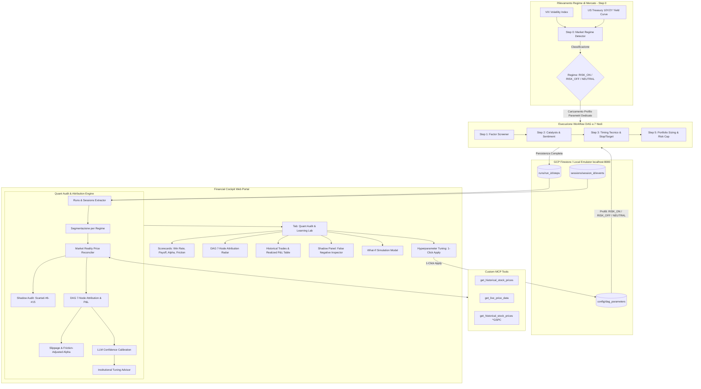

# AUDIT & CONTINUOUS LEARNING: Quant Audit Engine, DAG Post-Mortem & Institutional Continuous Calibration

**Autore:** Antigravity AI Engineering Team  
**Data:** 28 Agosto 2026  
**Stato:** Implementato & Validato in Produzione  
**Destinazione File:** Root del Repository (`/AUDIT_CONTINUOUS_LEARNING.md`)

---

Questo documento definisce l'architettura tecnica, le componenti software, i modelli analitici avanzati e il piano di esecuzione per implementare il sistema di **Quant Audit, Post-Mortem Feedback Loop & Institutional Continuous Calibration** condizionato al regime di mercato (**RISK_ON**, **RISK_OFF**, **NEUTRAL**), basato interamente su **GCP Firestore / Emulatore locale (`localhost:8080`)**, integrato nel Cockpit Web (`financial-cockpit-web`) e nell'agente ADK (`eodhd-agent`).

---

## 1. Visione Generale & Architettura del Sistema

Il sistema chiude il cerchio (*continuous learning loop*) tra le previsioni dell'agente AI e la realtà dei mercati finanziari, trasformando l'Audit Trail di Firestore in un motore di ottimizzazione quantitativa istituzionale:



---

## 2. Modelli e Metriche Quantitative Avanzate (Institutional Grade)

### 2.1 Shadow Audit sui Titoli Scartati (*False Negative Bias Analysis*)
- Oltre ai primi 5 titoli promossi a portafoglio, l'audit traccia in background l'andamento reale dei candidati arrivati in posizione **#6-#15** (scartati negli Step 1, 2 o 4).
- **Valore Quant**: Se i titoli scartati sovraperformano regolarmente i primi 5 selezionati, il sistema identifica un **False Negative Bias** (filtri di screening troppo stringenti che eliminano le migliori opportunità di crescita) e propone la correzione delle soglie.

### 2.2 Velocità dell'Alpha & Time-to-Target (*Holding Period Decay*)
- Misurazione del tempo effettivo impiegato per raggiungere i Target di prezzo:
  - **Average Days to Target 1**: Giorni medi per raggiungere il +6.0% (es. 7.4 giorni).
  - **Capital Drag / Stale Trade Ratio**: Percentuale di trade che oscillano in laterale senza toccare né Target né Stop-Loss entro 30 giorni.

### 2.3 Matrice Asimmetrica Win/Loss & Expected Value ($E$)
- **Payoff Ratio**: Rendimento medio delle operazioni vincenti diviso per la perdita media delle operazioni in stop (`Avg Win ÷ Avg Loss`).
- **Expected Value per Trade ($E$)**:
  - $E = (Win\ Rate \times Avg\ Win) - (Loss\ Rate \times Avg\ Loss)$
  - Consente di ottimizzare il sistema non solo sul numero di vittorie, ma sul valore atteso matematico per ogni euro allocato.

### 2.4 Calibration Curve della "Confidence" dell'Agente
- Verifica statistica dell'affidabilità delle stime di convinzione espresse dall'LLM (es. Conviction Score da 1 a 100).
- Calibra la curva di confidenza per evitare che posizioni speculative vengano sovrappesate a causa di *LLM Overconfidence Bias*.

### 2.5 Modellazione di Slippage e Costi di Transazione (*Friction-Adjusted Alpha*)
- Calcolo dell'Alpha netta al netto dell'attrito di mercato (default 5-10 bps per trade + spread bid-ask stimato).
- Garantisce che le statistiche visualizzate nel Cockpit Web siano realistiche e pronte per un'esecuzione reale a mercato.

### 2.6 Matrice di Correlazione Incrociata del Portafoglio (*Crowding Risk*)
- Monitoraggio della correlazione media tra i 5 titoli selezionati (soglia di allerta: correlazione media $\gt 0.45$).
- Previene la concentrazione di rischio settoriale/fattoriale mascherata.

### 2.7 Circuit Breakers & Drift Alerts
- Se il Win Rate calcolato sugli ultimi 5 trade scende sotto il 40% o se il Drawdown supera la soglia di tolleranza, il Cockpit Web attiva un alert visivo di **Performance Drift** suggerendo il passaggio automatico al profilo difensivo `RISK_OFF`.

### 2.8 Sandbox "What-If" di Pre-Visualizzazione
- Prima di confermare l'applicazione dei nuovi parametri con **1-Click Apply**, l'utente può aprire una modale **"What-If Simulation"** che confronta la curva di equity storica dei vecchi parametri con quella ricalibrata.

---

## 3. Schema Documentale Firestore Multi-Regime (`config/dag_parameters`)

```json
{
  "version": "v1.4.0",
  "updated_at": "2026-08-28T13:20:00Z",
  "applied_by": "quant_audit_engine",
  "global_guardrails": {
    "max_portfolio_cross_correlation": 0.45,
    "estimated_slippage_bps": 8.0,
    "drift_alert_win_rate_threshold": 0.40,
    "max_stale_holding_days": 30
  },
  "regimes": {
    "RISK_ON": {
      "description": "Mercato rialzista, VIX < 20, spread yield normali",
      "step1_factors": {
        "pe_max_threshold": 28.0,
        "debt_equity_max": 1.8,
        "growth_weight": 1.4,
        "congressional_trades_multiplier": 1.50,
        "dividend_streak_years_min": 0
      },
      "step3_technicals": {
        "target1_pct": 0.075,
        "target2_pct": 0.160,
        "stop_loss_pct": 0.040,
        "rsi_oversold_entry": 38
      },
      "step5_risk_sizing": {
        "max_risk_per_trade_pct": 0.010,
        "max_sector_concentration_pct": 0.30,
        "cash_buffer_min_pct": 0.00
      }
    },
    "RISK_OFF": {
      "description": "Alta volatilità, VIX >= 20, Safe Haven attivo (Gold/Treasury)",
      "step1_factors": {
        "pe_max_threshold": 20.0,
        "debt_equity_max": 1.0,
        "growth_weight": 0.8,
        "congressional_trades_multiplier": 1.20,
        "dividend_streak_years_min": 5
      },
      "step3_technicals": {
        "target1_pct": 0.045,
        "target2_pct": 0.090,
        "stop_loss_pct": 0.025,
        "rsi_oversold_entry": 30
      },
      "step5_risk_sizing": {
        "max_risk_per_trade_pct": 0.005,
        "max_sector_concentration_pct": 0.20,
        "cash_buffer_min_pct": 0.15
      }
    },
    "NEUTRAL_CHOPPY": {
      "description": "Mercato laterale / range-bound, VIX 16-20",
      "step1_factors": {
        "pe_max_threshold": 24.0,
        "debt_equity_max": 1.4,
        "growth_weight": 1.0,
        "congressional_trades_multiplier": 1.35,
        "dividend_streak_years_min": 3
      },
      "step3_technicals": {
        "target1_pct": 0.055,
        "target2_pct": 0.120,
        "stop_loss_pct": 0.035,
        "rsi_oversold_entry": 34
      },
      "step5_risk_sizing": {
        "max_risk_per_trade_pct": 0.008,
        "max_sector_concentration_pct": 0.25,
        "cash_buffer_min_pct": 0.05
      }
    }
  }
}
```

---

## 4. Endpoint REST FastAPI (`financial-cockpit-web/backend/main.py`)

- `GET /api/quant-audit/runs`: Elenco completo delle run storiche con filtri per regime (`ALL`, `RISK_ON`, `RISK_OFF`, `NEUTRAL`).
- `POST /api/quant-audit/evaluate`: Esegue la riconciliazione realtime mark-to-market dei prezzi e calcola metriche, slippage e shadow audit.
- `GET /api/quant-audit/kpis`: KPI istituzionali aggregati (Win Rate, Payoff Ratio, Expected Value $E$, Alpha Netta, Time-to-Target medio, Confidence Calibration Score).
- `GET /api/quant-audit/node-attribution`: Scorecard dei 7 nodi del DAG con analisi dei bias.
- `GET /api/quant-audit/shadow-audit`: Analisi comparativa delle performance dei titoli promossi (#1-#5) vs titoli scartati (#6-#15).
- `GET /api/quant-audit/tuning-recommendations`: Raccomandazioni analitiche di calibrazione per regime.
- `POST /api/quant-audit/simulate-tuning`: Calcola la simulazione What-If della curva di equity con i parametri proposti.
- `POST /api/quant-audit/apply-tuning`: Salva la nuova configurazione su Firestore (`config/dag_parameters`) con snapshot storica di rollback (**1-Click Apply**).

---

## 5. Componenti UI nel Frontend (`financial-cockpit-web/src/`)

1. **`Header.jsx`**: Aggiunta del tab di navigazione primaria `"Quant Audit & Learning Lab"` e badge di notifica per eventuali *Drift Alerts*.
2. **`RegimeFilterBar.jsx`**: Selettore rapido `Tutti i Regimi` | `RISK_ON` | `RISK_OFF` | `NEUTRAL`.
3. **`QuantKPICards.jsx`**:
   - Win Rate & Payoff Ratio (`2.8×`)
   - Net Realized Alpha vs S&P 500 (`+6.8%`)
   - Expected Value per Trade (`+€142 / trade`)
   - Average Days to Target (`7.4 gg`)
   - Numerical Fidelity (`100%`)
4. **`NodeAttributionRadar.jsx`**: Grafico radar / scorecard dei 7 nodi del DAG con identificazione del nodo a maggior valore aggiunto.
5. **`TradePostMortemTable.jsx`**: Tabella interattiva con filtri, P&L %, status (Target 1, Target 2, Stop Loss, In Progress), giorni di holding e Alpha vs Benchmark.
6. **`ShadowAuditPanel.jsx`**: Modulo di confronto visivo tra i titoli selezionati e i titoli scartati (#6-#15) per rilevare eventuali falsi negativi.
7. **`TuningAdvisorPanel.jsx`**: Schede con le raccomandazioni di ricalibrazione, slider interattivi, pulsante **"Simula Impatto (What-If)"** e pulsante **"Applica al DAG (1-Click Apply)"**.
8. **`WhatIfSimulationModal.jsx`**: Modale interattiva che traccia la curva di rendimento simulata prima della conferma.
9. **`AuditDetailModal.jsx`**: Drill-down dettagliato su singola run (dati grezzi MCP vs sintesi LLM).

---

## 6. Piano di Esecuzione in Fasi

### Fase 1: Backend & Engine Quantitativo Istituzionale (Firestore Native)
- [ ] **1.1**: Configurare `FirestoreSessionService` conforme a `BaseSessionService` di ADK su Firestore (`sessions/{session_id}`).
- [ ] **1.2**: Implementare il gestore di configurazione multi-regime `config_service.py` con persistenza `config/dag_parameters` e storico rollback.
- [ ] **1.3**: Creare `eodhd-agent/app/services/quant_audit_engine.py` con:
  - Riconciliazione prezzi live e storici con S&P 500 (`^GSPC`)
  - Calcolo Payoff Ratio, Expected Value $E$, e Time-to-Target
  - Shadow Audit sui titoli scartati (#6-#15)
  - Friction model (Slippage & Spread)
  - LLM Confidence Calibration
  - Decomposizione di attribuzione per i 7 nodi
- [ ] **1.4**: Implementare il motore What-If simulation per il Tuning Advisor.
- [ ] **1.5**: Esporre tutti gli endpoint REST in `financial-cockpit-web/backend/main.py`.

### Fase 2: Sviluppo Componenti Frontend Web
- [ ] **2.1**: Aggiungere il routing e la navigazione tab in `Header.jsx` e `App.jsx`.
- [ ] **2.2**: Implementare `QuantKPICards.jsx` con metriche avanzate (Win Rate, Payoff, Alpha, EV).
- [ ] **2.3**: Implementare `NodeAttributionRadar.jsx` e la Scorecard dei 7 Nodi.
- [ ] **2.4**: Implementare `TradePostMortemTable.jsx` con colonne avanzate (Holding Days, Slippage, Alpha).
- [ ] **2.5**: Implementare `ShadowAuditPanel.jsx` per l'ispezione dei titoli scartati.
- [ ] **2.6**: Implementare `TuningAdvisorPanel.jsx` con pulsante 1-Click Apply e pulsante What-If Simulation.
- [ ] **2.7**: Implementare `WhatIfSimulationModal.jsx` e `AuditDetailModal.jsx`.

### Fase 3: Testing, Validazione & Documentazione
- [ ] **3.1**: Creare test unitari in `tests/test_quant_audit.py` (Payoff, Alpha, Shadow Audit, Regime Filtering).
- [ ] **3.2**: Verificare la reattività del frontend con Vite dev server e l'emulatore Firestore.
- [ ] **3.3**: Aggiornare `README.md` e la documentazione del repository.
