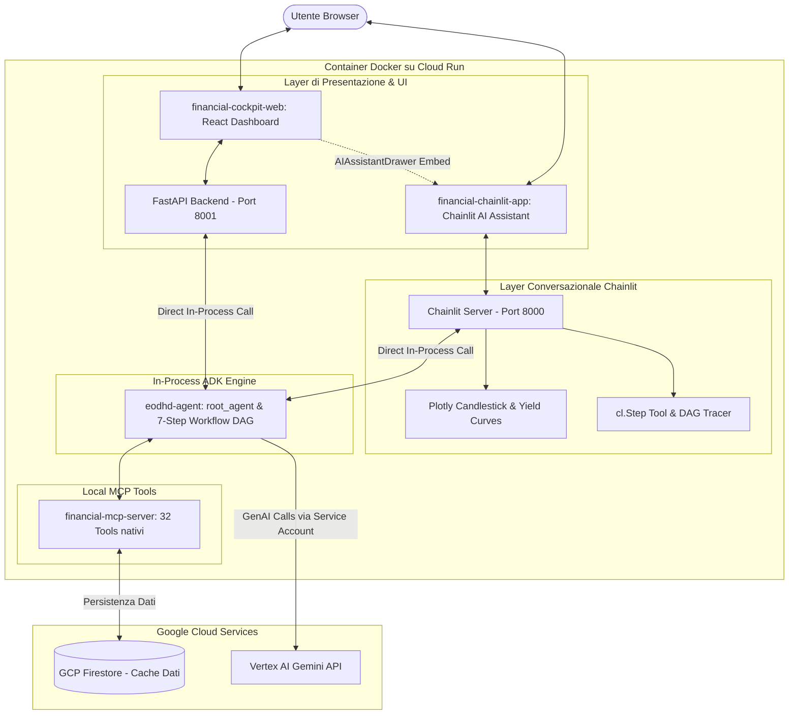

# Progettazione Architetturale: AI Financial Assistant (Chainlit) su Docker

**Autore:** Antigravity AI Engineering Team  
**Data:** 25 Agosto 2026  
**Stato:** Implementato & Operativo in Produzione  
**Destinazione File:** Root del Repository (`/FINANCIAL_AGENT_CHAINLIT_DESIGN.md`)

---

## 1. Visione Generale
L'architettura è **100% containerizzata con Docker su Google Cloud Run** e si struttura su **4 Layer Modulari Indipendenti** collocati alla radice del workspace:

1. **`financial-mcp-server/`** (*Data & Tool Layer*): Server Model Context Protocol con 32 tool nativi (Fondamentali, Tecnici, News, Sentiment, Macro FRED, Yield Curves, SEC Form 4, Scambi Congresso USA, Commodity, Opzioni Black-Scholes) con caching su GCP Firestore.
2. **`eodhd-agent/`** (*Agent Reasoning Layer*): Motore agentico ADK con Superprompt e Workflow quantitativo a 7 Nodi (*Market Regime, Factor Screening, Catalysts, Technical Timing, Relative Valuation, Portfolio Synthesis, Backtest*).
3. **`financial-chainlit-app/`** (*Conversational AI Assistant Layer*): Applicazione Chainlit autonoma che importa in-process `root_agent` da `eodhd-agent`, fornendo streaming token in tempo reale, grafici interattivi **Plotly**, tabelle dati e monitoraggio dei tool con `cl.Step`.
4. **`financial-cockpit-web/`** (*Web Dashboard & Presentation Layer*): Dashboard React + FastAPI che incorpora l'assistente Chainlit tramite un **AIAssistantDrawer** interattivo.

---

## 2. Architettura del Container Docker



---

## 3. Perché Esecuzione In-Process in Docker?

1. **Zero Attrito e Massima Semplicità**:
   - Nessun deploy frammentato su Vertex Reasoning Engine.
   - L'assistente importa direttamente `root_agent` di `eodhd-agent` come modulo Python.
2. **Latenza Minima**:
   - L'agente e i 32 tool comunicano in-process / via stdio locale senza round-trip di rete interni.
3. **Supporto Nativo WebSockets**:
   - Chainlit gestisce le connessioni WebSocket per lo streaming dei token e l'iniezione dei grafici Plotly.
4. **Scale-to-Zero su Cloud Run**:
   - Il container si avvia su richiesta e scala a 0 quando inattivo.

---

## 4. Modalità di Avvio

### Sviluppo Locale
1. **Assistente Chainlit**:
   ```bash
   cd financial-chainlit-app
   uv run chainlit run app.py -w --port 8000
   ```
2. **Cockpit Web App**:
   ```bash
   cd financial-cockpit-web
   npm run dev
   ```

### Produzione Docker su Cloud Run
```bash
# Build e deploy unificato su Cloud Run
gcloud builds submit --tag gcr.io/${GOOGLE_CLOUD_PROJECT}/financial-cockpit:latest .
gcloud run deploy financial-cockpit --image gcr.io/${GOOGLE_CLOUD_PROJECT}/financial-cockpit:latest --platform managed
```
