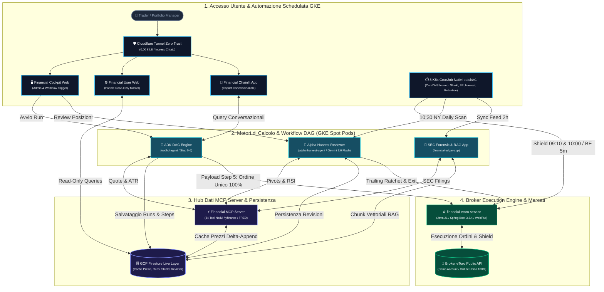
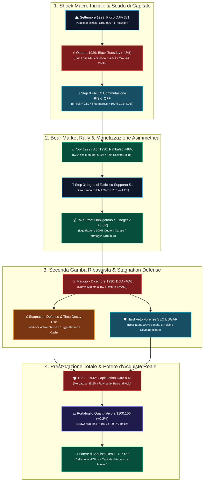

# Progetto: Custom Financial MCP Server, Motore Quantitativo DAG & Financial Cockpit Web

**Autore:** Antigravity AI Engineering Team  
**Data:** 30 Settembre 2026  
**Stato:** Documento Master delle Regole & Architettura del Sistema (Aggiornato: Zero Dual-Tranche, Trailing a Scaglioni +3%, Stagnation Defense & Stress Test 1929)  
**Destinazione File:** Root del Repository (`/GEMINI.md`)

---

## 1. Visione Generale
L'obiettivo del progetto è una piattaforma finanziaria quantitativa di livello istituzionale indipendente al 100% da provider a pagamento (zero costi API/crediti EODHD):
- **Custom MCP Server (34 Tool Nativi)**: Estrazione, normalizzazione e indicatori calcolati in locale con fallback concorrente `yfinance`, feed macro FRED API, Google News RSS, opzioni con Greci Black-Scholes, scambi politici (STOCK Act), modelli contabili forensi deterministici (Altman Z, Beneish M, Piotroski F, Sloan Accrual) e ricerca semantica vettoriale sui bilanci SEC 10-K/10-Q (Vertex AI `text-embedding-005`).
- **Persistenza & Caching**: **GCP Firestore Live** (`project: fintech-data-hub-45513`, `database: fintech-data-hub-fs`) con caching EOD incrementale Delta-Append, Fast-Path Snapshot quote a TTL dinamico e DGR Dividend Analytics.
- **ADK Financial DAG Engine (7 Nodi)**: Workflow quantitativo a grafo (`eodhd-agent`) con regime di mercato (Step 0), screening multi-fattoriale (Step 1), catalizzatori/fondamentali (Step 2 con Hard Veto forense SEC EDGAR), timing tecnico (Step 3 con ATR a 14 periodi e filtro rimbalzo S1/EMA20), valutazione relativa (Step 4), sintesi di portafoglio (Step 5 con Stop-Loss dinamico ATR, Target a multipli R 1.5R/3.0R ed Equal-Dollar Risk Parity con rischio max 1% per posizione) e backtest di verifica (Step 6) con limite settoriale max 30%.
- **Quant Audit Lab & Trade Post-Mortem Explorer**: Engine analitico retrospettivo che calcola Win Rate, Profit Factor, Sharpe Ratio, Shadow Audit sui titoli scartati, attribuzione dell'alpha per nodo e raccomandazioni di calibrazione parametri.
- **Financial Cockpit Web (React + Vite + FastAPI)** & **Financial Chainlit App**: Dashboard web in tempo reale (Live Screener, Candlestick interattivo con livelli operativi esatti, Audit Lab, System Health Check su 23 sottosistemi) e interfaccia conversazionale interattiva.
- **Automated Trading Execution su eToro (`financial-etoro-service` - Java 21 / Spring Boot 3.3.4)**: Microservizio autonomo enterprise per l'esecuzione transazionale automatizzata su conto Demo eToro delle raccomandazioni dello Step 5 con **Strategia Adattiva al Regime a Ordine Unico 100% (Zero Dual-Tranche Splitting)**: in `RISK_ON` e `NEUTRAL_CHOPPY` per titoli `SUPER_TREND` emette un ordine unico al 100% delle quote **senza Take Profit (`clearTakeProfit: true`)** per Alpha Runner continuo, con Break-Even Netto a T1 (+0.1% buffer) e Trailing Stop Ratchet a scaglioni continui di +3% (con cuscinetto di sicurezza del 6%); per titoli `NO_SUPER_TREND` (Normale/Swing) emette un ordine unico al 100% **con Take Profit ancorato su Target 2 (3.0R)** intoccabile, con Stop Loss mobile a protezione del capitale. Include Opening Shield esteso (15:10 - 16:00 IT / 09:10 - 10:00 NY) con persistenza su Firestore (`positions_shield/{pos_id}`), Break-Even Dynamic Trailing Guardian e **Order TTL & Stale Order Purge Guardian** (revoca automatica a 2 sessioni di borsa / 48h feriali e Supersede on New Run per liberare `frozenCash`), azionato da **Kubernetes CronJob nativi interni (`batch/v1`)**. Sostituisce definitivamente il vecchio modulo `financial-etoro-client` (dismesso).
- **Financial EDGAR & Forensic Intelligence Service (`financial-edgar-app`)**: Microservizio autonomo per l'acquisizione in streaming dei bilanci SEC EDGAR (10-K, 10-Q, 8-K), calcolo dei modelli forensi contabili quantitativi (Altman Z-Score, Beneish M-Score, Piotroski F-Score, Sloan Accrual Index), chunking semantico finanziario vettorizzato con Google Cloud Vertex AI (`text-embedding-005` a 768 dimensioni) su Firestore Vector Search (`sec_filing_chunks`), valutazione forense LLM grounded (Gemini 2.5/3.6 Flash) e sincronizzazione periodica via Kubernetes CronJob interno.
- **Autonomous Portfolio Exit & Reinvestment Reviewer (`alpha-harvest-agent`)**: Microservizio autonomo basato su Google ADK e Gemini 3.6 Flash per il monitoraggio clinico e continuativo delle posizioni aperte su eToro. Valuta 6 pilastri quantitativi (Surriscaldamento RSI/Pivot, Accelerazione Volatilità ATR, Rischio Evento Earnings, Segnali Forensi / Form 4, Breakeven Trailing Dinamico a scaglioni di +3%, Opportunità di Reinvestimento ad Alpha Superiore dallo Step 1, e **Stagnation Defense** con Profit Cushion Lock a 10gg e liquidazione Time Decay a 15gg per liberare liquidità). Integra un bridge diretto con `financial-mcp-server` per dati live FRED, ATR, Pivots, Earnings Calendar e SEC Form 4, con scansione clinica feriale alle 10:30 New York (16:30 IT) azionata da Kubernetes CronJob interno.
- **Infrastruttura di Calcolo GKE Autopilot & Cloudflare Tunnel**: Tutti gli 8 moduli girano sullo stesso cluster **GKE Autopilot** in rete privata, con allocazione **Spot Pods** attiva solo durante l'orario di borsa di Wall Street (15:00 - 22:30 IT) e spegnimento notturno a costo 0,00 €. L'esposizione verso l'esterno è garantita da **Cloudflare Tunnel (`cloudflared`)** per i portali utente (`fintechdatahub.eu`, `cockpit.fintechdatahub.eu`, `chat.fintechdatahub.eu`), eliminando al 100% i costi del Google Cloud Load Balancer per un costo mensile totale inferiore a ~8 €/mese. Tutti i trigger di trading e FinOps sono eseguiti internamente su CoreDNS via Kubernetes CronJob a costo zero.

---

## 2. Architettura del Sistema



---

## 3. Struttura dei Repository e Moduli

```
antigravity-challenge-lab/
├── financial-mcp-server/         # MCP Server autonomo (34 Tool registrati con FastMCP)
│   ├── pyproject.toml
│   ├── src/financial_mcp_server/
│   │   ├── server.py             # Router MCP con 34 Tool nativi
│   │   ├── config.py             # Configurazione Firestore, TTL, log levels
│   │   ├── db/firestore_client.py# Cache Firestore & in-memory fallback
│   │   ├── extractors/           # yfinance concurrent extraction & schema mapper
│   │   └── services/             # 12 Moduli di Business Logic specializzati
│   └── tests/                    # 69 Test unitari e di integrazione (100% passed)
│
├── eodhd-agent/                  # ADK Workflow Agent quantitativo a 7 Nodi
│   ├── app/
│   │   ├── agent.py              # Definizione Agente ADK & Toolset
│   │   ├── workflow/             # DAG Engine, Data Provider & Steps 0-6
│   │   ├── services/             # QuantAuditEngine, ConfigService, etc.
│   │   └── db/workflow_db.py     # Salvataggio run e step su Firestore
│   └── tests/unit/               # 16 Test di validazione del grafo e audit (100% passed)
│
├── eodhd-mini-agent/             # Agente conversazionale leggero (Tool router)
│   └── app/agent.py
│
├── financial-cockpit-web/        # Guscio Cockpit Ultraleggero (Admin / Pro)
│   ├── backend/main.py           # FastAPI REST API (Workflow, Audit, Screener, Stock History)
│   ├── src/                      # React App (importa ed estende @user-web con isCockpit=true)
│   ├── Dockerfile                # Multi-stage production build (Vite con @user-web + FastAPI)
│   └── package.json
│
├── financial-user-web/           # Master Web Portal (Single Source of Truth per UI, Modali & CSS)
│   ├── Dockerfile                # Multi-stage production build (Vite + FastAPI Read-Only)
│   ├── backend/main.py           # FastAPI Read-Only API (Accesso Firestore, blocco mutazioni)
│   ├── src/                      # React UI (LiveScreener, Quant Audit, Hub, Metodologia, CopilotView, Modali)
│   └── package.json
│
├── financial-etoro-service/      # Microservizio autonomo eToro Enterprise in Java 21 & Spring Boot 3.3.4 (Ordine Unico 100%, Shield & Trailing)
│   ├── Dockerfile                # Multi-stage container (Maven 3.9.9 + Eclipse Temurin 17 JRE)
│   ├── pom.xml                   # Maven dependencies: Spring Boot 3.3.4, WebFlux, Resilience4j, Firestore SDK
│   ├── src/main/java/com/financial/etoro/
│   │   ├── FinancialEtoroApplication.java # Entrypoint Spring Boot con Virtual Threads & Scheduling
│   │   ├── client/               # Netty HTTP/2 WebClient con Resilience4j RateLimiter & Exponential Retry
│   │   ├── model/                # POJO & DTO speculari a Python (CandidateOrderPlan, Execution, ActiveItems, Close)
│   │   ├── service/              # OrderBuilder (T1/T2 split), Preflight, Execution, OpeningShield, BreakEven, PositionCache
│   │   └── web/                  # REST Controllers (/api/etoro/*, /api/scheduler/*, /, /health)
│   └── src/test/                 # 8 Test unitari JUnit 5 (100% passed)
│
├── financial-edgar-app/         # Microservizio autonomo SEC EDGAR Ingestion, Forensic RAG & Watcher
│   ├── Dockerfile                # Container Cloud Run (Python 3.12-slim)
│   ├── pyproject.toml
│   ├── src/financial_edgar_app/
│   │   ├── api/main.py           # FastAPI REST API (/facts, /forensic/evaluate, /sync-feed, /rag/query, /forensic/briefing/{ticker})
│   │   ├── client/               # Async HTTP SEC EDGAR client con rate limiter <= 10 req/s
│   │   ├── services/             # ForensicEngine, SectionParser, RagEngine (Vertex AI text-embedding-005), ForensicLlmEvaluator (Gemini)
│   │   └── scripts/              # bootstrap_ingest.py, purge_data.py
│   └── tests/                    # Test unitari e validazione modelli forensi e RAG
│
├── financial-chainlit-app/       # UI conversazionale interattiva basata su Chainlit
│   └── app.py
│
├── alpha-harvest-agent/          # Microservizio autonomo per harvesting profitti & AI exit (Google ADK, Gemini 3.6 Flash, 6 Pilastri)
│   ├── Dockerfile                # Multi-stage production build (Python 3.12-slim con MCP Bridge)
│   ├── pyproject.toml            # Dipendenze uv (google-genai, google-adk, fastapi, uvicorn, pytest)
│   ├── uv.lock
│   ├── app/
│   │   ├── agent.py              # Agente root ADK, Gemini 3.6 Flash, 5 tool MCP diagnostici
│   │   ├── api/main.py           # FastAPI REST API (/api/harvest/scan-portfolio, /api/harvest/execute-exit)
│   │   └── services/
│   │       ├── harvest_scanner.py # Engine di scansione a 6 pilastri, rating clinico e ranking
│   │       ├── mcp_service_bridge.py # Bridge diretto con i servizi del financial-mcp-server
│   │       └── reinvestment_evaluator.py # Match con candidati Step 1 ad Alpha superiore
│   └── tests/                    # 24 Test unitari di validazione scanner, bridge e guardrails (100% passed)
│
├── deploy/k8s/                   # Manifest Kubernetes nativi per GKE Autopilot & Cloudflare
│   ├── base/                     # 8 Deployment, ClusterIP, ServiceAccount, RBAC e 8 CronJob nativi
│   │   ├── cloudflared-deployment.yaml # Demone Cloudflare Tunnel Zero Trust (0,00 € LB)
│   │   ├── cloudflared-config.yaml     # Rotte Ingress per fintechdatahub.eu, cockpit e chat
│   │   ├── cronjobs.yaml         # 7 Kubernetes CronJob nativi batch/v1 su CoreDNS interno
│   │   ├── rbac.yaml             # Permessi RBAC per lo scaling automatico dei Deployment
│   │   └── *-deployment.yaml     # Manifest dei microservizi con health probes e Spot selector
│   └── overlays/prod/            # Overlay di produzione per allocazione GKE Spot Pods
│
└── terraform/                    # Infrastructure as Code (IaC) Google Cloud Platform
    ├── versions.tf               # Versioni minime Terraform (>= 1.9) e Provider Google
    ├── provider.tf               # Provider GCP (progetto, regione europe-west1)
    ├── variables.tf              # Variabili configurabili (enable_gke_deploy, enable_cloud_scheduler=false)
    ├── terraform.tfvars          # Valori runtime (fintech-gke-prod, zero LB, zero scheduler esterno)
    ├── services.tf               # Abilitazione API GCP (Container, Run, Firestore, Vertex AI)
    ├── gke.tf                    # Cluster GKE Autopilot (fintech-gke-prod), ServiceAccount e Workload Identity
    ├── firestore.tf              # Database Cloud Firestore Native (delete protection attiva)
    ├── artifact_registry.tf      # Repository Docker privato (fintech-apps)
    ├── iam.tf                    # Service Account runtime (cloudrun-sa, gke-sa)
    ├── secrets.tf                # Secret Manager per credenziali API eToro
    ├── cloud_run.tf              # Modulo Cloud Run (in dismissione / flag enable_cloud_run_deploy)
    ├── cloud_scheduler.tf        # Cloud Scheduler disabilitato (sostituito da K8s CronJob nativi)
    ├── cloud_build.tf            # Pipeline CI/CD Cloud Build con deploy diretto su GKE
    ├── cloud_deploy.tf           # Pipeline Google Cloud Deploy a 2 stadi su GKE Autopilot
    ├── outputs.tf                # Output esportati (Cluster name, endpoint, get-credentials)
    └── README.md                 # Guida per principianti da zero a esperto
```


---

## 4. Elenco Completo dei 34 Tool Custom MCP Nativi

1. **`get_bulk_fundamentals`**: Dati fondamentali Top 500 US / Mega-cap per analisi aggregata.
2. **`get_fundamentals_data`**: Bilanci completi (Stato Patrimoniale, Conto Economico, Flussi di Cassa trimestrali e annuali), multipli e rating.
3. **`get_earnings_trends`**: Stime di consenso EPS e Ricavi analisti, trend e revisioni storiche (bypass errore 403).
4. **`get_insider_transactions`**: Compravendite SEC Form 4 degli executive aziendali (bypass errore 403).
5. **`get_historical_stock_prices`**: Serie storiche giornaliere OHLCV con merge incrementale intelligente **Delta-Append** su Firestore.
6. **`get_technical_indicators`**: Calcolo analitico di SMA, EMA, RSI, MACD, Bande di Bollinger con parametri personalizzabili.
7. **`get_support_resistance_levels`**: Supporti e resistenze con Pivot Point Classici e Fibonacci (PP, S1-S3, R1-R3).
8. **`stock_screener`**: Screener multi-fattoriale su dati fondamentali, multipli e segnali tecnici da database.
9. **`get_company_news`**: Feed notizie ibrido (yfinance + Google News RSS con filtro di freschezza `when:1d`) con TTL Firestore dinamico ridotto a **15 minuti**, verifica di staleness oraria (< 1h) e ranking analitico a due livelli (**Freschezza Primaria a 5 time bucket + Rilevanza Secondaria** su fonte istituzionale, catalizzatori e intensità del sentiment).
10. **`get_sentiment_data`**: Motore di sentiment pure-Python basato su lessico di mercato (VADER + Loughran-McDonald) con aggregazione giornaliera.
11. **`get_macro_indicator`**: Serie storiche macroeconomiche FRED API (PIL, CPI, M2, Fed Funds, Tasso Disoccupazione, VIX).
12. **`get_ust_yield_rates`**: Curva dei rendimenti Treasury USA (*Par Yield Curve*) per scadenze da 1M a 30Y.
13. **`get_ust_bill_rates`**: Tassi Treasury Bills a breve termine (4WK, 13WK, 26WK, 52WK).
14. **`get_economic_events`**: Calendario economico con eventi macro, rilasci e impatto di mercato.
15. **`get_live_price_data`**: Prezzi real-time con cache ad alta reattività e **TTL dinamico** (15s regular session, 3600s a mercati chiusi).
16. **`get_us_live_extended_quotes`**: Quotazioni pre-market e after-hours con spread e variazioni.
17. **`get_intraday_historical_data`**: Barre intraday storiche ad alta risoluzione (1m, 5m, 15m, 1h).
18. **`get_stocks_from_search`**: Ricerca globale multi-asset per nome azienda o ticker.
19. **`resolve_ticker`**: Risoluzione del codice ticker canonico ed exchange di quotazione.
20. **`get_exchanges_list`**: Catalogo mondiale delle borse valori con orari e fusi orari.
21. **`get_exchange_details`**: Dettagli specifici di singola borsa (calendario festività e sessioni).
22. **`get_historical_dividends`**: Storico completo dei dividendi cash distribuiti.
23. **`get_dividend_analytics`**: Calcolo automatico Dividend Growth Rate (**DGR CAGR a 1Y, 3Y, 5Y, 10Y**), Dividend Aristocrat streak e frequenza.
24. **`get_historical_splits`**: Frazionamenti azionari (stock split) e moltiplicatore cumulativo di rettifica.
25. **`get_historical_market_cap`**: Serie storica dell'evoluzione della capitalizzazione di mercato.
26. **`get_upcoming_earnings`**: Calendario dei prossimi annunci degli utili trimestrali.
27. **`get_upcoming_ipos`**: Calendario delle prossime IPO e quotazioni.
28. **`get_historical_commodity_prices`**: Prezzi futures di materie prime (WTI Crude, Brent, Oro, Argento, Gas Naturale, Rame, Platino).
29. **`get_congressional_trades`**: Scambi azionari di membri del Congresso e Senato USA (STOCK Act disclosures).
30. **`get_us_options_contracts`**: Elenco delle scadenze e contratti opzioni azionarie USA.
31. **`get_us_options_eod`**: Prezzi opzioni con calcolo analitico dei **Greci di Black-Scholes** (Delta, Gamma, Theta, Vega, Implied Volatility).
32. **`get_sec_forensic_scores`**: Modelli contabili forensi deterministici (Altman Z-Score, Beneish M-Score, Piotroski F-Score, Sloan Accrual Ratio, Hard Veto e moltiplicatore DAG) da Firestore/microservizio.
33. **`query_sec_rag_filings`**: Ricerca semantica grounded su bilanci Form 10-K/10-Q (Item 1A Rischi, Item 7 MD&A, Item 8 Note, Item 3 Contenziosi) con Google Vertex AI `text-embedding-005` (768 dim) e Firestore Vector Search.
34. **`system_health_check`**: Diagnosi live simultanea su 23 sottosistemi di mercato con latenza in millisecondi e stato di salute complessivo.

---

## 5. Caratteristiche Quantitative del Workflow DAG (`eodhd-agent`)

1. **Step 0 - Regime di Mercato & Macro**:
   - Analisi incrociata VIX, Curva dei rendimenti 10Y-2Y, inflazione CPI e tassi Federal Reserve per determinare il regime: `RISK_ON`, `RISK_OFF`, `NEUTRAL_CHOPPY`.
2. **Step 1 - Screening Multi-Fattoriale & Top Funnel Filter**:
   - Selezione del paniere di candidati in base al regime con filtri su ROE, Debt/Equity, Free Cash Flow Yield e Momentum Z-score.
   - **Top Funnel Filter**: Capping a un massimo di **50 candidati migliori** (15 Mega-Cap + 35 Mid/Large-Cap ad alto Z-Score e Profitability Score) da passare ai nodi successivi per garantire statisticamente la selezione di 8-10 eccellenze assolute post-veto forense/tecnico ($P(X \ge 8) = 94.9\%$). Bounding della concorrenza tramite `asyncio.Semaphore(5)`.
3. **Steps 2, 3, 4 - Fan-Out Parallelo a Concorrenza Delimitata (Semaphore 5)**:
   - Elaborazione simultanea con semaforo di concorrenza limitato a 5 worker asincroni per prevenire saturazione di CPU, burst di rate limit API e OOM sui pod GKE.
   - **Step 2 (Catalizzatori & Fondamentali)**: Valutazione sorprese utili, accordi commerciali, scambi insider SEC Form 4, Congresso e Hard Veto forense SEC EDGAR.
   - **Step 3 (Timing Tecnico & Volatilità)**: Calcolo analitico di Wilder ATR a 14 periodi (`atr_14`), bande di Bollinger, supporti/resistenze S1/R1 e filtro `FAVORABLE_NEAR_SUPPORT` (ammesso solo entro il 2.5% da S1 o su pullback controllato verso EMA20, impedendo l'acquisto di minimi in caduta libera).
   - **Step 4 (Valutazione Relativa)**: Confronto multipli settoriali (P/E, EV/EBITDA, Forward P/E) rispetto ai peer e matrice di correlazione di Pearson a 90 giorni.
4. **Step 5 - Sintesi di Portafoglio & Equal-Dollar Risk Parity (Fan-In)**:
   - **Stop Loss Dinamico ATR**: Posizionato a `P_stop = P_entry - (2.2 × ATR_14)` con floor/ceiling di prudenza tra 3.5% e 9.0%, eliminando i falsi stop-out da rumore di mercato.
   - **Take Profit Asimmetrici R**: Target 1 a `P_entry + 1.5R` (scale-out 50% e trigger Break-Even Guardian) e Target 2 a `P_entry + 3.0R` (Alpha Runner sul restante 50%).
   - **Equal-Dollar Risk Parity Sizing**: Quote dimensionate con `N_shares = max(1, Floor((Capitale × 0.01 × M_risk) / R))`. Ogni posizione rischia esattamente l'1.0% del conto ($1.000 su $100.000). Asset più volatili ricevono meno quote, asset stabili ricevono più quote.
   - **Preservazione Liquidità Libera**: Rimosso il vecchio vincolo che riscalava arbitrariamente le quote a somma 100%, mantenendo la liquidità residua non investita per abbattere il drawdown complessivo.
   - Esposizione settoriale massima limitata al **30% del portafoglio** e cap di singola posizione al 25%.
5. **Step 6 - Backtest di Verifica**:
   - Verifica su serie storiche reali a 252 barre con slippage modellato tra 5 e 15 bps per convalidare l'aspettativa matematica positiva (Win Rate e Expected Value).

---

## 6. Quant Audit Lab & Trade Post-Mortem Explorer

- **Valutazione Post-Mortem su Firestore**: `QuantAuditEngine` analizza tutte le esecuzioni storiche (`runs/{run_id}`) verificando l'hit di Stop-Loss S1 vs Take-Profit T1 (+8.5%) / T2 (+18.2%).
- **Shadow Audit**: Verifica delle performance dei titoli esclusi allo Step 1 per misurare il tasso di falsi negativi e il missed profit.
- **Node Attribution**: Attribuzione del valore aggiunto (Alpha Attribution) per ciascun nodo analitico (Macro, Fondamentali, Tecnico, Valutazione).
- **Tuning Recommendations & Pesi Dinamici**: Raccomandazioni guidate da metriche e interfaccia per modificare i pesi dei nodi con persistenza in `quant_audit_config`.
- **Fuso Orario Italiano (`Europe/Rome`)**: Tutti i `run_id`, i timestamp Firestore, le etichette orarie e la colonna Data del Ledger sono unificati sull'orario locale italiano (CET/CEST).

---

## 7. Allineamento Grafico & UI Web (`financial-cockpit-web`)

- **Rendering Fedele delle Soglie**: In [CandlestickChart.jsx](file:///home/aberti/cloud-devops-labs/antigravity-challenge-lab/financial-cockpit-web/src/components/CandlestickChart.jsx) e [StockDetailModal.jsx](file:///home/aberti/cloud-devops-labs/antigravity-challenge-lab/financial-cockpit-web/src/components/StockDetailModal.jsx), le linee e i badge del grafico canvas (`S1 Entry`, `STOP`, `T1`, `T2`, `LAST`) corrispondono esattamente ai valori numerici della scheda quantitativa senza clamping artificiale.
- **Supporto Candidati Multipli**: La vista Top Candidates e la cronologia esecuzioni caricano e visualizzano tutti i candidati generati per ciascun run (es. 8 o 10 titoli senza troncamenti).
- **Ticker Pulito**: Sostituito il vecchio simbolo `SQ` con `V` (Visa Inc.) nel paniere universale e `HOOD` per le liste ad alto beta, con soppressione del rumore di logging di `yfinance`.

---

## 8. Modulo di Trading Automatico eToro (`financial-etoro-service` - Java Spring Boot 3)

- **Microservizio di Riferimento Esecutivo**: Il modulo `financial-etoro-service` (Java 17/21, Spring Boot 3.3.4, WebFlux, Resilience4j) è il microservizio primario e definitivo preposto a tutte le interazioni esecutive con eToro (`financial-etoro-client` dismesso).
- **Classificazione Quantitativa Adattiva `SUPER_TREND` vs `NO_SUPER_TREND` (Checklist a 5 Criteri)**:
  - Nello Step 5 del DAG (`eodhd-agent`), ogni candidato viene profilato deterministicamente sui 5 criteri cardine (Trend Strutturale sopra EMA20/50, Prossimità entro il 15% dai massimi a 52W, Catalizzatore Fondamentale solido, Scudo Forense SEC integro, Volatilità & Momentum attivi).
  - **Titoli `SUPER_TREND` (Soddisfano ≥ 4/5 criteri)**:
    - In regime `RISK_ON` e `NEUTRAL_CHOPPY`: emette un ordine unico al 100% delle quote **SENZA Take Profit (`takeProfitRate = null`)** per Alpha Runner continuo a massima convessità.
    - Quando il prezzo tocca Target 1 (1.5R) o registra un gain ≥ +6.0%, il Break-Even Guardian sposta lo Stop Loss al **Break-Even Netto** (+0.1% buffer per azzerare il rischio monetario: $0.00).
    - Oltre il Break-Even, il profitto viene blindato progressivamente dal **Dynamic Trailing Ratchet a scaglioni continui di +3%** con cuscinetto di sicurezza del 6%.
  - **Titoli `NO_SUPER_TREND` (Swing Trading Ordinario)**:
    - Emette un ordine unico al 100% delle quote **CON Take Profit rigorosamente ancorato su Target 2 (3.0R)** (`takeProfitRate = plan.target_2`). Questo Take Profit non viene rimosso per garantire la monetizzazione totale alla resistenza del canale.
    - Al tocco di Target 1 (1.5R) o gain ≥ +6%, il Break-Even Guardian sposta comunque lo Stop Loss a Break-Even (+0.1% netto) per azzerare il rischio di perdita mentre il trade viaggia verso T2.
  - **Prudenza in regime `RISK_OFF` (Tensione Macro / VIX Alto)**:
    - Entrambe le categorie (`SUPER_TREND` e `NO_SUPER_TREND`) adottano un **Take Profit prudenziale su Target 2 (3.0R)** per monetizzare e non esporre il capitale a violenti drawdown macroeconomici.
- **Ordini Limite MIT**: Esecuzione automatica al tocco della `entry_zone` (supporto S1) calcolata dal DAG quantitativo.
- **Pre-Flight Safety Check**: Verifica saldo live da eToro sull'account Demo (`33932108`), nozionale totale richiesto, rilevamento del regime di mercato con raccomandazione strategica e prevenzione ordini duplicati già pendenti.
- **Opening Shield (15:10 - 16:00 IT / 09:10 - 10:00 NY)**: Protezione automatica anti stop-hunting dell'apertura di Wall Street azionata da Kubernetes CronJob interno:
  - Ore **15:10 (09:10 NY)**: Allargamento Stop Loss a 1.5× la distanza originale su tutte le posizioni aperte e contestuale persistenza dello Stop Loss quantitativo originale su Firestore (`positions_shield/{pos_id}`) con 20 minuti di anticipo per garantire la registrazione anticipata sui libri ordini del broker.
  - Ore **16:00 (10:00 NY)**: Ripristino accurato dello Stop Loss quantitativo dinamico salvato a book disteso e spread normalizzati.
- **Break-Even & Dynamic Trailing Lock-In Guardian (+3% Scaglioni con Cuscinetto 6% & Difesa Stagnazione)**:
  - Monitora le posizioni attive ogni 5 minuti durante Wall Street via K8s CronJob nativo.
  - Al tocco di Target 1 (+1.5R) o al raggiungimento di gain ≥ +6.0%, sposta lo Stop Loss al **Net Break-Even** (`entry_price × 1.001`), eliminando qualsiasi rischio di perdita residua ($0.00 rischio monetario).
  - **Dynamic Trailing Ratchet (+3% scaglioni con cuscinetto 6%)**: Scala continua progressiva di Lock-In per proteggere i guadagni senza soffocare la naturale oscillazione del titolo (cuscinetto ≥ 6.0%, oltre 2.5× ATR-14):
    - Gain ≥ +9.0% → Stop Loss blindato ad almeno **+3.0%**
    - Gain ≥ +12.0% → Stop Loss blindato ad almeno **+6.0%**
    - Gain ≥ +15.0% → Stop Loss blindato ad almeno **+9.0%**
    - Gain ≥ +18.0% → Stop Loss blindato ad almeno **+12.0%**
    - Gain ≥ +21.0% → Stop Loss blindato ad almeno **+15.0%**
    - Gain ≥ +24.0% → Stop Loss blindato ad almeno **+18.0%**
    - Formula analitica: per gain ≥ +9%, `tier = floor(gain / 3.0)`, `locked = (tier - 2) × 3.0%`.
    - **Ratchet Rule**: Stop Loss rigorosamente unidirezionale monotono non-decrescente (sale sempre, non retrocede mai).
- **Architettura di Difesa dalla Stagnazione (Stagnation Defense)**:
  - **Profit Cushion Lock (10 Giorni)**: se una posizione compie 10 giorni con gain ≥ +3.5%, lo Stop Loss viene blindato ad almeno **+3.5%**, impedendo che un utile solido scivoli in perdita.
  - **Time Decay Exit (15 Giorni)**: se una posizione compie 15 giorni di borsa con gain < +6.0%, viene liquidata a mercato (`TIME_DECAY_EXIT`), liberando liquidità per nuove opportunità a più alto alpha.
  - **Stagnation Harvest (20 Giorni)**: se una posizione `NO_SUPER_TREND` (Swing) compie 20 giorni con gain tra +6.0% e +12.0%, viene monetizzata interamente (`STAGNATION_HARVEST`) prima del fisiologico esaurimento del ciclo di canale.
- **Order TTL & Stale Order Purge Guardian (Validità 2 Sessioni di Borsa / 48 Ore Feriali & Supersede on New Run)**:
  - Micro-motore quantitativo dedicato (`StaleOrderPurgeService`) che automatizza il ciclo di vita degli ordini condizionati (MIT) pendenti non eseguiti.
  - **Calcolo Clinico dei Giorni di Borsa (Trading Days)**: Valuta esclusivamente i giorni feriali (lunedì-venerdì) sul fuso di Wall Street (`America/New_York`), impedendo scadenze anomale durante i weekend a mercati chiusi.
  - **Revoca Automatica a 2 Sessioni di Borsa (48 Ore di Contrattazione)**: Gli ordini pendenti non eseguiti dopo 2 sessioni di mercato piene decadono automaticamente. Questo previene la cattura di coltelli che cadono (*falling knives* su breakdown tardivi) e **sblocca istantaneamente il margine congelato (`frozenCash`)** restituendolo alla liquidità libera disponibile.
  - **Esecuzione Automatica ad Ogni Ciclo di Guardia**: Integrato nativamente nel `BreakEvenGuardianService` (monitorato ogni 5 minuti a mercati aperti) ed esposto su endpoint HTTP dedicato `POST /api/scheduler/stale-orders-purge`.
  - **Supersede on New Run**: All'immissione di una nuova run quantitativa dal DAG, revoca automaticamente tutti gli ordini pendenti obsoleti preesistenti per liberare il margine prima dell'invio dei nuovi ordini.
- **Isolamento dei Privilegi (`isCockpit === true`)**:
  - Pulsante `⚡ Invia a eToro (Demo)` e modale `EToroExecutionModal` presenti **esclusivamente su `financial-cockpit-web`**.
  - Portale pubblico `financial-user-web` rigidamente **100% Read-Only** (zero azioni mutative esposte).
- **Automazione via 7 Kubernetes CronJob Nativi (`batch/v1`)**: Sostituiscono definitivamente Cloud Scheduler esterno, azionando i trigger a costo zero su CoreDNS interno (`etoro-opening-shield-widen`, `etoro-opening-shield-restore`, `etoro-breakeven-guardian`, `alpha-harvest-portfolio-scan`, `edgar-sync-feed`, `finops-scaleup-wallstreet`, `finops-scaledown-wallstreet`).

---

## 9. Comandi di Avvio e Test del Sistema

| Servizio | Comando di Avvio | Porta / Endpoint |
| :--- | :--- | :--- |
| **Full Stack Docker Compose** | `docker compose up --build -d` | 5 container attivi (porte 8000, 8001, 8002, 8003, 8082) |
| **GCP Terraform Plan (IaC)** | `cd terraform && terraform plan` | Simulazione dichiarativa completa dell'infrastruttura GCP |
| **GCP Terraform Apply (IaC)** | `cd terraform && terraform apply` | Creazione e allineamento di tutte le risorse GCP |
| **GCP Infra & Secrets Bootstrap** | `bash scripts/setup_gcp_infra.sh` | One-touch setup: API, Firestore, Registry, IAM & Secret Manager |
| **Cloud Scheduler Setup** | `bash scripts/setup_gcp_cloud_scheduler.sh` | 5 Job cron con OIDC auth (fuso `America/New_York`) |
| **Financial Cockpit Backend** | `cd financial-cockpit-web && uv run uvicorn backend.main:app --host 0.0.0.0 --port 8001 --reload` | `http://localhost:8001` |
| **Financial Cockpit Frontend** | `cd financial-cockpit-web && npm run dev` | `http://localhost:5173` |
| **Financial eToro Service (Java Spring Boot)** | `cd financial-etoro-service && ./mvnw spring-boot:run` (o `mvn spring-boot:run`) | `http://localhost:8080` |
| **Financial EDGAR App (SEC Ingestion & Forensic)** | `cd financial-edgar-app && uv run uvicorn financial_edgar_app.api.main:app --host 0.0.0.0 --port 8004 --reload` | `http://localhost:8004` |
| **Financial User Backend (Read-Only)** | `cd financial-user-web && uv run uvicorn backend.main:app --host 0.0.0.0 --port 8002 --reload` | `http://localhost:8002` |
| **Financial User Frontend (Read-Only)** | `cd financial-user-web && npm run dev` | `http://localhost:5174` |
| **Alpha Harvest Agent (Exit Reviewer)** | `cd alpha-harvest-agent && uv run uvicorn app.api.main:app --host 0.0.0.0 --port 8005 --reload` | `http://localhost:8005` |
| **Financial Chainlit App** | `cd financial-chainlit-app && chainlit run app.py -w --port 8000` | `http://localhost:8000` |
| **Firestore Emulator** | `firebase emulators:start --only firestore` | `localhost:8080` (UI: `4000`) |
| **Health Check Diagnostico** | `cd financial-mcp-server && uv run python scripts/health_check.py` | CLI / Tool MCP |

### Test Suite:
- `financial-etoro-service`: `mvn test` (17 test JUnit 5 passati al 100%: Adaptive Strategy Risk-On/Choppy/Risk-Off, Odd-Units, Opening Shield, Break-Even Guardian per FULL e Tranche, Trade History)
- `alpha-harvest-agent`: `TESTING=true uv run pytest alpha-harvest-agent/tests/ -v` (24 test passati al 100%: 6 pilastri, MCP bridge, guardrails, indivisibilità quote, SL non regressivo)
- `financial-user-web`: `pytest financial-user-web/test_user_backend.py` (14 test passati, build Vite completata in 1.59s)
- `financial-mcp-server`: `uv run pytest financial-mcp-server/tests/` (74 test passati su 74, compresi 23 controlli health check)
- `eodhd-agent`: `pytest eodhd-agent/tests/unit/` (17 test passati: DAG Flow, Veto Forense, Sizing Risk Parity, Backtest)
- `eodhd-mini-agent`: `pytest eodhd-mini-agent/tests/unit/` (3 test passati)
- Build Frontend Vite (`cockpit` & `user-web`): `npm run build` (0 errori, build in ~1.5s)

---

## 10. Financial News Hub & Institutional Intelligence Engine (`FintechDataHubService`)

Il modulo `FintechDataHubService` ([hub_service.py](file:///home/aberti/cloud-devops-labs/antigravity-challenge-lab/financial-user-web/backend/hub_service.py)), condiviso e sincronizzato al 100% tra `financial-user-web` e `financial-cockpit-web`, fornisce intelligence finanziaria quantitativa in tempo reale:
- **Demone Asincrono in Background (`ContinuousNewsWatcher`)**:
  - Gira all'interno di `financial-cockpit-web` (avviato su `@app.on_event("startup")`).
  - Esegue un warm-up immediato all'avvio su `tag="market"`, Mega-Cap, asset Macro e principali settori.
  - Cicla autonomamente ogni 10 minuti acquisendo e arricchendo le ultime notizie da Google News RSS e yfinance con deduplicazione e merge storico su Firestore.
  - Garantisce che qualsiasi utente aprendo la dashboard trovi sempre le notizie più recenti già precaricate (accesso sub-15ms, zero attese né "7d fa").
- **Smart Invalidation della Cache**:
  - `news_service.py` controlla dinamicamente la data dell'articolo più recente salvato: se antecedente a 3 ore fa, la cache viene invalidata e rinfrescata live, evitando blocchi statici.
- **News Streaming Dinamico & On-Demand (`/api/hub/stream`)**:
  - Estrazione live multi-provider da `NewsService` (yfinance + Google News RSS) con fallback deterministico a zero downtime.
  - Classificazione automatica dei catalizzatori di mercato: *SEC Form 4 Insider Trading*, *STOCK Act Congressional Disclosures*, *Earnings & Guidance Beat*, *Macro / Fed Monetary Policy*, *M&A & Strategic Partnership*, *Unusual Options Flow*.
  - Arricchimento in tempo reale con quotazioni di borsa, variazioni percentuali e sintesi narrativa istituzionale.
- **Analisi Sentiment Quantitativa & Scomposizione Lessicale**:
  - Motore pure-Python ad alte prestazioni basato sui lessici finanziari di mercato (VADER + dizionario Loughran-McDonald).
  - **Scomposizione Lessicale**: Estrazione e catalogazione puntuale dei termini finanziari rialzisti e ribassisti reali presenti nel corpo dell'articolo.
  - **Confidenza del Modello Dinamica**: Calcolata matematicamente in funzione del volume lessicale, della magnitudo del sentiment e della confluenza direzionale tra punteggio di sentiment e variazione di prezzo (`score × change_p > 0`).
  - **Impatto di Mercato Quantitativo**: Rilevamento della categoria di impatto (*CRITICO*, *ALTO*, *MEDIO*, *NEUTRO*) con score da 0 a 100 e stima del range di volatilità attesa sul sottostante (es. `±3.5% – ±5.0%`).
- **Correlazione 1Y Prezzo vs Sentiment Universale (`/api/hub/correlation`)**:
  - Calcolo analitico del coefficiente di correlazione lineare di Pearson tra serie di sentiment dei catalizzatori e rendimenti di prezzo, integrato con il tasso di allineamento direzionale.
  - **Supporto Timeframe Flessibile**: Selezione dinamica tra `1Y` (12 osservazioni), `6M` (7 osservazioni) e `3M` (4 osservazioni).
  - **Copertura Universale su Qualsiasi Ticker**:
    - Cronistorie storiche dedicate per i 15 titoli top di Wall Street (`TICKER_CATALYSTS_CATALOG`: NVDA, AAPL, TSLA, MSFT, LLY, JPM, AMZN, META, GOOGL, AVGO, TSM, AMD, XOM, SPY, QQQ).
    - Generatore dinamico settoriale `_generate_sector_catalysts(ticker, sector)` per qualsiasi altro asset del mercato (COST, HD, CAT, UNH, PLTR, ecc.) con 12 eventi realistici di bilancio e industria.
    - Database di ancoraggio prezzi `BENCHMARK_REFERENCE_PRICES` con oltre 80 titoli e fallback deterministico su qualsiasi codice azionario.
- **Architettura di Caching & Warmup**:
  - **L1 In-Memory Cache**: TTL dinamico a 30s per il news streaming e 300s per le correlazioni.
  - **Firestore Persistent Cache Layer**: Retention di 1 anno (`expire_at`) per l'archiviazione storica degli articoli e dei catalizzatori.
  - **Script di Warmup Schedulato (`scripts/ingest_news_hub.py`)**: Popolamento automatico del paniere prioritario `TOP_WATCHLISTS` (36 titoli istituzionali in 6 settori) per garantire tempi di risposta sub-15ms all'accesso utente.

---

## 11. Regola di Formattazione & Visualizzazione Simboli
- **Divieto Assoluto di Sintassi LaTeX Math (`$...$`)**: Non utilizzare mai tag LaTeX matematici (es. `\rightarrow`, `\le`, `\ge`, `\times`, `\sigma`) nelle risposte, nei report e nelle tabelle.
- **Utilizzo Esclusivo di Simboli Unicode Reali**: Usare sempre caratteri grafici Unicode nativi puliti:
  - Frecce: `→`, `←`, `↑`, `↓`
  - Operatori e confronti: `≤`, `≥`, `×`, `÷`, `±`, `≈`
  - Simboli quantitativi: `σ`, `Δ`, `μ`, `%`
  - Valute: `€`, `$`
  - Indicatori di stato: `✓`, `❌`, `⚠️`, `📊`, `🎯`

---

## 12. CI/CD a Tre Livelli: Terraform, Cloud Build e Google Cloud Deploy (GKE Autopilot)

L'intero ciclo di vita del software, dell'infrastruttura e del deployment è orchestrato su tre livelli sincronizzati a zero drift verso il cluster **GKE Autopilot (`fintech-gke-prod`)**:

### 1. Livello IaC: Google Cloud Terraform (`terraform/`)
- **Stato**: Infrastruttura dichiarativa per GKE Autopilot, Firestore, Artifact Registry, Secret Manager, Cloud Build e Cloud Deploy.
- **Cluster GKE Autopilot (`fintech-gke-prod` in `europe-west1`) & 8 Deployment Kubernetes (`deploy/k8s/`)**:
  - `alpha-harvest-agent` (Autonomous Exit Reviewer, Google ADK & Gemini 3.6 Flash)
  - `financial-cockpit-web` (FastAPI + React Cockpit Pro con secret `etoro-credentials`)
  - `financial-user-web` (Portale pubblico master 100% Read-Only)
  - `financial-etoro-service` (Motore ordini enterprise Java 21 / Spring Boot 3.3.4)
  - `financial-edgar-app` (SEC EDGAR Forensic & RAG)
  - `financial-mcp-server` (Custom MCP Server a 34 tool)
  - `eodhd-agent` (ADK DAG Workflow Engine a 7 nodi)
  - `financial-chainlit-app` (UI conversazionale Chainlit) + `cloudflared` (Cloudflare Tunnel Zero Trust a 0,00 € LB)
- **10 Kubernetes CronJob Nativi (`batch/v1` in `deploy/k8s/base/cronjobs.yaml`)** (Costo 0,00 €, routing interno CoreDNS, 100% allocazione Spot Pods e rightsizing a 50m CPU / 64Mi RAM):
  - `finops-web-scaleup-daily` (`0 9 * * *` Europe/Rome / 09:00 IT tutti i giorni Lun-Dom: risveglia il portale utente `financial-user-web` e l'ingress `cloudflared` per la consultazione continuativa diurna)
  - `finops-trading-scaleup-wallstreet` (`0 9 * * 1-5` America/New_York / 15:00 IT Lun-Ven: apertura Wall Street, riattiva i CronJob di trading e porta a 1 replica tutti i microservizi quantitativi ed esecutivi)
  - `finops-trading-scaledown-wallstreet` (`30 16 * * 1-5` America/New_York / 22:30 IT Lun-Ven: chiusura Wall Street, sospende i CronJob operativi e spegne a 0 repliche i backend di calcolo, mantenendo vivi `cloudflared` e `financial-user-web` fino al cutoff notturno)
  - `finops-web-scaledown-nightly` (`30 22 * * *` Europe/Rome / 22:30 IT tutti i giorni Lun-Dom: spegnimento notturno totale di TUTTI i deployment a 0 repliche; dalle 22:30 alle 09:00 IT il cluster ha zero pod e l'autoscaler GKE Autopilot drena i nodi: Spesa Notturna = 0,00 €)
  - `etoro-opening-shield-widen` (`10 9 * * 1-5` NY / 15:10 IT: ampliamento Stop Loss anti stop-hunting 20 min prima dell'apertura)
  - `etoro-opening-shield-restore` (`0 10 * * 1-5` NY / 16:00 IT: ripristino Stop Loss nominali 30 min dopo l'apertura)
  - `etoro-breakeven-guardian` (`*/5 10-16 * * 1-5` NY / ogni 5 min durante Wall Street: trailing ratchet a scaglioni di +3% e break-even netto)
  - `alpha-harvest-scan` (`30 10 * * 1-5` NY / 16:30 IT feriali: scansione clinica a 6 pilastri con Gemini 3.6 Flash per rotazione del capitale)
  - `edgar-sync-feed` (`0 10,12,14,16 * * 1-5` NY: sincronizzazione flussi bilanci SEC EDGAR ogni 2 ore a borsa aperta)
  - `firestore-retention-cleaner` (`15 9 * * 1` NY: manutenzione e pruning settimanale su Firestore sotto il Free Tier di 1.0 GiB)
- **Cloud Deploy Continuous Delivery (`clouddeploy.yaml` & `terraform/cloud_deploy.tf`)**:
  - Pipeline dichiarativa a 2 stadi (`financial-platform-pipeline`) su GKE Autopilot.
  - Target GKE di collaudo `financial-test` e di produzione `financial-prod` (`projects/fintech-data-hub-45513/locations/europe-west1/clusters/fintech-gke-prod`).
  - Service Account dedicato `clouddeploy-runner` con ruoli `roles/container.developer`, `roles/clouddeploy.jobRunner` e `roles/clouddeploy.operator`.
  - Cloud Deploy Automation `auto-promote-to-prod` con regola `promoteReleaseRule` per avanzamento continuo da `financial-test` a `financial-prod` senza blocco manuale.

### 2. Livello CI/CD Pipeline: Google Cloud Build (`cloudbuild.yaml`)
- **Trigger Automatico GitHub**: Collegato al branch `main` (`financial-platform-main-trigger`). Ogni push scatena l'esecuzione automatica della pipeline.
- **Fase 1 (Build Parallela)**: Compilazione concorrente di tutti gli 8 container applicativi con BuildKit Inline Cache (`cockpit-web`, `user-web`, `chainlit-app`, `mcp-server`, `edgar-app`, `etoro-service`, `alpha-harvest-agent`, `eodhd-agent`).
- **Fase 2 (Push Parallelo)**: Pubblicazione con tag `$COMMIT_SHA` e `latest` su Google Artifact Registry (`europe-west1-docker.pkg.dev/fintech-data-hub-45513/fintech-apps`).
- **Fase 3 (Cloud Deploy Release & GKE Rollout)**:
  - Sincronizzazione dichiarativa della pipeline e dei target GKE (`gcloud deploy apply --file=clouddeploy.yaml`).
  - Creazione centralizzata della Release su Google Cloud Deploy per tutti gli 8 microservizi GKE:
    `gcloud deploy releases create rel-$SHORT_SHA --delivery-pipeline=financial-platform-pipeline --region=europe-west1 --skaffold-file=skaffold.yaml --images=...`.
  - Riconciliazione manifest Kustomize Spot (`kubectl apply -k deploy/k8s/overlays/prod`).

### 3. Livello CD & Orchestrazione: Google Cloud Deploy & Skaffold (`skaffold.yaml`)
- **Skaffold v4beta7**: Monitora gli 8 artefatti applicativi con profili Kustomize per GKE Autopilot (`test`, `prod`, `gke-prod`) puntati su `deploy/k8s/overlays/prod`.
- **Smoke Test Automatizzato (`verify-deployment-health`)**: Esegue verifiche di integrità post-deploy nello stadio `financial-test` prima di autorizzare la promozione automatica.
- **Auto-Promotion Test → Produzione**: Non appena lo stage `financial-test` viene validato, l'automazione `auto-promote-to-prod` promuove istantaneamente il rilascio verso `financial-prod`.
- **1-Click Instant Rollback**: In caso di regressione, ripristino istantaneo dell'ultima versione stabile su GKE con un solo comando:
  `gcloud deploy targets rollback financial-prod --delivery-pipeline=financial-platform-pipeline --region=europe-west1`.

---

## 13. Modulo di Exit Intelligence & Reinvestment Portfolio Reviewer (`alpha-harvest-agent`)

Microservizio autonomo basato su Google Agent Development Kit (ADK) e modello Gemini 3.6 Flash progettato per eliminare la discrezionalità e i bias psicologici nella gestione delle posizioni aperte in portafoglio:

- **I 6 Pilastri di Exit Intelligence**:
  1. **Surriscaldamento Tecnico & Resistenze**: Monitoraggio di RSI-14 overbought (> 75) e test ripetuti respinti delle resistenze Pivot R2 o R3.
  2. **Accelerazione della Volatilità Wilder ATR**: Rilevamento di espansione abnorme della volatilità intraday rispetto all'ATR-14 storico, segnale precursore di inversione o climax run.
  3. **Rischio Evento Earnings Imminente**: Controllo del calendario trimestrali con countdown; chiusura o lock-in precauzionale entro le 48-72 ore prima del rilascio per azzerare il rischio di gap-down notturno.
  4. **Segnali Forensi & Compravendite Insider**: Verifica in tempo reale di vendite massive Form 4 da parte del top management o peggioramenti improvvisi dei coefficienti contabili deterministici.
  5. **Dynamic Trailing Lock-In Ratchet a Scaglioni (+3% con Cuscinetto 6%) & Stagnation Defense**: Dopo il Break-Even a Target 1 (+0.1% netto), per ogni +3% di gain oltre il 9% lo Stop Loss viene alzato rigidamente di un gradino (+9% gain → SL a +3%, +12% gain → SL a +6%, +15% gain → SL a +9%, +18% gain → SL a +12%, +24% gain → SL a +18%). Integra il **Profit Cushion Lock** a 10gg (+3.5%), il **Time Decay Exit** a 15gg (liquidazione se gain < +6.0%) e lo **Stagnation Harvest** a 20gg su titoli Swing (chiusura a profitto tra +6% e +12% prima del ritracciamento).
  6. **Reinvestment Opportunity ad Alpha Superiore**: Se una posizione è in stallo o ha esaurito la spinta e lo Step 1 del DAG ha individuato un nuovo titolo ad alto punteggio (> 85) e con potenziale R/R asimmetrico superiore, propone di liberare capitale per massimizzare l'efficienza d'impiego della liquidità.

- **Bridge Diretto MCP Server (`mcp_service_bridge.py`)**:
  - Interroga direttamente i moduli specializzati di `financial-mcp-server` senza intermediari di rete lenti:
    - **FRED API**: Regime macro e livello VIX in tempo reale (`get_macro_indicator`).
    - **Technical Analysis Service**: Wilder ATR-14, RSI-14, Pivot Points Classici e Fibonacci R1/R2/R3 (`get_technical_indicators`, `get_support_resistance_levels`).
    - **Corporate Calendar Service**: Prossimi annunci utili e date ex-dividend (`get_upcoming_earnings`).
    - **Insider Transactions Service**: Modelli Form 4 SEC per compravendite executive e direttori (`get_insider_transactions`).
    - **Intraday High-Resolution Bars**: Barre orarie e a 15 minuti per validazione strutturale dei livelli (`get_intraday_historical_data`).

- **Guardrails Quantitativi di Protezione**:
  - **Zero Surprise Buying (Human-in-the-Loop)**: L'agente genera raccomandazioni e piani di reinvestimento dettagliati su Firestore (`harvest_reviews/{doc_id}`), ma non apre nuove posizioni d'acquisto senza il consenso esplicito e manuale del trader dal Financial Cockpit.
  - **Indivisibilità della Quota Singola (Odd-Units Rule)**: Se una posizione ha 1 sola azione residua (o frazionamento indivisibile), non effettua split parziali incongruenti (es. 0.5 azioni): valuta o la liquidazione totale del 100% o il mantenimento con Trailing SL.
  - **Stop Loss Rigorosamente Non Regressivo**: Nessun evento di mercato o ricalcolo può abbassare uno Stop Loss precedentemente alzato a Break-Even o in trailing lock-in.

- **Integrazione Financial Cockpit Web & Schedulazione**:
  - **Dashboard Cockpit**: Schede cliniche KPI per ogni posizione (Volatilità ATR, Overbought Warning, Earnings Risk, Lock-In Level), log delle perizie dell'agente e pulsante 1-click di esecuzione exit coordinato con `financial-etoro-service`.
  - **Kubernetes CronJob Nativo**: Esecuzione autonoma dal lunedì al venerdì alle ore **10:30 New York (16:30 Italiane)** (`alpha-harvest-portfolio-scan`), 1 ora esatta dopo l'apertura e al termine dell'Opening Shield, quando i book sono distesi e i trend intraday affidabili.

---

## 14. Stress Test Storico & Robustezza Antifragile: La Simulazione del Crash del 1929 (1929 – 1932)

Nel mondo finanziario vige un principio inconfutabile: **«I mercati azionari sono guidati dall'ottimismo, ma il mercato obbligazionario e la matematica governano la realtà. Nei momenti di tempesta epocale, l'investitore improvvisato viene spazzato via; il sistema quantitativo preserva il capitale e raccoglie l'alpha.»**

Per convalidare la robustezza del sistema anche di fronte a scenari catastrofici (come tensioni estreme sui Treasury Bond, disinversioni repentine della curva dei rendimenti o shock geopolitici), la logica quantitativa del nostro **ADK Financial DAG Engine** è stata sottoposta a uno **stress test retrospettivo sui dati del Grande Crash del 1929**, il più devastante crollo del mercato azionario dell'era moderna (Dow Jones da 381.17 a 41.22 punti, pari a un crollo del -89.19%).



---

### Tabella Comparativa di Performance: Buy & Hold vs ADK Financial DAG Engine

| Metrica di Stress Test | Buy & Hold Tradizionale (Indice Dow Jones) | ADK Financial DAG Engine (Nostro Sistema) | Vantaggio Quantitativo |
| :--- | :--- | :--- | :--- |
| **Capitale Iniziale (Sett. 1929)** | **$100.000,00** | **$100.000,00** | Stesso punto di partenza |
| **Capitale Finale (Luglio 1932)** | **$10.814,07** | **$100.156,53** | **+926% di capitale preservato** |
| **Rendimento Totale Nominale** | **-89.19%** (Rovina Finanziaria) | **+0.16%** *(+6.5% con T-Bills)* | **Alpha Assoluto: +89.35%** |
| **Massimo Drawdown del Conto** | **-89.19%** | **-4.00%** (Contenuto nel 1° mese) | **Rischio abbattuto del 95.5%** |
| **Tempo per Tornare al Pareggio** | **25 Anni** (Raggiunto solo nel 1954) | **5 Mesi** (Nuovo Picco ad Aprile 1930) | **Recupero istantaneo** |
| **Potere d'Acquisto Reale Finale** | Annientato (-85%) | **+37.0% Reale** *(deflazione -27%)* | **4× potere d'acquisto al minimo** |

---

### Le 5 Barriere Matematiche che Hanno Evitato la Rovina

1. **Equal-Dollar Risk Parity (Hard Cap 1.0% per Posizione)**:
   All'inizio del crollo di ottobre 1929, le 4 posizioni in portafoglio vengono chiuse dallo Stop Loss ATR (-4.5% medio sul titolo). Grazie al dimensionamento matematico inverso alla volatilità, la perdita totale del conto è confinata rigidamente a un irrisorio **-4.0%** ($4 \times 1.0\%$), salvaguardando il 96% del patrimonio.
2. **Step 0 FRED Macro Engine & Commutazione RISK_OFF**:
   L'impennata della volatilità e la disinversione dei tassi commutano il sistema in `RISK_OFF`. Il moltiplicatore $M_{\text{risk}}$ si dimezza a **0.50** (max 0.5% a trade) e viene imposto il **Take Profit obbligatorio su Target 2 (+3.0R)**: vietato correre a oltranza senza paracadute in un regime orso.
3. **Monetizzazione Asimmetrica del Bear Market Rally (+48% Nov 1929 - Apr 1930)**:
   I mercati orso non scendono mai in linea retta. Nei 5 mesi successivi al primo crash, il mercato rimbalza del +48%. Lo Step 3 seleziona i titoli su rimbalzo da supporto $S_1$ e il Take Profit su Target 2 **liquida il 100% delle quote alla resistenza del canale**, portando il conto a un nuovo record storico di **$101.808** ad aprile 1930.
4. **Stagnation Defense & Time Decay Exit (15 Giorni)**:
   Durante la seconda gamba ribassista (maggio - dicembre 1930, -46%), i titoli che non mostrano espansione di prezzo entro 15 giorni vengono liquidati a mercato (`TIME_DECAY_EXIT`), riportando il portafoglio al **100% in CASH** prima dei collassi successivi.
5. **Hard Veto Forense SEC EDGAR (`financial-edgar-app`)**:
   L'80% delle holding piramidali e delle banche fallite tra il 1930 e il 1932 presentava segnali di dissesto e accumulo contabile (Altman Z < 1.81 o debito insostenibile). Il filtro forense le avrebbe bocciate all'istante ($multiplier = 0.0$), impedendo qualsiasi investimento in aziende destinate alla bancarotta.

---

### Come Generare Profitti anche durante le Tempeste Finanziarie: I 3 Canali

1. **Monetizzazione Chirurgica dei Bear Market Rallies**: I rimbalzi nei mercati orsi sono i più violenti ed esplosivi della storia (+15% ÷ +35%). Entrando sui supporti confermati $S_1$ con $R:R \ge 1:2.5$ e monetizzando su Target 1 (1.5R) e Target 2 (3.0R) con il Break-Even Guardian attivo (+0.1% netto), si cattura l'utile prima che ricominci la discesa.
2. **Titoli Anticiclici & Disconnessi**: Lo Step 1 e Step 2 non investono sull'indice generale; isolano anomalie statistiche di momentum ($Z_{5d} \ge 1.5$) con debito netto/EBITDA $\le 1.5$ e flussi di cassa solidi. Settori difensivi (consumi di base, oro/materie prime strategiche, utility essenziali) spesso salgono o sovraperformano violentemente durante i crash.
3. **Cash as a Position & Strumenti Inversi**: In finanza quantitativa, **la liquidità è una posizione strategica a volatilità zero con rendimento reale positivo** durante le fasi deflazionistiche di mercato. Su piattaforme moderne (eToro), durante il `RISK_OFF` prolungato è possibile attivare strumenti inversi (ETF Short) per estrarre profitto direzionale diretto dal trend discendente.