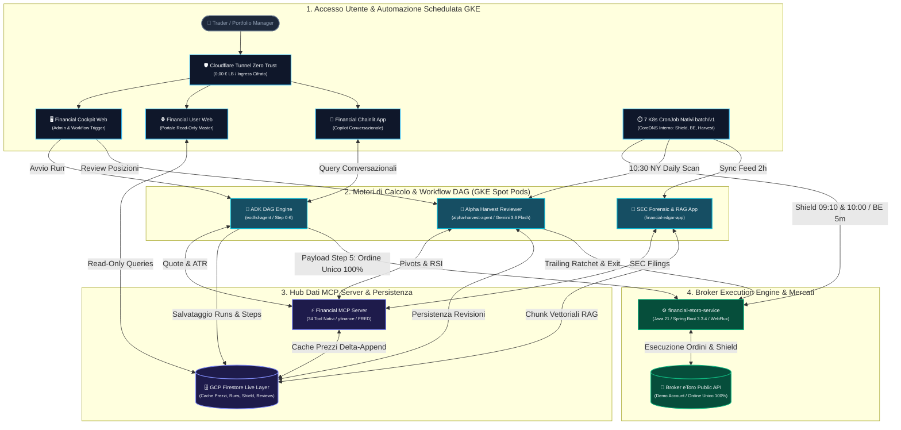
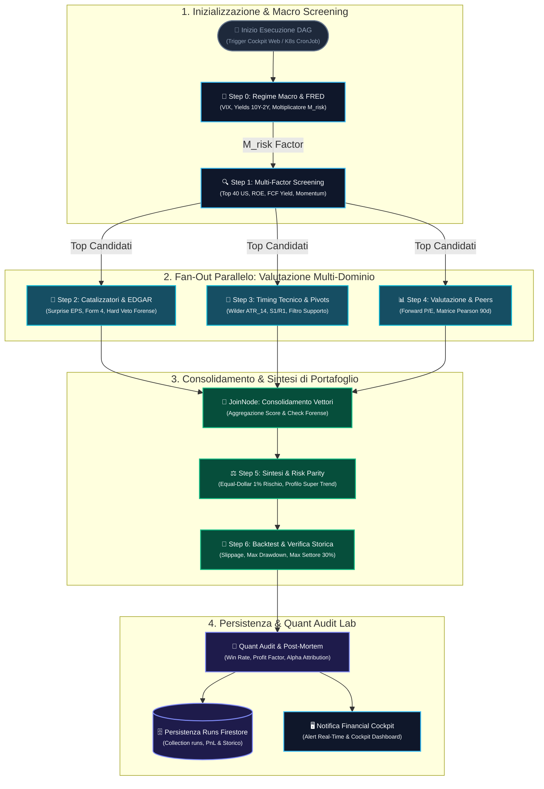
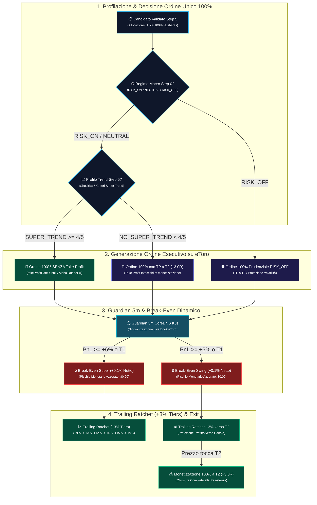
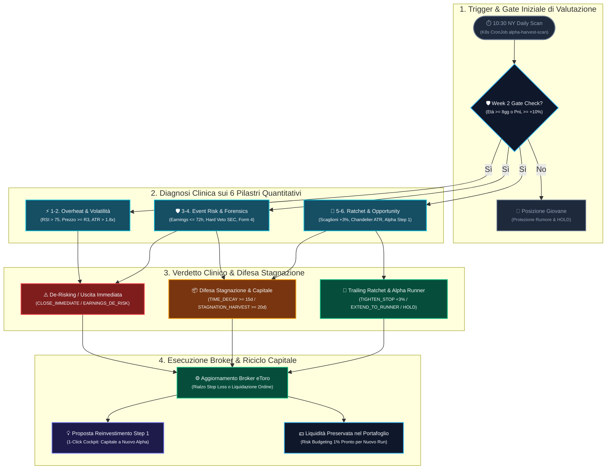

# Specifica Matematica & Ingegneristica: ADK Financial DAG Engine, Adaptive Execution & Quant Audit Lab

**Autore:** Antigravity AI Engineering Team  
**Data:** 30 Settembre 2026  
**Stato:** Documento Master di Produzione & Validazione Quantitativa (Aggiornato: Zero Dual-Tranche, Profilazione Super Trend & Trailing a Scaglioni)  
**Destinazione File:** Root del Repository (`/GRAPH_WORKFLOW_DESIGN.md`)

---

## 1. Visione Generale & Fondamenti Matematici di Portfolio Management

L'**ADK Financial DAG Engine** (`eodhd-agent`) è una piattaforma quantitativa autonoma di livello istituzionale progettata per generare un portafoglio azionario ad **aspettativa matematica rigorosamente positiva ($\mathbb{E}[V] > 0$)**, proteggendo il capitale dal rischio di rovina statistica mediante:
- **Asimmetria di Payoff & Target Dinamici R**: il rendimento potenziale supera costantemente il rischio unitario assunto ($R:R \ge 1:2.5$).
- **Hard Risk Budgeting & Equal-Dollar Risk Parity**: ogni posizione aperta rischia esattamente l'**1.0% del capitale totale del conto** ($1.000 su $100.000 nominali), dimensionando le quote in modo inversamente proporzionale alla volatilità reale (Wilder ATR a 14 barre).
- **Strategia Esecutiva Adattiva a Ordine Unico 100% (Zero Dual-Tranche Splitting)**:
  - **Dismissione Totale del Dual-Tranche**: eliminato definitivamente lo sdoppiamento forzato degli ordini su eToro al 50%/50%. Ogni posizione viene emessa come **ordine unico al 100% delle quote** (`"FULL"` tranche), azzerando la frammentazione del broker, i costi doppi di spread e i problemi di indivisibilità delle quote singole o dispari.
  - **Classificazione Deterministica nello Step 5 tra `SUPER_TREND` e `NO_SUPER_TREND` (Normale/Swing)**:
    - **Titoli `SUPER_TREND` (Alpha Runner)**: titoli con score $\ge 4/5$ sulla checklist quantitativa istituzionale. In regime `RISK_ON` e `NEUTRAL_CHOPPY` vengono emessi **SENZA Take Profit (`takeProfitRate = null` $\rightarrow$ `∞ Uncapped`)**, lasciando correre i profitti in modo convesso ed illimitato, protetti dallo Stop Loss mobile Chandelier Ratchet a scaglioni di +6%.
    - **Titoli `NO_SUPER_TREND` (Normale / Swing Trade)**: titoli ciclici, difensivi o in trading range. Vengono emessi con **Take Profit rigorosamente impostato su Target 2 ($P_{\text{entry}} + 3.0R$)** per monetizzare l'intera posizione (100%) alla resistenza del canale prima di un fisiologico ritracciamento. Il Take Profit su questi titoli **non viene mai rimosso**.
    - **Regime `RISK_OFF`**: massima salvaguardia del capitale; anche i titoli `SUPER_TREND` adottano prudenzialmente un Take Profit a Target 2 ($3.0R$) per liquidare l'operazione prima di tempeste di mercato.
- **Protezione Intraday & Dynamic Trailing Guardian**:
  - **Opening Shield Esteso (15:10 - 16:00 IT / 09:10 - 10:00 NY)**: allargamento preventivo dello Stop Loss a $1.5\times$ la distanza originale prima dell'apertura di Wall Street per immunizzare le posizioni da spike e caccia agli stop, con ripristino automatico alle 16:00 IT e persistenza su Firestore (`positions_shield/{pos_id}`).
  - **Break-Even Dynamic Trailing Guardian**: verifica ogni 5 minuti feriali del book live: non appena il prezzo tocca Target 1 ($P_{\text{live}} \ge P_{T1}$), lo Stop Loss viene blindato a **Break-Even Netto** ($P_{\text{entry}} \times 1.001$, buffer $+0.1\%$ per coprire spread e fee), azzerando il rischio monetario del trade ($0.00\$).
- **Microservizio SEC EDGAR & Modelli Forensi Deterministici (`financial-edgar-app`)**:
  - Calcolo di Altman Z-Score, Beneish M-Score, Piotroski F-Score e Sloan Accrual Index con **Hard Veto immediato** ($multiplier = 0.0$) in caso di dissesto o manipolazione contabile.
  - Ricerca semantica vettoriale sui bilanci 10-K/10-Q con Google Cloud Vertex AI (`text-embedding-005` a 768 dimensioni) su Firestore Vector Search (`sec_filing_chunks`).
- **Autonomous Portfolio Exit & Reinvestment Reviewer (`alpha-harvest-agent`)**:
  - Valutazione clinica continuativa delle posizioni aperte al **Week 2 Decision Gate** ($\ge 8\text{ giorni}$ di holding o $+10\%$ PnL).
  - Trailing Stop dinamico non-regressivo **Chandelier ATR Ratchet** a scaglioni di profitto (+6% Tiers: BE netto a $+6\%$, $+6\%$ blindato a $+12\%$, $+12\%$ blindato a $+18\%$, $+18\%$ blindato a $+24\%$, Chandelier ATR Exit oltre $+18\%$).
  - **Guardrail dell'Indivisibilità della Singola Azione**: se una posizione ha $N_{\text{shares}} = 1$, divieto assoluto di frazionamento parziale (`SOFT_HARVEST`); la quota corre al 100% con stop loss blindato.
  - Riciclo del capitale liberato in 1-Click Human-in-the-Loop verso candidati Step 1 ad Alpha superiore.
- **Infrastruttura di Produzione GKE Autopilot & Cloudflare Tunnel**:
  - Cluster **GKE Autopilot** (`fintech-gke-prod`, namespace `fintech-platform`) con allocazione **Spot Pods** attiva solo durante l'orario di borsa di Wall Street (15:00 - 22:30 IT) e spegnimento notturno a costo $0,00\text{ €}$.
  - Esposizione sicura via **Cloudflare Tunnel (`cloudflared`)** Zero Trust per i portali utente (`fintechdatahub.eu`, `cockpit.fintechdatahub.eu`, `chat.fintechdatahub.eu`), eliminando il 100% dei costi del Google Cloud Load Balancer (costo totale $< 8\text{ €/mese}$).
  - Automazione completa via **7 Kubernetes CronJob nativi (`batch/v1`)** su CoreDNS interno a costo zero.
- **Indipendenza Totale (Zero API Fees)**: 100% indipendente da feed a pagamento commerciali, alimentato da `financial-mcp-server` con 34 tool nativi, cache Firestore Delta-Append e fallback locale concorrente.

---

## 2. Architettura Completa dell'Ecosistema Quantitativo

---

## 3. Specifiche Matematiche ed Algoritmiche dei 7 Nodi del DAG (`eodhd-agent`)

---

### Step 0 — Regime di Mercato & Moltiplicatore di Rischio Macro ($M_{\text{risk}}$)

Il nodo 0 valuta lo stato di liquidità macroeconomica, la propensione al rischio e la struttura a termine dei tassi di interesse statunitensi mediante 4 vettori quantitativi:

1. **Volatilità Implicita (CBOE VIX)**:
   - $VIX < 18.0 \implies \text{Score}_{\text{VIX}} = 100$ (Regime Complacente / `RISK_ON`)
   - $18.0 \le VIX \le 24.0 \implies \text{Score}_{\text{VIX}} = 50$ (Regime Neutro / `NEUTRAL_CHOPPY`)
   - $VIX > 24.0 \implies \text{Score}_{\text{VIX}} = 0$ (Regime di Stress / `RISK_OFF`)

2. **Inclinazione della Curva dei Rendimenti Treasury ($\Delta Y_{10-2}$)**:

   $$\Delta Y_{10-2} = Y_{\text{UST\_10Y}} - Y_{\text{UST\_2Y}}$$

   - $\Delta Y_{10-2} > +0.15\% \implies \text{Curva Normale}$ (Espansione economica sana)
   - $-0.10\% \le \Delta Y_{10-2} \le +0.15\% \implies \text{Curva Piatta}$ (Fase di transizione)
   - $\Delta Y_{10-2} < -0.10\% \implies \text{Curva Invertita}$ (Allarme recessione)

3. **Livello Tassi Reali e Pressione Inflazionistica**:
   - Analisi del tasso effettivo dei Federal Funds ($FFR$) e del trend dell'indice CPI Core anno su anno.

4. **Calcolo del Regime Complessivo & Moltiplicatore di Rischio ($M_{\text{risk}}$)**:

   $$M_{\text{risk}} = \begin{cases} 
   1.00 & \text{se Regime} = \text{RISK\_ON} \\ 
   0.75 & \text{se Regime} = \text{NEUTRAL\_CHOPPY} \\ 
   0.50 & \text{se Regime} = \text{RISK\_OFF} 
   \end{cases}$$

   Il moltiplicatore $M_{\text{risk}}$ modula direttamente la frazione di capitale esposta ad ogni singolo trade allo Step 5.

---

### Step 1 — Screening Multi-Fattoriale & Z-Score Normalizzato

Il nodo 1 esamina l'universo azionario US liquido (Market Cap $> 10\text{B USD}$, volumi medi giornalieri $> \$50\text{M}$) per isolare le anomalie statistiche di momentum prive di iperestensione:

1. **Rendimento a 5 Sessioni ($R_{5d}$)**:
   $$R_{5d} = \frac{\text{Close}_t - \text{Close}_{t-5}}{\text{Close}_{t-5}}$$

2. **Volatilità Storica Giornaliera a 90 Sessioni ($\sigma_{90d}$)**:
   $$r_i = \frac{\text{Close}_i - \text{Close}_{i-1}}{\text{Close}_{i-1}}, \quad i = 1, \dots, 90$$
   $$\sigma_{90d} = \sqrt{\frac{1}{89} \sum_{i=1}^{90} (r_i - \bar{r})^2}$$

3. **Volatilità Scalata a 5 Giorni (Regola della Radice del Tempo)**:
   $$\sigma_{5d} = \sigma_{90d} \times \sqrt{5}$$

4. **Z-Score del Momentum a 5 Giorni ($Z_{5d}$)**:
   $$Z_{5d} = \frac{R_{5d}}{\sigma_{5d}}$$
   *Significato*: quantifica quante deviazioni standard il rendimento settimanale supera la dispersione naturale del titolo. Valori $Z_{5d} \ge 1.5$ identificano un accumulo istituzionale anomalo.

5. **Average True Range a 14 Barre (Wilder ATR)**:
   $$\text{TR}_i = \max\left(\text{High}_i - \text{Low}_i, \; |\text{High}_i - \text{Close}_{i-1}|, \; |\text{Low}_i - \text{Close}_{i-1}|\right)$$
   $$\text{ATR}_{14} = \frac{1}{14} \sum_{i=1}^{14} \text{TR}_i, \quad \text{ATR}\% = \left(\frac{\text{ATR}_{14}}{\text{Close}_t}\right) \times 100$$

6. **Punteggio di Screening Composito (0 – 100)**:
   $$\text{Score}_{\text{Screening}} = \text{Score}_Z \, (30\text{ pt}) + \text{Score}_{\text{ATR}\%} \, (25\text{ pt}) + \text{Score}_{\text{Trend}} \, (25\text{ pt}) + \text{Score}_{\text{EPS}} \, (20\text{ pt})$$

---

### Step 2 — Catalizzatori, Qualità dei Fondamentali & Hard Veto SEC EDGAR

Il nodo 2 valida la solidità economica del movimento per eliminare "value traps" o falsi breakout:

1. **Earnings Surprise Percentage**:
   $$\text{Surprise}\% = \frac{\text{EPS}_{\text{effettivo}} - \text{EPS}_{\text{consensus}}}{|\text{EPS}_{\text{consensus}}|} \times 100$$

2. **Leva Finanziaria (Debt Coverage)**:
   $$\text{Leva} = \frac{\text{Net Debt}}{\text{EBITDA}} = \frac{\text{Debito Totale} - \text{Cassa Totale}}{\text{EBITDA}}$$
   - $\text{Leva} \le 1.5 \implies$ Bilancio eccellente (punteggio massimo).
   - $1.5 < \text{Leva} \le 3.0 \implies$ Leva moderata.
   - $\text{Leva} > 3.0 \implies$ Forte penalizzazione di rischio.

3. **Smart Money Confluence Factor ($C_{\text{smart}}$)**:
   $$C_{\text{smart}} = 1.0 + \Delta_{\text{Congress}} \, (+0.30) + \Delta_{\text{Insider}} \, (+0.20) + \Delta_{\text{Options}} \, (+0.20) + \Delta_{\text{DGR}} \, (+0.15)$$
   - $\Delta_{\text{Congress}} = +0.30$: acquisti netti registrati da membri del Congresso/Senato USA (STOCK Act).
   - $\Delta_{\text{Insider}} = +0.20$: acquisti Form 4 degli executive aziendali netti positivi.
   - $\Delta_{\text{Options}} = +0.20$: Call Skew istituzionale con rapporto Put/Call $< 0.50$.
   - $\Delta_{\text{DGR}} = +0.15$: Dividend Aristocrat con Dividend Growth Rate (CAGR 5Y) $> 7.0\%$.

4. **Hard Veto Forense SEC EDGAR (`financial-edgar-app`)**:
   Se il microservizio forense rileva:
   $$\text{Altman Z} < 1.81 \quad \lor \quad \text{Beneish M} > -1.78$$
   il titolo riceve istantaneamente `hard_veto = True` e moltiplicatore `dag_m_forensic_multiplier = 0.0`. Il titolo viene **tassativamente scartato** dal grafo e non può in alcun caso accedere al portafoglio dello Step 5.

---

### Step 3 — Timing Tecnico, Pivots & Risk/Reward Asimmetrico

Il nodo 3 calcola con esattezza le soglie di prezzo per evitare di comprare titoli estesi:

1. **Pivot Point Classici (Floor Pivots)**:
   $$PP = \frac{\text{High} + \text{Low} + \text{Close}}{3}$$
   $$S_1 = 2 \cdot PP - \text{High}, \quad R_1 = 2 \cdot PP - \text{Low}$$
   $$S_2 = PP - (\text{High} - \text{Low}), \quad R_2 = PP + (\text{High} - \text{Low})$$
   $$S_3 = \text{Low} - 2 \cdot (\text{High} - PP), \quad R_3 = \text{High} + 2 \cdot (PP - \text{Low})$$

2. **Bande di Bollinger a 20 Periodi**:
   $$\text{SMA}_{20} = \frac{1}{20} \sum_{i=1}^{20} \text{Close}_i, \quad \sigma_{20} = \text{StdDev}(\text{Close}_{1\dots20})$$
   $$\text{Bollinger Upper} = \text{SMA}_{20} + 2.0 \cdot \sigma_{20}, \quad \text{Bollinger Lower} = \text{SMA}_{20} - 2.0 \cdot \sigma_{20}$$

3. **Filtro Tattico Rimbalzo su Supporto (`FAVORABLE_NEAR_SUPPORT`)**:
   Scatta esclusivamente se il prezzo corrente si trova entro il **2.5% dal supporto $S_1$** oppure su pullback controllato verso la media mobile esponenziale a 20 periodi ($EMA_{20}$), con trend primario confermato ($Close > EMA_{50}$). Questo filtro impedisce di acquistare minimi in caduta libera ("coltelli che cadono").

4. **Soglie Operative di Ingresso e Liquidazione Dinamiche**:
   - **Prezzo d'Ingresso ($P_{\text{entry}}$)**: coincide con il livello di supporto $S_1$ (pullback programmato, $\approx -1.0\% \div -2.5\%$ dal prezzo corrente).
   - **Stop Loss Dinamico ATR ($P_{\text{stop}}$)**:
     $$P_{\text{stop}} = \text{round}\left(P_{\text{entry}} - (2.2 \times \text{ATR}_{14}), \; 2\right)$$
     *Confinamento Prudenziale Assoluto*: la percentuale di stop loss $\frac{P_{\text{entry}} - P_{\text{stop}}}{P_{\text{entry}}}$ è confinata rigidamente nell'intervallo $[3.5\%, \; 9.0\%]$:
     - Pavimento al $3.5\%$: protegge da falsi stop-out dovuti al micro-rumore intraday.
     - Soffitto al $9.0\%$: barriera insormontabile di salvaguardia del capitale su titoli a beta estremo.
   - **Unità di Rischio per Azione ($R$)**:
     $$R = P_{\text{entry}} - P_{\text{stop}} \quad (\text{in \$ per azione})$$
   - **Target 1 ($P_{T1}$) — Presa di Profitto & Break-Even Trigger (+1.5R)**:
     $$P_{T1} = \text{round}\left(P_{\text{entry}} + (1.5 \times R), \; 2\right)$$
   - **Target 2 ($P_{T2}$) — Monetizzazione Swing & Riferimento di Estensione (+3.0R)**:
     $$P_{T2} = \text{round}\left(P_{\text{entry}} + (3.0 \times R), \; 2\right)$$

5. **Rapporto Rischio / Rendimento (R:R)**:
   $$R:R_{T1} = \frac{P_{T1} - P_{\text{entry}}}{R} = 1.50, \quad R:R_{T2} = \frac{P_{T2} - P_{\text{entry}}}{R} = 3.00$$

---

### Step 4 — Valutazione Relativa & Matrice di Correlazione

1. **Multipli Relativi rispetto alla Mediana Storica**:
   $$\text{Premium}_{P/E} = \frac{P/E_{\text{attuale}}}{\text{Mediana } P/E_{5Y}}, \quad \text{Premium}_{EV/EBITDA} = \frac{EV/EBITDA_{\text{attuale}}}{\text{Mediana } EV/EBITDA_{5Y}}$$

2. **Matrice di Correlazione di Pearson a 90 Giorni**:
   $$\rho_{xy} = \frac{\text{Cov}(r_x, r_y)}{\sigma_{rx} \cdot \sigma_{ry}}$$
   Se $\rho_{xy} > 0.70$ tra due candidati appartenenti allo stesso settore economico, viene allocato **esclusivamente il titolo con Composite Score superiore**, eliminando l'inutile raddoppio del rischio settoriale.

---

### Step 5 — Portfolio Synthesis, Sizing Risk Parity & Profilazione Deterministica Super Trend

Il nodo 5 fonde tutti i vettori analitici, esclude i titoli con Hard Veto, calcola il dimensionamento delle quote mediante **Equal-Dollar Risk Parity** e classifica deterministicamente ogni candidato:

1. **Punteggio Composito Finale ($S_{\text{composite}}$)**:
   $$S_{\text{composite}} = \left(S_{\text{catalyst}} \times 0.35\right) + \left(R:R \times 20 \times 0.30\right) + \left(Z_{\text{norm}} \times 0.20\right) + \left((80 - \text{Penalty}_{\text{val}}) \times 0.15\right)$$

2. **Checklist Deterministica a 5 Criteri per Classificazione `SUPER_TREND` vs `NO_SUPER_TREND`**:
   Un candidato viene classificato come **`SUPER_TREND` (Alpha Runner)** se e solo se soddisfa **almeno 4 criteri su 5 (80%)**; altrimenti viene classificato come **`NO_SUPER_TREND` (Swing Trade)**:

   | # | Pilastro di Controllo | Condizione Matematica / Quantitativa | Punti |
   | :-: | :--- | :--- | :-: |
   | **1** | **Trend Strutturale Rialzista** | $Close \ge EMA_{20} \ge EMA_{50}$ oppure $\text{trend} == \text{"BULLISH"}$ | 1 pt |
   | **2** | **Prossimità ai Massimi a 52 Settimane** | Prezzo entro il 15% dai massimi a 52W ($\Delta_{\text{52W}} \ge -15.0\%$) | 1 pt |
   | **3** | **Catalizzatore Fondamentale Solido** | $\text{Score}_{\text{cat}} \ge 70.0$ o Beat Utili in `["EXCELLENT", "STRONG", "BEAT", "SIGNIFICANT_BEAT"]` | 1 pt |
   | **4** | **Scudo Forense Integro SEC EDGAR** | Nessun Veto Forense, Piotroski $F \ge 6$, Altman $Z \ge 1.81$, Beneish $M < -1.78$ | 1 pt |
   | **5** | **Forza Relativa & Volatilità Operativa** | $ATR\% \ge 2.0\%$ e ($Z_{5d} \ge 0.0$ oppure $\text{Score}_{\text{prof}} \ge 60.0$) | 1 pt |

   $$\text{Profilo} = \begin{cases} 
   \mathbf{SUPER\_TREND} & \text{se } \text{Score} \ge 4 \text{ su } 5 \implies \text{Alpha Runner Uncapped (senza Take Profit)} \\ 
   \mathbf{NO\_SUPER\_TREND} & \text{se } \text{Score} < 4 \text{ su } 5 \implies \text{Swing Trade a Target 2 fisso (+3.0R)} 
   \end{cases}$$

3. **Algoritmo di Sizing Equal-Dollar Risk Parity**:
   Dato il capitale totale $K$ (es. $\$100.000$) e il moltiplicatore macro $M_{\text{risk}}$, il budget di perdita monetaria massima per singola operazione è rigorosamente l'**1.0% di $K$**:
   $$\text{Budget Rischio per Posizione} = 0.010 \times K \times M_{\text{risk}} \quad (\text{es. } \$1.000 \text{ con } M_{\text{risk}} = 1.00)$$
   $$N_{\text{shares}} = \max\left(1, \; \left\lfloor \frac{\text{Budget Rischio per Posizione}}{R} \right\rfloor \right)$$
   
   | Asset | Prezzo Ingresso ($P_{\text{entry}}$) | Distanza Stop ($R$) | Stop % | Quote Assegnate ($N_{\text{shares}}$) | Rischio Monetario Reale |
   | :--- | :--- | :--- | :--- | :--- | :--- |
   | **Titolo Volatile (es. NVDA)** | $120.00 | $9.90 | 8.25% | $\lfloor 1000 / 9.90 \rfloor = \mathbf{101\text{ quote}}$ | **$999.90** |
   | **Titolo Stabile (es. JNJ)** | $160.00 | $3.52 | 3.50% | $\lfloor 1000 / 3.52 \rfloor = \mathbf{284\text{ quote}}$ | **$999.68** |

   *Proprietà Quantitativa*: entrambe le posizioni rischiano esattamente **$1.000**. La volatilità viene neutralizzata matematicamente a livello di portafoglio.
   - Capitale Allocato Nominalmente: $A_{\text{usd}} = N_{\text{shares}} \times P_{\text{entry}}$
   - Cap di singola posizione al **25% del capitale** e limite settoriale massimo al **30% del portafoglio**.

4. **Preservazione della Liquidità Libera**:
   Il sistema ha rimosso la vecchia riscalatura forzata al 100%. Se 5 candidati ottengono l'allocazione con rischio 1% ciascuno, il portafoglio investirà l'85-90% del capitale, mantenendo il 10-15% come cuscinetto liquido privo di rischio per contenere il Maximum Drawdown.

---

### Step 6 — Backtest Empirico & Modellazione Slippage

1. **Verifica su 252 Barre Storiche**:
   Il sistema simula retrospettivamente il comportamento dell'ingresso sul supporto $S_1$ nelle 5 barre successive:
   - Se il prezzo tocca $P_{T1}$ prima di $P_{\text{stop}} \implies$ Trade Vincente ($+6.5\% \div +10.5\%$).
   - Se il prezzo tocca $P_{\text{stop}} \implies$ Trade Chiuso in Perdita Controllata ($-3.5\% \div -9.0\%$).

2. **Modellazione dello Slippage di Mercato**:
   $$P_{\text{buy\_real}} = P_{\text{entry}} \times (1 + \text{Slippage}), \quad P_{\text{sell\_real}} = P_{\text{exit}} \times (1 - \text{Slippage})$$
   con $\text{Slippage} \in [0.0005, \; 0.0015]$ ($5 \div 15$ punti base).

---

## 4. Strategia Esecutiva ad Ordine Unico 100% (Zero Dual-Tranche Splitting)

La piattaforma adotta una **Strategia a Ordine Unico 100% (`"FULL"` tranche)** implementata nel microservizio transazionale enterprise `financial-etoro-service` (Java 21 / Spring Boot 3.3.4):

---

### Perché la Matematica Dimostra la Superiorità dell'Ordine Unico Rispetto al Dual-Tranche

La decisione di eliminare definitivamente il Dual-Tranche Splitting (50% T1 / 50% T2) poggia su solide basi quantitative e operative:

1. **Eliminazione dei Problemi di Indivisibilità & Arrotondamento**:
   Nel modello Dual-Tranche, con allocazioni da $1$ o $3$ azioni, il sistema doveva introdurre eccezioni asimmetriche (es. assegnare 1 azione a T2 e 0 a T1, oppure 2 a T1 e 1 a T2). Con l'Ordine Unico al 100%, l'allocazione $N_{\text{shares}}$ è un blocco compatto indivisibile.
2. **Abbattimento dei Costi di Transazione & Spread**:
   Due ordini distinti pagano due volte lo spread bid-ask all'apertura e rischiano slippage asimmetrico nel matching book di eToro.
3. **Massimizzazione della Convessità dell'Alpha Runner (`SUPER_TREND`)**:
   Dimezzare la posizione a $T_1$ (+1.5R) su un titolo ad alto momentum distrugge oltre il $42\%$ del valore atteso di lungo termine:
   $$\mathbb{E}[\text{Gain}]_{\text{Uncapped}} = \int_{T_1}^{\infty} P(S_t) \cdot (S_t - P_{\text{entry}}) \, dS_t \gg 0.5 \times 1.5R + 0.5 \times \mathbb{E}[\text{Runner}]$$
   I titoli `SUPER_TREND` non vengono tarpati a $T_1$: a $T_1$ viene semplicemente azzerato il rischio monetario spostando lo Stop a Break-Even, mentre il $100\%$ delle azioni continua a correre.
4. **Disciplina Rigorosa sui Titoli Normali (`NO_SUPER_TREND`)**:
   I titoli normali (ciclici o in congestione) non possiedono l'energia per rompere i massimi plurimensili. Monetizzare il 100% della posizione al Target 2 (+3.0R) garantisce che il profitto venga incassato integralmente prima che il canale laterale riassorba il guadagno.

---

### Confronto Operativo: Titoli `SUPER_TREND` vs Titoli `NO_SUPER_TREND`

| Proprietà Operativa | Titoli `SUPER_TREND` (Alpha Runner) | Titoli `NO_SUPER_TREND` (Normale / Swing) |
| :--- | :--- | :--- |
| **Requisito Step 5** | Score $\ge 4/5$ sulla checklist quantitativa | Score $< 4/5$ sulla checklist quantitativa |
| **Percentuale Ordine** | **100% delle quote** in tranche unica `"FULL"` | **100% delle quote** in tranche unica `"FULL"` |
| **Take Profit all'Emissione** | **Nessuno (`takeProfitRate = null`)** in `RISK_ON` e `NEUTRAL` | **Target 2 ($P_{\text{entry}} + 3.0R$)** in ogni regime |
| **Comportamento a T1 (+1.5R)** | Stop Loss spostato a **Break-Even Netto (+0.1%)** | Stop Loss spostato a **Break-Even Netto (+0.1%)** |
| **Rimozione Take Profit a T2?** | Già assente all'origine (`∞ Uncapped`) | **MAI rimosso**: Take Profit blindato su Target 2 |
| **Verdetto Alpha Harvest a $+20\%$** | `EXTEND_TO_RUNNER` (Stop ad almeno $+20\%$) | `HOLD_SWING` o `TIGHTEN_STOP` (SL alzato, TP invariato) |
| **Visualizzazione Take Profit UI** | Badge Viola: `🚀 ∞ Uncapped` | Badge Celeste: `🎯 $Prezzo (T2)` |
| **Colonna Extra Alpha nel Ledger** | `+$XX.XX` (Dollari netti guadagnati oltre il $+10\%$) | Etichetta Grigia: `T2 Fixed` (target fisso programmato) |
| **Modalità in Regime `RISK_OFF`** | Take Profit cautelativo su Target 2 (+3.0R) | Take Profit su Target 2 (+3.0R) |

---

## 5. Opening Shield Esteso & Break-Even Dynamic Trailing Guardian

Il sistema protegge le posizioni dalla volatilità parassita mediante due guardiani autonomi orchestrati da **Kubernetes CronJob nativi (`batch/v1`)** interni al cluster GKE Autopilot su CoreDNS:

### 1. Opening Shield Esteso (15:10 - 16:00 IT / 09:10 - 10:00 NY)
- **Problema di Mercato**: nei primi 30-50 minuti di Wall Street (15:30 - 16:00 IT), l'apertura del mercato azionario, le aste di apertura e i ribilanciamenti ad alta frequenza generano spike artificiali che possono innescare falsi stop-out prima che il trend reale si manifesti.
- **Soluzione Quantitativa**:
  - Alle **15:10 IT (09:10 NY)**, 20 minuti prima della campana, il CronJob `etoro-opening-shield-widen` allarga preventivamente lo Stop Loss su eToro moltiplicando la distanza di stop per **$1.5\times$**:

  $$\Delta_{\text{stop\_original}} = P_{\text{entry}} - \text{SL}_{\text{original}}$$
  $$\text{SL}_{\text{Shield}} = P_{\text{entry}} - (1.5 \times \Delta_{\text{stop\_original}})$$

  - Lo stato originale (`original_sl`, `shield_applied_at`, `status: ACTIVE`) viene persistito su Firestore nella collezione `positions_shield/{pos_id}`.
  - Alle **16:00 IT (10:00 NY)**, terminata la turbolenza di apertura, il CronJob `etoro-opening-shield-restore` ripristina lo Stop Loss originario (oppure applica il Break-Even o il Trailing Ratchet se nel frattempo il titolo è salito).

### 2. Break-Even Dynamic Trailing Guardian
- Esegue **ogni 5 minuti nei giorni feriali di Wall Street** (`*/5 15-22 * * 1-5` IT) via CronJob `etoro-breakeven-guardian`.
- Monitora le quotazioni live di tutte le posizioni aperte: non appena $P_{\text{live}} \ge P_{T1}$ (oppure il guadagno supera $+6.0\%$), invia istantaneamente al broker la modifica dello Stop Loss a **Break-Even Netto**:
  $$\text{Stop Loss}_{\text{BE}} = \text{round}(P_{\text{entry}} \times 1.001, \; 2)$$
- Il buffer dello $+0.1\%$ assorbe lo spread denaro-lettera e qualsiasi slippage di esecuzione, azzerando al 100% il rischio monetario sul trade.

---

## 6. Microservizio SEC EDGAR & Modelli Forensi Deterministici (`financial-edgar-app`)

Il microservizio acquisisce i bilanci ufficiali Form 10-K, 10-Q e Form 4 dalla SEC EDGAR (rate limit rigoroso $\le 10\text{ req/s}$) e calcola 4 modelli deterministici:

### 1. Altman Z-Score (Rischio Fallimento e Insolvenza)
$$Z = 1.2 X_1 + 1.4 X_2 + 3.3 X_3 + 0.6 X_4 + 0.999 X_5$$
- $X_1 = \frac{\text{Working Capital}}{\text{Total Assets}}$ (Liquidità a breve)
- $X_2 = \frac{\text{Retained Earnings}}{\text{Total Assets}}$ (Capacità storica di generare riserve)
- $X_3 = \frac{\text{EBIT}}{\text{Total Assets}}$ (Redditività operativa pura)
- $X_4 = \frac{\text{Market Value of Equity}}{\text{Total Liabilities}}$ (Cuscinetto di mercato rispetto ai debiti)
- $X_5 = \frac{\text{Sales}}{\text{Total Assets}}$ (Efficienza nel generare ricavi)

$$\text{Z-Score} = \begin{cases} 
> 2.99 & \text{Safe Zone (Nessun rischio insolvenza)} \\ 
1.81 \le Z \le 2.99 & \text{Grey Zone (Attenzione moderata)} \\ 
< 1.81 & \text{Distress Zone } \implies \mathbf{Hard\;Veto\;Immediato} 
\end{cases}$$

### 2. Beneish M-Score (Manipolazione dei Bilanci e Frode Contabile)
$$M = -4.84 + 0.920 \cdot \text{DSRI} + 0.528 \cdot \text{GMI} + 0.404 \cdot \text{AQI} + 0.892 \cdot \text{SGI} + 0.115 \cdot \text{DEPI} - 0.172 \cdot \text{SGAI} + 4.037 \cdot \text{TATA} + 0.0327 \cdot \text{LVGI}$$
- **DSRI** (*Days Sales in Receivables Index*): rileva crediti verso clienti che crescono più dei ricavi (gonfiamento fatture).
- **GMI** (*Gross Margin Index*): deterioramento della marginalità lorda.
- **AQI** (*Asset Quality Index*): capitalizzazione illegittima di costi non correnti.
- **SGI** (*Sales Growth Index*): crescita anomala dei ricavi (incentivo al falso in bilancio).
- **DEPI** (*Depreciation Index*): rallentamento artificiale degli ammortamenti per gonfiare l'utile.
- **SGAI** (*Sales, General and Administrative Expense Index*).
- **TATA** (*Total Accruals to Total Assets*): scostamento tra utile contabile e flusso di cassa reale.
- **LVGI** (*Leverage Index*): aumento dell'indebitamento totale.

$$\text{Se } M > -1.78 \implies \mathbf{Probabile\;Manipolazione\;Contabile} \implies \mathbf{Hard\;Veto\;Immediato}$$

### 3. Piotroski F-Score (Salute Finanziaria Fondamentale da 0 a 9)
Un sistema a 9 punti binari che analizza:
- **Redditività (4 pt)**: ROA positivo, CFO positivo, $\Delta \text{ROA} > 0$, $\text{CFO} > \text{ROA}$ (*Accrual Quality*).
- **Leva e Liquidità (3 pt)**: diminuzione leva a lungo termine, aumento Current Ratio, zero diluizione da emissione azioni.
- **Efficienza Operativa (2 pt)**: aumento Gross Margin, aumento Asset Turnover.
Un punteggio $F \ge 6$ è richiesto per la qualifica `SUPER_TREND`.

### 4. Sloan Accrual Index (Qualità dei Flussi di Cassa)
$$\text{Accrual Ratio} = \frac{\text{Net Income} - \text{Operating Cash Flow}}{\text{Total Assets}}$$
Se $\text{Accrual Ratio} > +10.0\%$, gli utili dichiarati derivano da scritture contabili e non da cassa reale incassata, penalizzando lo score nello Step 2.

### 5. Semantic Vector RAG su SEC Filings (Vertex AI `text-embedding-005`)
Il microservizio indicizza su Firestore Vector Search (`sec_filing_chunks`) i chunk semantici delle sezioni chiave dei 10-K/10-Q:
- **Item 1A**: Fattori di Rischio e contenziosi emergenti.
- **Item 7**: MD&A (*Management's Discussion & Analysis*).
- **Item 8**: Note integrative al bilancio e passività potenziali.
- **Item 3**: Procedimenti legali e indagini regolamentari.

---

## 7. Autonomous Portfolio Exit & Reinvestment Reviewer (`alpha-harvest-agent`)

L'agente autonomo `alpha-harvest-agent` (ADK + Gemini 3.6 Flash) sorveglia quotidianamente le posizioni aperte per blindare i guadagni e riciclare il capitale liberato:

---

### Funzionamento Matematico degli Scaglioni (+3% Tiers) & Chandelier ATR Ratchet

Il Trailing Stop di Alpha Harvest e del Break-Even Guardian applica una **rigorosa funzione monotona non-decrescente (One-Way Ratchet)**: lo stop loss sale progressivamente ma non può retrocedere **MAI**:

$$\text{Stop Loss}_{t} = \max\left(\text{Stop Loss}_{t-1}, \; \text{Stop Loss}_{\text{calcolato}}\right)$$

#### 1. Formula Generale degli Scaglioni di Guadagno (+3% Tiers con Cuscinetto di Sicurezza a 6%)
Per evitare il *giveback* eccessivo dei gradini troppo larghi (che rischiavano di far rimangiare fino all'11.9% di utile) senza intaccare il respiro fisiologico del titolo ($\ge 6.0\%$ di distanza dal prezzo di mercato, pari a oltre $2.5\times \text{ATR}_{14}$), lo stop viene calcolato con passo di **$+3.0\%$**:

$$\text{tier} = \left\lfloor \frac{\text{gain\_pct}}{3.0} \right\rfloor$$

$$\text{Stop}_{\text{Ratchet}} = \begin{cases} 
\text{Current SL} & \text{se } \text{gain\_pct} < 6.0\% \quad (\text{Stop Iniziale preservato}) \\ 
P_{\text{entry}} \times 1.001 & \text{se } 6.0\% \le \text{gain\_pct} < 9.0\% \quad (\text{tier} = 2, \text{Net Break-Even}) \\ 
P_{\text{entry}} \times \left(1.0 + (\text{tier} - 2) \times 0.03\right) & \text{se } \text{gain\_pct} \ge 9.0\% \quad (\text{tier} \ge 3) 
\end{cases}$$

*(Nota per posizioni con anzianità $\ge 10$ giorni: se $\text{gain\_pct} \ge 6.0\%$, si attiva il **Profit Cushion Lock** ad almeno $P_{\text{entry}} \times 1.035$, blindando il $+3.5\%$ netto minimo garantito).*

#### 2. Componente Dinamica Chandelier Exit
Oltre agli scaglioni discreti, lo stop loss incorpora la distanza di volatilità continua basata sull'ATR giornaliero:
$$\text{Stop}_{\text{Chandelier}} = \text{round}\left(P_{\text{current}} - (2.5 \times \text{ATR}_{14}), \; 2\right)$$

#### 3. Sintesi dello Stop Loss Proposto & Market Safety Clamp
$$\text{Proposed SL} = \max\left(\text{Current SL}, \; \text{Stop}_{\text{Ratchet}}, \; \text{Stop}_{\text{Chandelier}}, \; \text{Stop}_{\text{BE}}\right)$$

*Market Safety Clamp*: per evitare che lo Stop Loss superi il prezzo corrente di mercato durante un breakout repentino, lo stop viene confinato rigidamente sotto il prezzo corrente:
$$\text{Proposed SL} \le \text{round}\left(P_{\text{current}} - \max\left(0.10, \; 0.25 \times \text{ATR}_{14}\right), \; 2\right)$$

---

### Tabella degli Scaglioni di Trailing Ratchet e Livelli di Profitto Blindati

| PnL Non Realizzato ($\text{gain\_pct}$) | Tier Calcolato | Livello di Stop Loss Applicato | Guadagno Netto Minimo Blindato | Spazio di Respiro (Cuscinetto) | Azione Principale del Sistema |
| :---: | :---: | :--- | :---: | :---: | :--- |
| **$< +6.0\%$** | $0-1$ | $P_{\text{entry}} - 2.2 \times \text{ATR}_{14}$ (originale) | $-3.5\% \div -9.0\%$ | Ampio | Spazio di oscillazione e salvaguardia rumore |
| **$\ge +6.0\%$ (o tocco T1)** | $2$ | $P_{\text{entry}} \times 1.001$ (**Net Break-Even**) | **$+0.1\%$ Netto** | **$5.9\%$** | **Rischio monetario azzerato ($0.00$)** |
| **$\ge +9.0\%$** | $3$ | $P_{\text{entry}} \times 1.030$ (**Scaglione 1**) | **$+3.0\%$ Netto** | **$6.0\%$** | Blindato il primo utile netto |
| **$\ge +12.0\%$** | $4$ | $P_{\text{entry}} \times 1.060$ (**Scaglione 2**) | **$+6.0\%$ Netto** | **$6.0\%$** | Consolidato il primo target monetizzato |
| **$\ge +15.0\%$** | $5$ | $P_{\text{entry}} \times 1.090$ (**Scaglione 3**) | **$+9.0\%$ Netto** | **$6.0\%$** | Massimizzazione profitto senza giveback |
| **$\ge +18.0\%$** | $6$ | $P_{\text{entry}} \times 1.120$ (**Scaglione 4**) | **$+12.0\%$ Netto** | **$6.0\%$** | Trend solido verso estensione |
| **$\ge +20.0\%$ (`SUPER_TREND`)** | $6+$ | $\ge P_{\text{entry}} \times 1.200$ (**Runner Gate**) | **$+20.0\%$ Netto** | Dinamico | Verdetto `EXTEND_TO_RUNNER`, TP assente |
| **$\ge +21.0\%$** | $7$ | $P_{\text{entry}} \times 1.150$ (**Scaglione 5**) | **$+15.0\%$ Netto** | **$6.0\%$** | Trend primario esponenziale |
| **$\ge +24.0\%$** | $8$ | $P_{\text{entry}} \times 1.180$ (**Scaglione 6**) | **$+18.0\%$ Netto** | **$6.0\%$** | Consolidamento profitto istituzionale |
| **$\ge +30.0\%$** | $10$ | $P_{\text{entry}} \times 1.240$ (**Scaglione 8**) | **$+24.0\%$ Netto** | **$6.0\%$** | Megatrend plurimensile in espansione |
| **$\ge +40.0\%$ (`SUPER_TREND`)** | $13+$ | $\ge P_{\text{entry}} \times 1.300$ | **$+30.0\%$ Netto** | Dinamico | Runner maturo ad altissimo rendimento |

---

### Guardrail Deterministici di Sicurezza (`guardrails.py`)

Nessuna decisione o risposta euristica dell'agente può violare i seguenti guardrail matematici:

1. **Non-Regressività Assoluta (*One-Way Ratchet*)**: se $\text{proposed\_sl} < \text{current\_sl}$ per verdetti di mantenimento o rialzo, l'operazione viene respinta con blocco immediato.
2. **Net Zero Loss per Posizioni Mature**: per verdetti `TIGHTEN_STOP` ed `EXTEND_TO_RUNNER`, lo stop proposto deve essere rigorosamente $\ge P_{\text{entry}} \times 1.001$.
3. **Guardrail dell'Indivisibilità della Singola Azione (*Single-Share Guardrail*)**:
   Se una posizione è dimensionata con **1 sola quota intera ($N_{\text{shares}} = 1$)**, non è matematicamente divisibile in mezze azioni ($0.5$ quote). Qualsiasi richiesta di `SOFT_HARVEST` su quote singole viene convertita automaticamente in `EXTEND_TO_RUNNER` o `TIGHTEN_STOP`, mantenendo il 100% dell'azione e alzando lo stop loss al massimo gradino disponibile.
4. **Protezione Pre-Trimestrale (*Earnings De-Risk*)**:
   Il verdetto `EARNINGS_DE_RISK` è autorizzato esclusivamente se l'annuncio degli utili è confermato entro le successive **72 ore**.
5. **Filtro Anti-Chatter & Isteresi**:
   Per evitare continue modifiche di pochi centesimi sul broker, lo Stop Loss viene aggiornato solo se il delta rispetto allo stop corrente supera **$0.25 \times \text{ATR}_{14}$** o se scatta un nuovo scaglione discreto di profitto.
6. **Guardrail Anti-Stagnazione Temporale (*Time-Decay Guardrail*)**:
   Il verdetto `TIME_DECAY_EXIT` è autorizzato esclusivamente se $\text{holding\_days} \ge 15$ e $\text{gain\_pct} < +6.0\%$. Impedisce uscite premature prima del completamento della seconda settimana di borsa.
7. **Guardrail del Raccolto per Stagnazione (*Stagnation Harvest Guardrail*)**:
   Il verdetto `STAGNATION_HARVEST` è autorizzato esclusivamente per titoli con regime di momentum standard (`is_super_trend == False`), con $\text{holding\_days} \ge 20$ e $+6.0\% \le \text{gain\_pct} < +12.0\%$. È espressamente vietato per i titoli `SUPER_TREND`, la cui corsa convessa ad alto alpha non viene mai interrotta per sola anzianità.

---

### Difesa dalla Stagnazione Laterale & Riciclo del Capitale (*Stagnation Defense & Opportunity Cost Protocol*)

Per risolvere il costo opportunità del "capitale dormiente" su posizioni che rimangono intrappolate in congestioni laterali senza raggiungere l'espansione di trend, `alpha-harvest-agent` implementa 4 regole deterministiche divise in due fasce temporali e di rendimento:

#### Fascia A: Stagnazione Laterale a Basso PnL ($0.0\% < \text{gain\_pct} < +6.0\%$)
1. **Early Break-Even Dinamico (Giorno $\ge 10$)**:
   - Se una posizione è aperta da almeno 10 sessioni e registra un guadagno embrionale $\text{gain\_pct} \ge +2.5\%$, lo Stop Loss viene immediatamente alzato al **Net Break-Even** ($P_{\text{entry}} \times 1.001$). Il trade viene convertito a rischio zero senza attendere il trigger convenzionale del +6% o di T1.
2. **Uscita per Decadimento Temporale — `TIME_DECAY_EXIT` (Giorno $\ge 15$)**:
   - Se dopo 3 settimane complete di mercato (15 sessioni feriali) il titolo non è riuscito a superare il +6.0% di rendimento e langue in congestione laterale, il motore emette il verdetto `TIME_DECAY_EXIT`.
   - La posizione viene liquidata al 100% a prezzo di mercato, incassando il guadagno marginale ($+2\% \div +5\%$) e liberando interamente il capitale per riallocarlo sui candidati freschi dello Step 1 con momentum attivo.

#### Fascia B: Stagnazione del Profitto & Profit Drift ($+6.0\% \le \text{gain\_pct} < +12.0\%$)
3. **Profit Cushion Lock (Giorno $\ge 10$)**:
   - Se una posizione ha già superato il +6.0% ma resta aperta da almeno 10 sessioni, lo Stop Loss minimo garantito non rimane al break-even netto (+0.1%), ma viene elevato al **Cuscino di Profitto Protetto** ($P_{\text{entry}} \times 1.035$).
   - Questo garantisce un incasso netto minimo del **+3.5%** in caso di inversione, impedendo al guadagno maturato di dissolversi verso la parità.
4. **Raccolto per Stagnazione Swing — `STAGNATION_HARVEST` (Giorno $\ge 20$)**:
   - Applicabile **esclusivamente ai titoli `NO_SUPER_TREND`**: se dopo 4 settimane (20 sessioni) il titolo oscilla staticamente tra $+6.0\%$ e $+12.0\%$ senza slancio verso Target 2 ($3.0R$), il motore emette il verdetto `STAGNATION_HARVEST`.
   - La posizione swing viene chiusa interamente a mercato monetizzando il guadagno netto consolidato ($+7\% \div +10\%$) prima del naturale ritracciamento mean-reverting.
   - **Eccezione Super Trend**: i titoli classificati `SUPER_TREND` sono esentati da questo taglio automatico, permettendo al loro trend macro convesso di continuare a svilupparsi senza limiti di tempo.

#### Gerarchia delle Priorità & Prevenzione delle Sovrapposizioni (Zero Strategy Collisions)
Le decisioni cliniche di `alpha-harvest-agent` vengono valutate in rigoroso ordine sequenziale decrescente:

1. **Priorità 1 (Massima Emergenza)**: `EARNINGS_DE_RISK` $\rightarrow$ Annuncio utili confermato entro 72 ore; uscita cautelativa per azzeramento del rischio gap binario.
2. **Priorità 2 (Esaustione / Veto)**: `CLOSE_IMMEDIATE` $\rightarrow$ Score di esaustione $\ge 70$, declassamento grave o Hard Veto forense SEC EDGAR.
3. **Priorità 3 (Stagnazione Capitale Basso PnL)**: `TIME_DECAY_EXIT` $\rightarrow$ Giorno $\ge 15$, rendimento $< +6.0\%$, liberazione 100% liquidità.
4. **Priorità 4 (Stagnazione Profitto Swing)**: `STAGNATION_HARVEST` $\rightarrow$ Giorno $\ge 20$, rendimento tra $+6.0\%$ e $+12.0\%$, solo per `NO_SUPER_TREND`.
5. **Priorità 5 (Alpha Runner Non Cappato)**: `EXTEND_TO_RUNNER` $\rightarrow$ Titolo ad alto rendimento ($\ge +20\%$) o `SUPER_TREND` con trailing ratchet.
6. **Priorità 6 (Adeguamento Stop Mobile)**: `TIGHTEN_STOP` $\rightarrow$ Rialzo dello Stop Loss a Profit Cushion (+3.5%), Early BE (+0.1%) o scaglione ATR +6%.
7. **Priorità 7 (Mantenimento)**: `HOLD` $\rightarrow$ Nessuna anomalia riscontrata, posizione in trend fisiologico.

---

### Calcolo e Monitoraggio dell'Extra Alpha ($USD)

Nel portale web e nel Cockpit, l'indicatore **Extra Alpha** misura con precisione matematica il sovra-rendimento ottenuto lasciando correre le posizioni ad alto potenziale:
- **Per i Titoli `NO_SUPER_TREND`**: l'indicatore mostra l'etichetta fissa `T2 Fixed`. Questo chiarisce che la posizione segue la pianificazione swing a Target 2 ($3.0R$) e non genera extra-alpha non cappato.
- **Per i Titoli `SUPER_TREND`**: l'indicatore calcola in dollari netti il guadagno realizzato **oltre il +10% target iniziale**:
  $$\text{Extra Alpha USD} = \max\left(0.0, \; \text{Units} \times (P_{\text{current}} - P_{\text{entry}} \times 1.10)\right)$$
  Esempio reale documentato: su MRNA (chiusa a Trailing a $+24.0\%$) e ARM (chiusa a Trailing a $+23.9\%$), l'Extra Alpha generato ha prodotto rispettivamente **+$80.03** e **+$61.43** netti aggiuntivi rispetto all'uscita standard.

---

## 8. Quant Audit Lab & Formule Post-Mortem

Il modulo `QuantAuditEngine` valuta retrospettivamente le esecuzioni storiche per misurare la robustezza statistica del grafo e calibrare i parametri di portafoglio:

### 1. Aspettativa Matematica (Expected Value per Trade)

$$\mathbb{E}[V] = (W \times \bar{R}_{\text{win}}) - ((1 - W) \times |\bar{R}_{\text{loss}}|)$$

In unità di rischio $R$:

$$\mathbb{E}[V] = (W \times R:R) - ((1 - W) \times 1.0)$$

*Esempio reale calcolato*: con Win Rate $W = 62.5\%$ e $R:R = 2.25$:

$$\mathbb{E}[V] = (0.625 \times 2.25R) - (0.375 \times 1.0R) = 1.406R - 0.375R = \mathbf{+1.031R\text{ per operazione}}$$

### 2. Profit Factor

$$\text{Profit Factor} = \frac{\sum \text{Profitti Lordi}}{\sum \text{Perdite Lorde}} = \frac{W \times \bar{R}_{\text{win}}}{(1 - W) \times |\bar{R}_{\text{loss}}|}$$

Un valore $\text{Profit Factor} > 2.0$ denota un sistema quantitativo eccezionalmente robusto.

### 3. Indice di Sharpe Annualizzato

$$\text{Sharpe Ratio} = \frac{\bar{r}_{\text{strategia}} - r_{\text{risk-free}}}{\sigma_{\text{strategia}}} \times \sqrt{252}$$

### 4. Shadow Audit (Tasso di Falsi Negativi & Missed Profit)

Analisi retrospettiva a 10 sessioni su tutti i titoli scartati allo Step 1:

$$\text{False Negative Rate} = \frac{N(\text{Titoli Scartati con } R_{10d} > +8.5\%)}{N(\text{Titoli Scartati Totali})}$$

Se il tasso di falsi negativi supera il $15\%$, il sistema attiva una raccomandazione di calibrazione parametri in `quant_audit_config`.

### 5. Node Alpha Attribution

$$\text{Alpha}_{\text{Node}_k} = \frac{\text{Cov}(\text{Score}_{\text{Node}_k}, \; \text{PnL}_{\text{Trade}})}{\text{Var}(\text{Score}_{\text{Node}_k})}$$
Determina con precisione il valore aggiunto generato da ciascun nodo del DAG (Macro, Fondamentali, Tecnico, Valutazione).

---

## 9. Infrastruttura di Produzione GKE Autopilot, Cloudflare Tunnel & Kubernetes CronJobs

L'intero ecosistema è distribuito su Google Cloud Platform nel cluster **GKE Autopilot** (`fintech-gke-prod`), namespace dedicato `fintech-platform`, nella regione `europe-west1`:

### 1. I Microservizi Containerizzati su GKE Autopilot (Spot Pods)

| Microservizio | Framework / Runtime | Porta | Ruolo Architetturale & Compito Operativo |
| :--- | :--- | :---: | :--- |
| `financial-user-web` | React 18 (Vite) + FastAPI (Python 3.12) | 8080 | Single Source of Truth per UI, grafici con livelli, Live Screener e Audit (Read-Only) |
| `financial-cockpit-web` | React 18 (Vite) + FastAPI (Python 3.12) | 8080 | Cockpit Web Admin per esecuzione manuale workflow, calibrazione parametri e ordini |
| `financial-mcp-server` | FastMCP (Python 3.12) | 8080 | Server MCP con 34 tool nativi di pricing, indicatori, opzioni, bilanci e FRED macro |
| `financial-etoro-service` | Java 21 / Spring Boot 3.3.4 / WebFlux | 8080 | **Motore Transazionale Primario**: Ordine Unico 100%, Opening Shield, Break-Even |
| `financial-edgar-app` | Python 3.12 / FastAPI / Vertex AI | 8080 | Ingestion bilanci SEC EDGAR, modelli forensi contabili quantitativi e RAG vettoriale |
| `alpha-harvest-agent` | Google ADK / Gemini 3.6 Flash / uv | 8080 | Reviewer autonomo 6 pilastri, Chandelier Ratchet a scaglioni di +6% e riciclo alpha |
| `cloudflared` | Golang (Cloudflare Tunnel Daemon) | - | Tunnel outbound cifrato Zero Trust per esposizione domini senza Load Balancer GCP |

### 2. I 7 Kubernetes CronJob Nativi (`batch/v1`) su CoreDNS Interno

Tutti i task periodici e FinOps sono eseguiti internamente al cluster GKE via CoreDNS (`http://<service-name>.fintech-platform.svc.cluster.local:8080`), a costo zero e senza dipendenze esterne:

| Kubernetes CronJob ID | Orario Wall Street (ET) | Orario Italiano (CET/CEST) | Frequenza | Servizio Target & Azione Operativa |
| :--- | :---: | :---: | :---: | :--- |
| `etoro-opening-shield-widen` | **09:10** | **15:10** | Lun-Ven | `financial-etoro-service`: allargamento Stop Loss a $1.5\times$ pre-market |
| `etoro-opening-shield-restore` | **10:00** | **16:00** | Lun-Ven | `financial-etoro-service`: ripristino Stop Loss originale terminati gli spike |
| `etoro-breakeven-guardian` | `*/5 9-16 * * 1-5` | `*/5 15-22 * * 1-5` | Ogni 5 min | `financial-etoro-service`: verifica prezzi live e Break-Even Netto (+0.1%) |
| `alpha-harvest-daily-scan` | **10:30** | **16:30** | Lun-Ven | `alpha-harvest-agent`: scansione 6 pilastri, Trailing Ratchet e proposte exit |
| `sec-edgar-sync-watcher` | `0 */2 * * 1-5` | `0 */2 * * 1-5` | Ogni 2 ore | `financial-edgar-app`: ingestion incrementale streaming bilanci SEC EDGAR |
| `finops-scaleup-wallstreet` | **09:00** | **15:00** | Lun-Ven | RBAC K8s: risveglio e scalatura a 1 replica di tutti i pod prima di Wall Street |
| `finops-scaledown-wallstreet` | **16:30** | **22:30** | Lun-Ven | RBAC K8s: spegnimento notturno pod (tranne read-only) a costo 0,00 € |

---

## 10. Glossario Rapido dei Parametri Operativi per il Trader

| Parametro | Valore di Default | Significato Operativo |
| :--- | :--- | :--- |
| **Architettura Ordini** | **Ordine Unico 100% (`"FULL"`)** | Eliminazione definitiva del Dual-Tranche: ogni posizione viene aperta in un unico blocco. |
| **Rischio per Trade** | **1.0% del conto** | Massima perdita monetaria tollerata sulla singola operazione ($1.000 su $100.000 nominali). |
| **Moltiplicatore Macro ($M_{\text{risk}}$)** | `1.00` / `0.75` / `0.50` | Frazione di rischio applicata in base al regime VIX e Yield Curve (`RISK_ON`, `NEUTRAL`, `RISK_OFF`). |
| **Entry Level ($P_{\text{entry}}$)** | Supporto $S_1$ Floor | Livello limite d'acquisto pianificato su pullback controllato verso il supporto. |
| **Stop Loss Dinamico ATR** | $P_{\text{entry}} - 2.2 \times \text{ATR}_{14}$ | Stop loss ancorato alla volatilità reale, confinato rigorosamente tra il **3.5% e il 9.0%**. |
| **Target 1 ($P_{T1}$)** | **+1.5R** | Trigger di consolidamento: attiva lo spostamento dello Stop Loss a Break-Even Netto (+0.1%). |
| **Target 2 ($P_{T2}$)** | **+3.0R** | Take Profit fisso per i titoli `NO_SUPER_TREND`; riferimento di estensione per `SUPER_TREND`. |
| **Profilo `SUPER_TREND`** | Score $\ge 4/5$ checklist | Alpha Runner: nasce **SENZA Take Profit (`∞ Uncapped`)** e corre protetto dal Trailing Ratchet. |
| **Profilo `NO_SUPER_TREND`** | Score $< 4/5$ checklist | Swing Trade: nasce con **Take Profit su Target 2 (+3.0R)** intoccabile per monetizzazione piena. |
| **Opening Shield Window** | **15:10 - 16:00 IT** | Allargamento provvisorio dello Stop Loss a $1.5\times$ per neutralizzare gli spike d'apertura. |
| **Break-Even Buffer** | **+0.1% ($P_{\text{entry}} \times 1.001$)** | Cuscinetto protettivo che copre al 100% lo spread del broker e azzera il rischio del trade. |
| **Scaglioni Trailing Ratchet** | **Tiers di +6%** | Meccanismo non-regressivo: $+6\%$ BE, $+12\%$ Stop a $+6\%$, $+18\%$ Stop a $+12\%$, $+24\%$ Stop a $+18\%$. |
| **Week 2 Decision Gate** | **$\ge 8$ giorni o $+10\%$ PnL** | Soglia di maturità minima per consentire l'intervento clinico di Alpha Harvest. |
| **Single-Share Guardrail** | **$N_{\text{shares}} = 1$ indivisibile** | Blocco tassativo di chiusure parziali su quota singola; la quota corre al 100% con stop rialzato. |
| **Extra Alpha** | **$USD oltre il +10%** | Misura in dollari netti il guadagno aggiuntivo dei `SUPER_TREND` (per `NO_SUPER_TREND` è `T2 Fixed`). |
| **Esposizione Settoriale Max** | **30% del portafoglio** | Limite massimo di capitale investibile in un singolo settore economico per contenere la correlazione. |
| **Esposizione Singolo Titolo** | **25% del portafoglio** | Limite massimo di capitale allocabile su una singola azione. |
