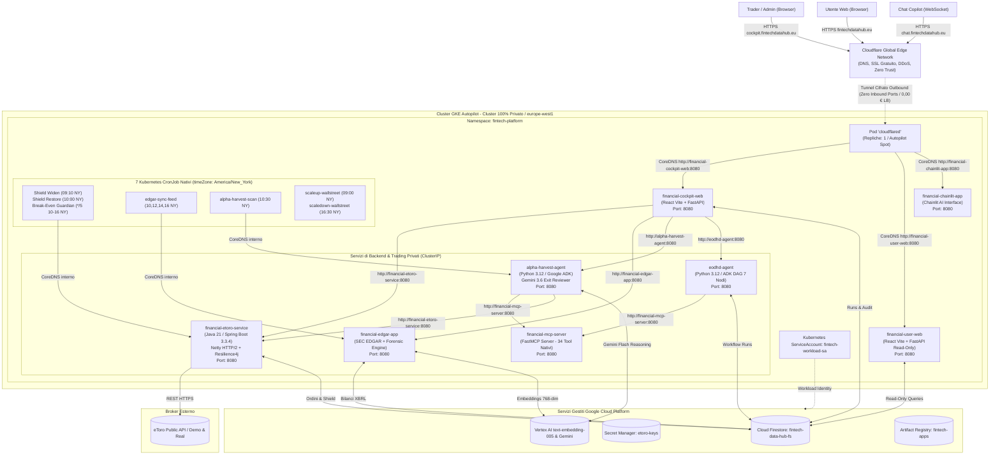
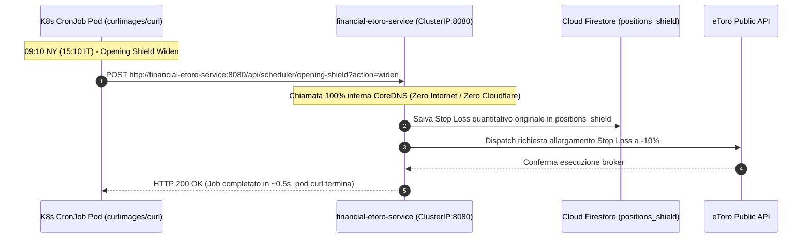
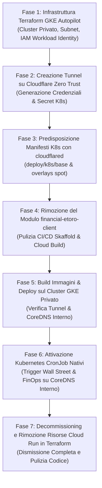

# Progettazione Tecnica: Architettura Integrale su GKE Autopilot con Cloudflare Tunnel (Zero Load Balancer)

**Autore:** Antigravity AI Engineering Team  
**Data:** 29 Settembre 2026  
**Stato:** Documento Master di Progettazione Architetturale Definitivo (Approvato per Implementazione)  
**Destinazione File:** Root del Repository (`/PROGETTAZIONE_ARCHITETTURA_GKE_AUTOPILOT.md`)

---

## 1. Visione Generale & Decisioni Strategiche Approvate

In conformità con le direttive operative e le decisioni di ottimizzazione dei costi:

1. **Sostituzione Integrale di Cloud Run con GKE Autopilot**:
   - L'intera piattaforma e tutti i suoi moduli containerizzati migrano su un unico cluster **Google Kubernetes Engine (GKE) in modalità Autopilot**.
   - Cloud Run viene **completamente dismesso**.
   - Si sfrutta la maglia di rete privata Kubernetes: chiamate dirette tra pod via CoreDNS interno a bassissima latenza, zero overhead di routing pubblico tra microservizi e gestione serverless dei nodi infrastrutturali gestita da Google.

2. **Adozione Ufficiale ed Esclusiva di `financial-etoro-service` (Java 21 / Spring Boot 3.3)**:
   - Il microservizio enterprise **`financial-etoro-service`** (Java 17/21, Spring Boot 3.3.4, Netty HTTP/2 WebClient, Virtual Threads, Resilience4j) diventa l'**unico motore di trading execution** della piattaforma.
   - Il vecchio client Python **`financial-etoro-client` viene definitivamente dismesso, estirpato e rimosso** da qualsiasi configurazione o pipeline di build (`cloudbuild.yaml`, `skaffold.yaml`, Terraform).

3. **Eliminazione Totale del Cloud Load Balancer tramite Cloudflare Tunnel**:
   - Viene rimosso il Google Cloud Load Balancer (Gateway API / Ingress esterno a pagamento, che costava ~$18.25/mese).
   - L'esposizione verso l'esterno è interamente gestita da **Cloudflare Tunnel (`cloudflared`)** in modalità **Zero Trust**:
     - Il cluster GKE è **privato al 100%**: zero porte aperte in ingresso, zero IP pubblici associati ai nodi.
     - Un container ultraleggero `cloudflared` apre connessioni cifrate in sola uscita (outbound) verso la rete globale di Cloudflare.
     - Certificati SSL/TLS gestiti gratuitamente da Cloudflare con protezione DDoS e WAF integrati a **costo 0,00 €**.

4. **Schedulazione FinOps ad Alto Rendimento (Wall Street Active Hours Only)**:
   - Poiché il mercato NYSE/NASDAQ opera dal lunedì al venerdì, l'intera computazione dei pod viene scalata a 0 durante la notte e nei fine settimana.
   - I pod lavorano in modalità **GKE Spot Pods** (sconto ~60-70% su vCPU e RAM), portando il costo computazionale mensile totale a circa **~$5.50 / mese**.

5. **Trigger Schedulati Nativi via Kubernetes CronJob (Zero Dipendenze Esterne e 0,00 € Costi)**:
   - I compiti pianificati di Wall Street e le automazioni FinOps sono implementati come risorse native Kubernetes **`CronJob`** (`batch/v1`) con `timeZone: "America/New_York"`.
   - Le chiamate avvengono interamente sulla rete privata del cluster via CoreDNS (es. `http://financial-etoro-service:8080`), azzerando la latenza, eliminando qualsiasi dipendenza da Google Cloud Scheduler e rimuovendo qualsiasi superficie d'attacco da Internet. Cloudflare Tunnel espone esclusivamente le UI rivolte agli utenti umani.

6. **Sicurezza Zero-Key con GKE Workload Identity Federation**:
   - Nessuna chiave statica JSON o credenziale nel cluster: associazione biunivoca tra `Kubernetes ServiceAccount` (KSA) e `Google Service Account` (GSA) per l'accesso a **Cloud Firestore** (`fintech-data-hub-fs`), **Secret Manager** e **Vertex AI**.

---

## 2. Cos'è Cloudflare e a Cosa Serve Cloudflare Tunnel

### 2.1 Panoramica su Cloudflare
**Cloudflare** è una delle reti perimetrali (*edge network*) più grandi e avanzate al mondo. Opera come un reverse proxy globale distribuito su centinaia di datacenter nel mondo, frapponendosi tra gli utenti finali e l'infrastruttura applicativa:
- **DNS Globale ad Alta Velocità**: Risoluzione istantanea dei record del dominio.
- **Terminazione SSL/TLS Gratuita**: Emissione e rinnovo automatico di certificati crittografici conformi agli standard più recenti.
- **Protezione DDoS e WAF (Web Application Firewall)**: Blocco automatico di botnet, attacchi volumetrici e scansioni malevole prima ancora che raggiungano il cluster.
- **Cloudflare Zero Trust Access**: Meccanismo per proteggere interfacce web private (come il Cockpit amministrativo) richiedendo un login sicuro (es. Google OAuth o One-Time PIN via email) senza dover implementare codice di autenticazione nell'applicazione.

### 2.2 Cos'è Cloudflare Tunnel (`cloudflared`)
Tradizionalmente, per esporre un'applicazione Kubernetes su Internet, il provider cloud (Google Cloud) crea un **External Load Balancer** con un indirizzo IP pubblico, addebitando una tariffa fissa oraria per le regole di inoltro (~$18.25/mese) e obbligando ad aprire porte firewall in ingresso.

**Cloudflare Tunnel** stravolge questo paradigma:
1. Nel cluster GKE viene distribuito un Pod contenente il demone open-source **`cloudflared`**.
2. All'avvio, `cloudflared` stabilisce 4 connessioni cifrate **in sola uscita (egress)** su protocollo HTTP/2 / QUIC verso i datacenter Cloudflare più vicini.
3. Il firewall del cluster GKE può essere completamente sigillato: **nessuna porta in ingresso (0 ingress ports) e nessun IP pubblico**.
4. Quando un utente naviga su `https://cockpit.tuodominio.com`, Cloudflare riceve la richiesta sul proprio edge, applica SSL, WAF e regole Zero Trust, e la convoglia attraverso il tunnel cifrato direttamente al pod `cloudflared` dentro il cluster.
5. `cloudflared` inoltra la chiamata tramite CoreDNS interno Kubernetes al servizio corrispondente (`http://financial-cockpit-web:8080`).

---

## 3. Architettura Globale del Cluster GKE Autopilot con Cloudflare Tunnel



---

## 4. Matrice dei Moduli Containerizzati su GKE Autopilot

Tutti i moduli girano nello stesso cluster, senza alcun Load Balancer esterno:

| Modulo Applicativo | Stack Software | Esposizione K8s | Risorse GKE Autopilot (Req/Limit) | Ruolo & Funzionalità Chiave |
| :--- | :--- | :--- | :--- | :--- |
| **`cloudflared`** | Go (Immagine ufficiale Cloudflare) | Pod Ingress verso il cluster | CPU: `100m`<br/>RAM: `128Mi` | Stabilisce il tunnel cifrato verso Cloudflare, inoltrando il traffico HTTP/WS ai vari servizi via CoreDNS. |
| **`financial-cockpit-web`** | Node 20, Vite, React, FastAPI | `ClusterIP:8080` (via tunnel `cockpit.*`) | CPU: `250m`<br/>RAM: `512Mi` | Dashboard amministrativa Pro: lancio workflow, audit quantitativo, gestione ordini live. |
| **`financial-user-web`** | Node 20, Vite, React, FastAPI Read-Only | `ClusterIP:8080` (via tunnel `user.*`) | CPU: `250m`<br/>RAM: `512Mi` | Portale pubblico: visualizzazione screener e candlestick interattivi con blocco mutazioni. |
| **`financial-chainlit-app`** | Python 3.12, Chainlit, WebSockets | `ClusterIP:8080` (via tunnel `chat.*`) | CPU: `250m`<br/>RAM: `512Mi` | Chat AI conversazionale in streaming WebSocket per l'analisi copilot di mercato. |
| **`financial-etoro-service`** | **Java 21 LTS, Spring Boot 3.3.4**, WebClient | `ClusterIP:8080` (via tunnel `api.*`) | CPU: `500m`<br/>RAM: `1024Mi` | **Unico Motore di Trading**: calcolo asimmetrico R, Opening Shield, Break-Even Guardian, Resilience4j. |
| **`financial-edgar-app`** | Python 3.12, FastAPI, sec-edgar, google-genai | `ClusterIP:8080` Privato | CPU: `500m`<br/>RAM: `1024Mi` | Ingestion bilanci SEC 10-K/10-Q, modelli contabili (Altman, Beneish, Piotroski, Sloan) e RAG Vertex AI. |
| **`alpha-harvest-agent`** | Python 3.12, FastAPI, Google ADK, Gemini Flash | `ClusterIP:8080` Privato | CPU: `250m`<br/>RAM: `512Mi` | Reviewer clinico delle posizioni su 6 pilastri, trailing a scaglioni +6% e reinvestimento. |
| **`financial-mcp-server`** | Python 3.12, FastMCP, yfinance, FRED API | `ClusterIP:8080` Privato | CPU: `250m`<br/>RAM: `512Mi` | Server MCP a 34 tool nativi: dati macro FRED, Black-Scholes, DGR dividendi, sentiment RSS. |
| **`eodhd-agent`** | Python 3.12, Google ADK, NetworkX, NumPy | `ClusterIP:8080` Privato | CPU: `500m`<br/>RAM: `1024Mi` | Motore DAG quantitativo a 7 nodi: screening, ATR 14 periodi, rimbalzo S1/EMA20 e backtest. |

---

## 5. Analisi Economica Dettagliata (FinOps: Spot Pods + Orario Wall Street)

### 5.1 Il Modello di Esercizio a Mercato Aperto
- **Finestra Operativa**: 15:00 - 22:30 IT (09:00 - 16:30 NY) = **7,5 ore al giorno**.
- **Giorni di Borsa Mensili**: ~21,5 giorni di borsa aperta al mese (esclusi weekend e festivi).
- **Ore di Computazione Attiva**: $21.5 \times 7.5 = \mathbf{\sim 161.25\text{ ore/mese}}$ (arrotondate per prudenza a **170 ore/mese**).
- **Ore di Spegnimento a Repliche Zero**: 730 - 170 = **560 ore/mese a costo 0,00 €**.

### 5.2 Calcolo dei Costi Computazionali su GKE Autopilot (Spot)
Durante le 170 ore, gli 8 pod applicativi + il pod `cloudflared` consumano complessivamente:
- **vCPU Totali**: $7 \times 0.25 + 2 \times 0.50 + 0.10 \approx \mathbf{2.85\text{ vCPU}}$
- **RAM Totale**: $7 \times 0.50 + 2 \times 1.00 + 0.128 \approx \mathbf{5.63\text{ GiB RAM}}$

Con le tariffe **GKE Autopilot Spot** (sconto del ~60-70%):
- **vCPU Spot**: ~$0.0133 per vCPU / ora $\rightarrow 2.85 \times \$0.0133 = \$0.0379 / \text{ora}$
- **RAM Spot**: ~$0.00147 per GiB / ora $\rightarrow 5.63 \times \$0.00147 = \$0.0083 / \text{ora}$
- **Costo orario totale**: **~$0.0462 all'ora** (meno di 5 centesimi di dollaro per l'intero cluster!).

$$\text{Costo Computazione Mensile} = 170\text{ ore} \times \$0.0462 = \mathbf{\$7.85\text{ / mese}}$$

### 5.3 Tabella Comparativa Finale dei Costi

| Voce di Costo | Cloud Run (Storico) | GKE con Cloud Load Balancer | GKE Autopilot Spot + Cloudflare Tunnel |
| :--- | :--- | :--- | :--- |
| **Cluster Management GKE** | N/A | 0,00 € *(Free Tier)* | **0,00 €** *(Free Tier Google $74.40)* |
| **Computazione Applicativa** | ~$15 - $25 / mese | ~$79.28 / mese (24/7) | **~$7.85 / mese** *(Spot + Wall Street)* |
| **Ingress & Rete Esterna** | 0,00 € (URL pubblici) | ~$18.25 / mese *(Forwarding Rule)* | **0,00 € (ELIMINATO via Cloudflare)** |
| **Certificati SSL & Dominio** | 0,00 € | 0,00 € | **0,00 €** *(Incluso Cloudflare Free)* |
| **Protezione DDoS / WAF / Zero Trust**| N/A | A pagamento (Cloud Armor) | **0,00 €** *(Incluso Cloudflare Free)* |
| **Servizi PaaS (Firestore, Secret, Scheduler)**| ~$2.50 / mese | ~$2.80 / mese | **~$2.50 / mese** |
| **TOTALE MENSILE STIMATO** | **~20 - 30 € / mese** | **~100 € / mese** | **~8,50 € / mese! (~$10.35)** |

---

## 6. Configurazione e Manifest di Cloudflare Tunnel (`cloudflared`)

### 6.1 Configurazione delle Regole di Instradamento Ingress
Nel pannello di Cloudflare (o tramite file di configurazione `config.yaml`), le rotte pubbliche vengono instradate ai rispettivi servizi Kubernetes via CoreDNS interno:

```yaml
apiVersion: v1
kind: ConfigMap
metadata:
  name: cloudflared-config
  namespace: fintech-platform
data:
  config.yaml: |
    tunnel: fintech-gke-tunnel
    credentials-file: /etc/cloudflared/creds/credentials.json
    metrics: 0.0.0.0:2000
    no-autoupdate: true
    ingress:
      # 1. Portale Utente Pubblico (Read-Only) sul Dominio Principale (Apex e www)
      - hostname: fintechdatahub.eu
        service: http://financial-user-web.fintech-platform.svc.cluster.local:8080
      - hostname: www.fintechdatahub.eu
        service: http://financial-user-web.fintech-platform.svc.cluster.local:8080
      # 2. Cockpit Web (Admin Pro Dashboard)
      - hostname: cockpit.fintechdatahub.eu
        service: http://financial-cockpit-web.fintech-platform.svc.cluster.local:8080
      # 3. Chat Copilot Interattivo (WebSockets abilitati di default in Cloudflare)
      - hostname: chat.fintechdatahub.eu
        service: http://financial-chainlit-app.fintech-platform.svc.cluster.local:8080
      # Regola di fallback 404 (Tutti gli endpoint di backend e i CronJob rimangono 100% privati su CoreDNS)
      - service: http_status:404
```

### 6.2 Deployment Kubernetes per `cloudflared`
```yaml
apiVersion: apps/v1
kind: Deployment
metadata:
  name: cloudflared
  namespace: fintech-platform
  labels:
    app.kubernetes.io/name: cloudflared
spec:
  replicas: 1
  selector:
    matchLabels:
      app: cloudflared
  template:
    metadata:
      labels:
        app: cloudflared
    spec:
      nodeSelector:
        cloud.google.com/gke-spot: "true"
      containers:
      - name: cloudflared
        image: cloudflare/cloudflared:latest
        args:
        - tunnel
        - --config
        - /etc/cloudflared/config/config.yaml
        - run
        livenessProbe:
          httpGet:
            path: /ready
            port: 2000
          initialDelaySeconds: 10
          periodSeconds: 10
        volumeMounts:
        - name: config
          mountPath: /etc/cloudflared/config
          readOnly: true
        - name: creds
          mountPath: /etc/cloudflared/creds
          readOnly: true
        resources:
          requests:
            cpu: "100m"
            memory: "128Mi"
          limits:
            cpu: "100m"
            memory: "128Mi"
      volumes:
      - name: config
        configMap:
          name: cloudflared-config
      - name: creds
        secret:
          secretName: cloudflare-tunnel-token
```

---

## 7. Automazione dei Job di Trading & FinOps tramite Kubernetes CronJob Nativi (Zero Egress)

I job pianificati per Wall Street e le automazioni FinOps non dipendono più da Google Cloud Scheduler né da chiamate esterne via Cloudflare. Sono implementati come risorse native **`batch/v1` `CronJob`** con `timeZone: "America/New_York"` eseguite direttamente sulla rete interna del cluster:



### 7.1 Mappatura dei 7 Kubernetes CronJob Nativi

| Nome CronJob | Schedulazione (America/New_York) | Target Service (CoreDNS Interno) | Azione Eseguita |
| :--- | :--- | :--- | :--- |
| **`etoro-opening-shield-widen`** | `10 9 * * 1-5` (09:10 NY / 15:10 IT) | `financial-etoro-service:8080` | Allarga lo Stop Loss a -10% prima dell'apertura per prevenire lo stop-hunting. |
| **`etoro-opening-shield-restore`** | `00 10 * * 1-5` (10:00 NY / 16:00 IT) | `financial-etoro-service:8080` | Ripristina lo Stop Loss quantitativo calcolato a book disteso. |
| **`etoro-breakeven-guardian`** | `*/5 10-16 * * 1-5` (10:00-16:00 NY) | `financial-etoro-service:8080` | Protezione Break-Even dinamico ogni 5 min a Target 1 raggiunto. |
| **`edgar-sync-feed`** | `0 10,12,14,16 * * 1-5` (10:00, 12:00, 14:00, 16:00 NY) | `financial-edgar-app:8080` | Ingestion e indicizzazione vettoriale dei nuovi bilanci SEC EDGAR solo a borsa aperta. |
| **`alpha-harvest-scan`** | `30 10 * * 1-5` (10:30 NY / 16:30 IT) | `alpha-harvest-agent:8080` | Perizia clinica a 6 pilastri sulle posizioni aperte e capital recycling. |
| **`finops-scaleup-wallstreet`** | `00 9 * * 1-5` (09:00 NY / 15:00 IT) | `kubectl:latest` | Scala tutti i deployment a 1 replica per l'apertura dei mercati. |
| **`finops-scaledown-wallstreet`** | `30 16 * * 1-5` (16:30 NY / 22:30 IT) | `kubectl:latest` | Scala tutti i deployment a 0 repliche per azzerare i costi notturni. |

---

## 8. Automazione di Accensione e Spegnimento (Scale to Zero)

Per garantire la massima economia, due job automatici regolano le repliche dei Deployment:

1. **Start Campana Wall Street (15:00 IT / 09:00 NY, Lun-Ven)**:
   ```bash
   kubectl scale deployment --all --replicas=1 -n fintech-platform
   ```
   In 30 secondi Autopilot avvia i Pod Spot e riscalda le cache in tempo per l'Opening Shield delle 15:10 IT.

2. **Stop Chiusura Mercati (22:30 IT / 16:30 NY, Lun-Ven)**:
   ```bash
   kubectl scale deployment --all --replicas=0 -n fintech-platform
   ```
   Tutti i pod vengono terminati. La fatturazione di CPU e RAM si arresta istantaneamente. Sabato e domenica il cluster rimane a **0,00 €** di computazione.

---

## 9. Struttura dei File di Deployment

```
antigravity-challenge-lab/
├── deploy/
│   └── k8s/
│       ├── base/
│       │   ├── kustomization.yaml             # Aggregatore manifest
│       │   ├── namespace.yaml                 # Namespace: fintech-platform
│       │   ├── serviceaccount.yaml            # KSA con Workload Identity
│       │   ├── cloudflared-deployment.yaml    # Deployment cloudflared (Tunnel)
│       │   ├── cloudflared-config.yaml        # ConfigMap delle rotte ingress
│       │   ├── configmap-env.yaml             # Variabili comuni (PROJECT, DB, MODEL)
│       │   ├── cockpit-web-deployment.yaml    # Deployment & Service financial-cockpit-web
│       │   ├── user-web-deployment.yaml       # Deployment & Service financial-user-web
│       │   ├── chainlit-app-deployment.yaml   # Deployment & Service financial-chainlit-app
│       │   ├── etoro-service-deployment.yaml  # Deployment & Service financial-etoro-service (Java)
│       │   ├── edgar-app-deployment.yaml      # Deployment & Service financial-edgar-app
│       │   ├── harvest-agent-deployment.yaml  # Deployment & Service alpha-harvest-agent
│       │   ├── mcp-server-deployment.yaml     # Deployment & Service financial-mcp-server
│       │   └── eodhd-agent-deployment.yaml    # Deployment & Service eodhd-agent
│       └── overlays/
│           └── prod/                          # Overlay produzione con Spot NodeSelectors
│               ├── kustomization.yaml
│               └── patch-spot-nodes.yaml
```

---

## 10. Roadmap Operativa a Fasi (Senza Interruzioni)



---

## 11. Riepilogo dei Vantaggi Conseguiti

1. **Abbattimento dei Costi a ~8 € / Mese**: Eliminazione del Cloud Load Balancer Google (-$18.25/m), azzeramento del Cluster fee con il credito Google (-$74.40/m) e computazione Spot limitata alle ore di Wall Street (~$7.85/m).
2. **Cluster 100% Blindato e Privato**: Nessun IP pubblico, nessuna porta aperta su Internet verso Google Cloud. Tutta l'esposizione passa dal tunnel cifrato di Cloudflare.
3. **Trading Engine Enterprise**: Esecuzione transazionale affidata in via esclusiva a `financial-etoro-service` (Java 21 Spring Boot 3.3.4 con Virtual Threads e Resilience4j).
4. **Protezione Zero Trust Gratuita**: Autenticazione con account Google per il Cockpit Pro gestita all'edge da Cloudflare a zero righe di codice.
5. **Zero Ops**: Nodi gestiti in modalità Autopilot da Google senza manutenzione sistemistica.
