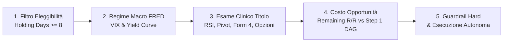
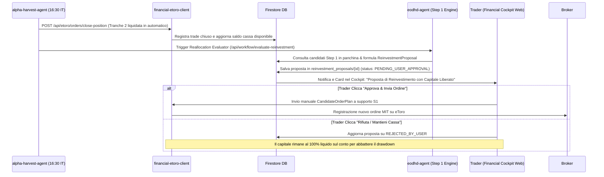

# Documento di Progettazione Architetturale: Alpha-Harvest Agent (`alpha-harvest-agent`)
## Motore Quantitativo Autonomo di Revisione del Portafoglio, Harvesting dei Profitti & Ottimizzazione delle Uscite (Week 2 Decision Gate)

**Autore:** Antigravity AI Engineering Team  
**Data:** 22 Settembre 2026  
**Stato:** Documento di Progettazione Istituzionale Definitivo (Approvato in Modalità Autonoma 100% con Audit Ledger su Cockpit)  
**Destinazione File:** Root del Repository (`/PROGETTAZIONE_EXIT_REVIEWER_AGENT.md`)

---

## 1. Executive Summary & Visione di Livello Hedge Fund

Nei fondi multi-strategy moderni (*quantamental hedge fund* quali Millennium Management, Citadel, Point72 o D.E. Shaw), la generazione dell'Alpha non si esaurisce nell'algoritmo di selezione dell'ingresso: **l'efficienza dell'uscita (*Exit Alpha*) e la velocità di ricircolo del capitale (*Capital Velocity*) costituiscono oltre il 40% del rendimento corretto per il rischio (Sharpe Ratio)**.

Il nostro sistema a 7 nodi DAG (`eodhd-agent`) e il microservizio di trading automatizzato (`financial-etoro-client`) gestiscono con rigore matematico la fase iniziale (Step 0-5, ingresso MIT a supporto S1, Dual-Tranche splitting, Break-Even Guardian e Profit Ratchet a gradini di +6%).

Tuttavia, **al compimento della Settimana 2 (Giorno ≥ 8 di contrattazione)**, la posizione entra in una fase critica in cui le formule meccaniche fisse mostrano i loro limiti:
1. **Il Decadimento Temporale dell'Alpha (*Alpha Half-Life*)**: l'impulso iniziale (catalizzatore di utili, rimbalzo S1) ha un'emivita di 10-15 giorni. Prolungare l'attesa per colpire un target fisso espone la posizione a un'alta probabilità di mean-reversion, rischiando di restituire al mercato guadagni del +20% o +25%.
2. **La Trappola del "Capitale Morto" (*Opportunity Cost of Dead Capital*)**: mantenere aperto un titolo che oscilla orizzontalmente in congestione blocca liquidità che potrebbe essere immediatamente impiegata sui nuovi candidati freschi ad altissimo potenziale scaturiti dallo Step 1 del DAG.
3. **Il Rischio di Soffocamento dei "Super-Runner" (L'Errore dei Target Fissi T2/T3)**: applicare un Take Profit rigido su titoli eccezionali con volumi istituzionali storici (come Nvidia o ARM) taglia anzitempo profitti esponenziali da +50% o +100%. Il nostro modello trasforma la Tranche 2 in un **"T2 Allungato ad Uscita Trailing Pura" (Uncapped Runner)** senza alcun tetto artificiale.
4. **La Protezione Anticipata Pre-T1**: appena il titolo tocca +6% (o +1.0R), lo Stop Loss sale istantaneamente a **Net Break-Even** (`entry_price × 1.001`), azzerando il rischio di mercato prima ancora che il prezzo raggiunga T1.

L'**Alpha-Harvest Agent** (`alpha-harvest-agent`) è il microservizio autonomo basato su **Google Cloud ADK (Agent Development Kit)**, alimentato da **Vertex AI (Gemini 3.6 Flash)**, progettato per operare in **autonomia totale al 100%** ogni giorno di borsa aperta alle **16:30 IT (10:30 NY)**. L'agente esamina clinicamente ogni posizione matura (≥ 8 giorni), interroga i **34 tool MCP nativi**, applica i **6 Pilastri Istituzionali di Exit Alpha** (Scudo Anti-Trimestrali, VIX-Adaptive Ratchet, Multi-Timeframe 1h, Rotazione Settoriale, Soft Harvest parziale e Alpha Attribution Ledger), decide ed esegue le uscite sul broker eToro, e traccia l'intero audit trail sul **Financial Cockpit Web**.

---

## 2. Architettura del Sistema & Flusso Dati

L'agente è ingegnerizzato come microservizio Python serverless indipendente su Google Cloud Run, inserito nell'ecosistema cloud a costo computazionale 0,00 € quando inattivo (`min_instances = 0`):

```mermaid
graph TD
    Scheduler[Google Cloud Scheduler / Cron: Lun-Ven 16:30 IT - 10:30 NY] -->|POST /api/harvest/scan-portfolio| HarvestApp[alpha-harvest-agent / Google ADK + FastAPI]
    AdminUser[Trader / Financial Cockpit Web] -->|Trigger Manuale On-Demand| HarvestApp
    
    subgraph HarvestApp[Microservizio alpha-harvest-agent]
        ADKCore[Google ADK Core Engine / Python 3.12]
        GeminiFlash[Vertex AI / Gemini 3.6 Flash]
        ReasoningEngine[Chain-of-Thought Decision Engine]
        Guardrails[Hard Deterministic Safety Guardrails]
        Hysteresis[Cooldown & Anti-Chatter State Machine]
        
        ADKCore <--> GeminiFlash
        GeminiFlash <--> ReasoningEngine
        ReasoningEngine --> Guardrails
        Guardrails --> Hysteresis
    end
    
    HarvestApp <-->|McpToolset Stdio/HTTP| CustomMCP[Custom Financial MCP Server - 34 Tools]
    HarvestApp <-->|REST API JSON| EToroClient[financial-etoro-client / financial-etoro-service]
    HarvestApp <-->|Firestore Client SDK| DB[(Firestore Database: fintech-data-hub-fs)]
    
    subgraph EToroClient[financial-etoro-client Microservice]
        GetPositions[GET /api/etoro/positions]
        UpdateOrder[POST /api/etoro/orders/update-sl-tp]
        ClosePos[POST /api/etoro/orders/close-position]
        Preflight[Preflight Safety Check & Rate Limiter]
        
        UpdateOrder --> Broker[(eToro Public API / Demo & Real)]
        ClosePos --> Broker
    end
    
    subgraph DB[Collezioni Firestore]
        ColReviews[harvest_reviews/{review_id}]
        ColSignals[harvest_active_signals/{symbol}]
        ColPositions[cached_positions/{account}]
    end
    
    DB <-->|Real-Time Listener & REST API| CockpitUI[Financial Cockpit Web / Vite + FastAPI]
    
    subgraph CockpitUI[Financial Cockpit Web - Sezione Alpha Harvest]
        Banner[Banner / Toast Notifiche Real-Time]
        BadgeTable[Badge Dinamici nella Tabella Posizioni]
        LedgerTab[Tab Dedicato: Alpha Harvest Intelligence & Audit Ledger]
    end
```

---

## 3. Perché la Comunicazione REST verso `financial-etoro-client` è Superiore

Invece di interagire direttamente con le API grezze di eToro, `alpha-harvest-agent` invoca le API REST di `financial-etoro-client` (o dell'alternativa Java `financial-etoro-service`). Questo garantisce:

1. **Isolamento dei Segreti e Least Privilege**:
   - `alpha-harvest-agent` non memorizza chiavi API o token eToro: delega l'autenticazione al client dedicato.
2. **Interoperabilità Hot-Swappable (Python / Java Spring Boot)**:
   - Se l'infrastruttura attiva il microservizio Java Spring Boot 3 (`financial-etoro-service`), `alpha-harvest-agent` continua a operare senza modifiche poiché il contratto REST è rigorosamente speculare.
3. **Protezione da Rate Limiting e Preflight**:
   - Tutte le chiamate verso eToro passano attraverso il rate limiter (≤ 10 req/s) e il safety check del client broker.
4. **Allineamento con Opening Shield e Break-Even Guardian**:
   - `financial-etoro-client` conosce lo stato di tutte le posizioni, la cronologia degli Stop Loss salvati (`positions_shield/{pos_id}`) e previene qualsiasi conflitto di concorrenza sui libri ordini.

---

## 4. Scheduling & Timing Ottimale: Perché le 16:30 IT (10:30 NY)?

L'orario di esecuzione non è casuale, ma risponde alla microstruttura dei mercati finanziari statunitensi:

| Finestra Oraria | Dinamica di Mercato a Wall Street | Interazione con il Nostro Sistema |
| :--- | :--- | :--- |
| **15:10 - 15:30 IT** | Pre-Market e asta di apertura | L'**Opening Shield** allarga lo Stop Loss a -10% per impedire lo stop-hunting sui book sottili. |
| **15:30 - 16:00 IT** | Prima mezz'ora di contrattazione ad altissima volatilità (*Opening Drive*) | Lo scudo protettivo rimane attivo; spread bid/ask ampi e rumore casuale. |
| **16:00 IT (10:00 NY)** | Chiusura dell'Opening Drive | L'**Opening Shield** ripristina con precisione lo Stop Loss quantitativo originale su tutte le posizioni. |
| **16:30 IT (10:30 NY)** ⭐ | **Punto di Equilibrio Istituzionale (*Goldilocks Window*)** | **Intervento di `alpha-harvest-agent`**: gli spread sono compressi ai minimi, i volumi istituzionali hanno definito il trend della giornata e la liquidità è massima per eseguire modifiche di Stop o chiusure a mercato a zero slippage. |

---

## 5. Il Processo di Diagnosi Clinica in 5 Fasi (I 34 Tool MCP Nativi)

L'agente non formula opinioni generiche, ma interroga deterministicamente la nostra infrastruttura:



### Dettaglio dei Tool MCP interrogati per ogni titolo maturo:
1. **Macro Regime & Volatilità VIX (Pilastro #2)**:
   - `get_macro_indicator`: monitora in tempo reale il VIX (volatilità implicita S&P 500) e lo spread Treasury 10Y-2Y. Se VIX > 22, modula la morsa del trailing e abbassa la soglia di esaurimento per proteggere il capitale dai ribassi corali.
   - `system_health_check`: diagnosi live su 23 sottosistemi di mercato.
2. **Indicatori Tecnici Daily & Multi-Timeframe Intraday 1h (Pilastro #3)**:
   - `get_technical_indicators`: calcolo di RSI a 14 periodi per rilevare **divergenze ribassiste** (prezzo al nuovo massimo ma RSI discendente), pendenza dell'EMA a 20 periodi e ampiezza delle Bande di Bollinger.
   - `get_intraday_historical_data`: scansione delle barre a **1 ora (1h)** delle ultime 48 ore per anticipare i *Market Structure Shift* (rotture di minimi con volumi di scarico) senza attendere la campana serale.
   - `get_support_resistance_levels`: confronto del prezzo con le resistenze istituzionali di Fibonacci e Pivot Classici ($R_2, R_3$).
3. **Scudo Anti-Trimestrali & Eventi Binari (Pilastro #1)**:
   - `get_upcoming_earnings` e `get_economic_events`: verifica se la società ha la data degli utili (Earnings Call) o eventi societari critici programmati entro le **successive 48–72 ore**, prevenendo gap-down notturni a mercati chiusi.
4. **Flussi Smart Money & Insider Disclosures**:
   - `get_insider_transactions`: verifica se executive (CEO, CFO) hanno depositato vendite azionarie su **SEC Form 4** nell'ultima settimana sul picco dei prezzi.
   - `get_congressional_trades`: controllo di eventuali vendite da parte di membri del Congresso USA (STOCK Act).
5. **Controllo Rotazione Settoriale & Peer Contagion (Pilastro #4)**:
   - `get_bulk_fundamentals`: scansione dell'ETF di settore (es. SMH, XLK, XLE) e dei peer diretti per verificare se la debolezza è isolata o se è in atto una rotazione settoriale istituzionale con deflussi di comparto.
6. **Mercato dei Derivati & Volatilità Implicita**:
   - `get_us_options_eod`: analisi dei **Greci di Black-Scholes** (Delta, Gamma, Theta, Vega), call-skew e open interest per intercettare dinamiche di *Gamma Squeeze*.
7. **Sentiment & Rassegna Notizie**:
   - `get_company_news` e `get_sentiment_data`: sentiment pure-Python basato su lessico Loughran-McDonald e rassegna Google News RSS per catturare downgrade di rating o inchieste.
8. **Arbitraggio di Portafoglio & Costo Opportunità**:
   - Confronta il guadagno residuo stimabile con il potenziale dei nuovi titoli dello Step 1 del DAG:
     `Remaining Reward-to-Risk = Potenziale Residuo / (P_attuale - P_stop)`
     Se Reward-to-Risk < 0.8 e lo Step 1 offre titoli con Reward-to-Risk ≥ 2.5, l'allocazione su un titolo fermo risulta inefficiente.

---

## 6. Il Framework a Scala Mobile Continua & I Verdetti Decisionali

Il sistema supera la logica rigida dei target fissi adottando un **Framework a Scala Mobile Unificata (Dynamic Multi-Tranche Ladder)**:

```
                            SCALA MOBILE QUANTITATIVA UNIFICATA
                                            ▲
                                            │  FASE 4 (Oltre T2): "T2 Allungato" (Uncapped Trailing Runner)
                                            │  - Nessun tetto artificiale di Take Profit (Zero limiti ai guadagni!)
                                            │  - Dual-Engine Trailing infinito: SL sale a +30%, +36%, +42%, +48%...
                                            │  - Possibile Soft Harvest a +40% (liquida 25%, lascia correre 25%)
                                            │
                                            │  FASE 3 (Da T1 verso T2): Trailing Ratchet Continuo
                                            │  - Tranche 2 scortata da Profit Ratchet a scaglioni di +6%
                                            │  - Chandelier ATR ed EMA 9 per proteggere i picchi
                                            │
                                            │  FASE 2 (Raggiungimento T1, ~+9%): First Harvest Garantito
                                            │  - Tranche 1 (50%) liquidata con ordine limite su eToro
                                            │  - Mette liquidità certa in cassa per finanziare il portafoglio
                                            │
                                            │  FASE 1 (Pre-T1 Early Protection, a +6% / +1.0R):
                                            │  - Stop Loss alzato SUBITO a Net Break-Even (+0.1%) su TUTTE le quote
                                            │  - Rischio di perdita AZZERATO prima ancora di toccare T1!
                                            │
════════════════════════════════════════════════════╧════════════════════════════════════════════════
```

---

### I 6 Verdetti Operativi di `alpha-harvest-agent`

```
                    ┌────────────────────────────────────────────────────────┐
                    │               ALPHA HARVEST DECISION GATE              │
                    └───────────────────────────┬────────────────────────────┘
                                                │
         ┌──────────────┬──────────────┬────────┴───────┬──────────────┬──────────────┐
         ▼              ▼              ▼                ▼              ▼              ▼
     [CLOSE_       [EARNINGS_      [TIGHTEN_        [HOLD_         [SOFT_         [EXTEND_TO_
    IMMEDIATE]      DE_RISK]         STOP]          RUNNER]        HARVEST]        RUNNER]
    Stanchezza,    Trimestrale     Morsa a 1x      Trend sano     Allungo        Breakout epico,
    divergenze,    entro 48-72h,   ATR su R2 o     verso T2,      > +40%,        volumi 1.8x,
    stallo >5gg.   incassa 100%    Macro CPI/Fed   Ratchet +6%    incassa 25%    T2 Allungato
```

#### 1. `CLOSE_IMMEDIATE` *(Harvesting Completo per Stanchezza del Trend)*
- **Condizioni**: Exhaustion Score ≥ 65/100 basato su divergenza ribassista RSI/MACD, volumi in contrazione (-40% rispetto alla media), insider selling su SEC Form 4 o stallo temporale (ΔP ≤ ±0.8% per oltre 5 giorni con candidato Step 1 fresco pronto ad entrare).
- **Azione**: Invia a `financial-etoro-client` `POST /api/etoro/orders/close-position` liquidando immediatamente la Tranche 2 a mercato.
- **Risultato**: Monetizza il profitto di picco (es. +18%, +22%) prima del ritracciamento, azzera il rischio e rende la cassa disponibile per la proposta di reinvestimento.

#### 2. `EARNINGS_DE_RISK` *(Scudo Anti-Trimestrali)*
- **Condizioni**: La società ha la data degli utili (Earnings Call) o un evento societario critico programmato entro le successive **48–72 ore** (`get_upcoming_earnings`).
- **Azione**: Liquida d'ufficio a mercato la posizione residua.
- **Risultato**: Neutralizza il rischio asimmetrico di crolli notturni in Gap-Down da -15% che salterebbero gli Stop Loss a mercati chiusi. Il profitto viene blindato in cassaforte al 100%.

#### 3. `TIGHTEN_STOP` *(Morsa Protettiva Chandelier)*
- **Condizioni**: Trend primario ancora positivo ma evento macro imminente (FOMC, CPI); oppure prezzo a contatto con la resistenza istituzionale R2 con difficoltà di rottura.
- **Azione**: Calcola uno Stop Loss Chandelier stretto:
  `P_stop_tight = HighestHigh_5 - (1.0 × ATR_14)`
  Invia `POST /api/etoro/orders/update-sl-tp` aggiornando lo Stop Loss su eToro.
- **Risultato**: Se il titolo sfonda la resistenza prosegue la corsa; se ritraccia anche solo dell'1-2%, la posizione viene chiusa garantendo il 95% del picco massimo raggiunto.

#### 4. `HOLD_RUNNER` *(Scorta Attiva Verso T2)*
- **Condizioni**: Volumi in espansione, nessun segnale di stanchezza, opzioni con call-skew positivo, distanza da $T_2$ colmabile in 2-3 barre di ATR.
- **Azione**: Non interviene a mercato: il *Profit Ratchet continuo a scaglioni di +6%* gestito dal cron job a 5 minuti continua la sua scorta automatica.

#### 5. `SOFT_HARVEST` *(Chiusura Parziale sui Rally Parabolici)*
- **Condizioni**: Guadagno attuale ≥ +40%, presenza di almeno 2 quote nella Tranche 2 (`units >= 2`). Il titolo è in forte espansione ma ha percorso oltre 3 deviazioni standard dal prezzo di carico.
- **Regola della Singola Azione (Indivisibilità)**: Se la Tranche 2 possiede **1 singola azione** (`units == 1`), il Soft Harvest **non viene applicato**: l'azione intera viene lasciata correre al 100% come `EXTEND_TO_RUNNER`, scortata dal Trailing Stop continuo.
- **Azione (se ≥ 2 quote)**: Invia `POST /api/etoro/orders/close-position` specificando `amount` pari al **50% della Tranche 2 residua** (ossia il 25% della posizione iniziale complessiva).
- **Risultato**: Incassa un ulteriore profitto record monetizzato, mantenendo il restante 25% della posizione aperto per cavalcare l'onda fino all'esaurimento.

#### 6. `EXTEND_TO_RUNNER` *(Promozione a T2 Allungato / Uncapped Trailing Runner)*
- **Condizioni**: "Super-Alpha" istituzionale (breakout epocale, volumi ≥ 1.8× media a 50 giorni, call-skew con Gamma Squeeze e zero insider selling). Guadagno attuale già ≥ +20%.
- **Azione**: 
  - Rimuove qualsiasi ordine Take Profit limite su eToro (`take_profit = None`): **nessun tetto prefissato**.
  - Imposta il pavimento iniziale minimo dello Stop Loss ad almeno **+20%** (o al livello del vecchio T2).
  - Attiva la scorta continua:
    - **Intraday (ogni 5 min)**: Ratchet a gradini continui (+30% → SL +24%, +36% → SL +30%, +42% → SL +36%, +48% → SL +42%, +54% → SL +48%, +60% → SL +54% ...).
    - **Cognitivo (16:30 IT)**: Chandelier parabolico su massimi storici e supporto dinamico dell'**EMA 9**.
- **Formula Unidirezionale Finale**:
  `P_stop_runner = max(P_stop_attuale, P_ratchet_6%, P_chandelier_1.5atr, EMA_9)`

---

## 7. I 6 Pilastri Istituzionali di Ottimizzazione dell'Exit Alpha

Per competere con gli standard dei principali fondi quantitativi globali, l'agente incorpora 6 pilastri operativi ingegnerizzati sui 34 tool MCP:

### Pilastro 1: Scudo Anti-Trimestrali (*Earnings Blackout & Event De-Risking*)
- **Rischio Evitato**: Gap-down notturni a mercati chiusi causati da trimestrali negative o guidance deludente.
- **Ingegneria**: Con `get_upcoming_earnings` e `get_economic_events`, se l'annuncio utili cade entro T ≤ 72h, la posizione viene chiusa a mercato. In finanza quantitativa non si fa "gambling" sugli utili societari.

### Pilastro 2: Trailing Adattivo al Regime di Volatilità (*VIX-Adaptive Ratchet*)
- **Rischio Evitato**: Falsi stop-out da fiammate di volatilità nei mercati turbolenti, o stop troppo larghi nei mercati calmi.
- **Ingegneria**: Con `get_macro_indicator` l'agente monitora il VIX:
  - **VIX < 18 (Mercato Calmo / Risk-On)**: Chandelier stretto a 1.0 × ATR per mungere il massimo picco e proteggere i guadagni.
  - **18 ≤ VIX ≤ 25 (Mercato Normale)**: Parametri standard a 1.5 × ATR e gradini del +6%.
  - **VIX > 25 (Mercato Nervoso / Turbolento)**: Allarga il cuscinetto a 1.8 × ATR per assorbire le oscillazioni intraday, ma abbassa la soglia di stanchezza da 65 a 50 punti (uscita preventiva al primo segno di cedimento corale).

### Pilastro 3: Diagnosi Multi-Timeframe con Barre Intraday 1h (`get_intraday_historical_data`)
- **Rischio Evitato**: Attendere passivamente la chiusura giornaliera delle 22:00 IT mentre il titolo sta crollando.
- **Ingegneria**: Alle 16:30 IT l'agente esamina le ultime 48 barre a 1 ora. Se rileva un *Market Structure Shift* (rottura con volumi del minimo della sessione precedente), anticipa l'uscita di 5 ore e mezza rispetto ai sistemi tradizionali.

### Pilastro 4: Controllo di Rotazione Settoriale (*Sector Contagion Check*)
- **Rischio Evitato**: Il contagio di vendite istituzionali sull'intero settore industriale.
- **Ingegneria**: Con `get_bulk_fundamentals`, se un titolo vacilla, l'agente analizza i peer diretti del paniere e l'ETF di comparto (es. SMH per Semiconduttori). Se oltre il 60% dei peer mostra deflussi netti, l'agente liquida la posizione prima che il sell-off settoriale la travolga.

### Pilastro 5: Chiusura Parziale a Scaglioni sui Rally Parabolici (*Soft Harvest*)
- **Rischio Evitato**: La scelta binaria "tutto o niente" su titoli che superano il +40%.
- **Ingegneria & Vincolo di Indivisibilità**: 
  - Se la Tranche 2 possiede **≥ 2 azioni**: sfrutta la funzionalità di chiusura parziale di eToro (`amount` parziale) per liquidare metà Tranche 2 (portando a casa il 25% del controvalore iniziale con rendimento record) e lascia correre l'ultimo 25% verso l'infinito.
  - **Regola della Singola Azione**: se la posizione possiede **1 singola azione intera** (`units == 1`), il Soft Harvest **è vietato**: l'azione non viene frazionata ma **viene lasciata correre al 100% come Runner**, scortata dallo Stop Loss continuo senza barriere.

### Pilastro 6: Misurazione dell'Alpha Generato nel Cockpit Web (*Alpha Attribution Ledger*)
- **Valore Istituzionale**: Dimostrare con precisione millimetrica l'efficacia del motore decisionale.
- **Ingegneria**: Firestore calcola e archivia in tempo reale:
  `Extra Alpha $ = Profitto Reale Incassato dall'AI - Profitto Teorico del Take Profit Fisso Originale`
  Esposto nella dashboard Cockpit come KPI primario di performance.

---

## 8. Guardrail Matematici Inviolabili (*Hard Safety Engine*)

A garanzia della sicurezza totale del capitale (indispensabile per presentare il progetto a qualsiasi hedge fund o istituzione finanziaria), il codice Python implementa un **livello di validazione deterministico** a valle dell'LLM:

```python
def validate_harvest_guardrails(
    current_sl: float, 
    proposed_sl: float, 
    entry_price: float, 
    current_gain_pct: float,
    verdict: str,
    proposed_tp: Optional[float],
    hours_to_earnings: Optional[float] = None,
    units: float = 1.0
) -> Tuple[bool, str]:
    """
    Validazione matematica deterministica dei vincoli di sicurezza di portafoglio.
    Nessun output dell'LLM può violare queste regole.
    """
    # 1. Regola di Non-Regressività Assoluta dello Stop Loss (One-Way Ratchet)
    if proposed_sl < current_sl:
        return False, f"VIOLAZIONE: Proposta di abbassare lo Stop Loss da {current_sl} a {proposed_sl}. Lo Stop Loss può solo salire."

    # 2. Principio di Rischio Zero per Posizioni Mature (Net Zero Loss)
    net_be = round(entry_price * 1.001, 2)
    if proposed_sl < net_be:
        return False, f"VIOLAZIONE: Stop Loss proposto ({proposed_sl}) inferiore al Net Break-Even ({net_be})."

    # 3. Guardrail per Promozione a Runner (EXTEND_TO_RUNNER)
    if verdict == "EXTEND_TO_RUNNER":
        if current_gain_pct < 20.0:
            return False, f"VIOLAZIONE: Promozione a Runner non consentita con guadagno inferiore al +20.0% (attuale: {current_gain_pct}%)."
        min_locked_sl = round(entry_price * 1.20, 2)
        if proposed_sl < min_locked_sl:
            return False, f"VIOLAZIONE: Per promuovere a Runner è obbligatorio blindare lo Stop ad almeno +20% ({min_locked_sl})."
        if proposed_tp is not None:
            return False, "VIOLAZIONE: Un Runner a corsa libera non ammette Take Profit rigido (proposed_tp deve essere None)."

    # 4. Guardrail per Scudo Anti-Trimestrali (EARNINGS_DE_RISK)
    if verdict == "EARNINGS_DE_RISK":
        if hours_to_earnings is not None and hours_to_earnings > 72.0:
            return False, f"VIOLAZIONE: EARNINGS_DE_RISK consentito solo con evento entro 72 ore (attualmente: {hours_to_earnings}h)."

    # 5. Guardrail per Chiusura Parziale (SOFT_HARVEST & Vincolo Indivisibilità)
    if verdict == "SOFT_HARVEST":
        if current_gain_pct < 35.0:
            return False, f"VIOLAZIONE: SOFT_HARVEST consentito solo con guadagno >= +35.0% (attuale: {current_gain_pct}%)."
        if units < 2.0:
            return False, f"VIOLAZIONE: SOFT_HARVEST non consentito su singola quota ({units} unità). L'azione singola deve correre al 100% come EXTEND_TO_RUNNER."

    return True, "GUARDRAILS_VALIDATED"
```

---

## 9. Prevenzione del "Chatter" (Anti-Chatter State Machine & Cooldown)

Un errore tipico dei bot amatoriali è modificare gli ordini continuamente ogni giorno anche per variazioni minime di pochi centesimi (*Order Book Chatter*). Nei desk quantitativi istituzionali si applica il principio dell'**Isteresi di Stato**:

- **Regola di Rilevanza del Delta**:
  Lo Stop Loss viene modificato sul broker solo se la nuova soglia proposta supera la precedente di almeno:
  `ΔP_stop ≥ 0.5 × ATR_14  oppure  ≥ +1.5% del prezzo`
- **Cooldown di Stato**:
  Se su una posizione è già stato emesso un verdetto `TIGHTEN_STOP` o `HOLD_RUNNER`, l'agente non ripete la medesima azione nei 2 giorni successivi a meno che il prezzo non abbia fatto un nuovo massimo o non sia intervenuto un catalizzatore di notizie rilevante (*delta news score* $> 0.3$).
- **Stato Persistente su Firestore**:
  Lo stato viene memorizzato nella collezione `harvest_active_signals/{symbol}` con i campi `last_verdict`, `last_harvest_timestamp`, `last_applied_stop`.

---

## 10. Il Meccanismo "Harvest & Seed" con Approvazione Umana Esplicita (Human-in-the-Loop Reinvestment Proposal)

A differenza delle azioni di protezione del capitale e chiusura delle posizioni mature (che operano in **autonomia totale al 100%** per blindare tempestivamente gli utili), **l'acquisto di nuovi titoli non avviene MAI in modo automatico**. 

Il capitale liberato dalla chiusura di una Tranche 2 non viene reinvestito a ciclo perpetuo senza consenso: **il trader mantiene il controllo decisionale supremo al 100% sulla scelta di aprire o meno nuove posizioni**.

### Il Flusso Operativo: Proposta Strutturata ➔ Approvazione Manuale 1-Click



### Come si presenta la Proposta nel Financial Cockpit Web:
Quando una posizione matura viene chiusa e i dollari tornano disponibili, nel Cockpit Web compare una modale/card dedicata in evidenza:

> 🌾 **OPPORTUNITÀ DI REINVESTIMENTO CAPITALE LIBERATO**  
> **Capitale Incassato da ARM**: `+$318,82` (di cui `+$61,71` di puro utile netto certificato).  
> **Candidato #1 Raccomandato dal DAG**: **AVGO (Broadcom Inc.)**  
> - **Prezzo Attuale**: $165,20 | **Supporto Ingresso S1**: $161,50 (Ordine MIT)  
> - **Stop Loss ATR**: $153,80 (-4,7%) | **Target 1**: $173,00 (+7,1%) | **Target 2**: $184,50 (+14,2%)  
> - **Valutazione Quantitativa**: Score 94/100, RSI a 48 rimbalzato da ipervenduto, zero insider selling.  
> 
> `[ ⚡ Approva & Invia Ordine MIT a eToro ]` &nbsp;&nbsp;&nbsp;&nbsp; `[ ❌ Rifiuta & Mantieni Liquidità Libera ]`

**Zero acquisti a sorpresa**: se non tocchi nulla o rifiuti la proposta, la liquidità rimane intoccata e protetta sul tuo conto. Se decidi che l'opportunità è ottima, la invii con un singolo click senza dover ricalcolare quote, prezzi S1 o stop loss.

---

## 11. Architettura UI nel Cockpit Web (`financial-cockpit-web`)

Per soddisfare il requisito di visibilità e tracciamento assoluto per il trader:

1. **Badge Dinamici nella Tabella Posizioni Aperte**:
   - Accanto a ciascun titolo comparirà un badge distintivo:
     - 🌾 `HARVEST: TIGHTENED (+16.5% SL)` (Verde smeraldo)
     - 🌾 `HARVEST: UNCAPPED RUNNER` (Viola brillante)
     - 🌾 `HARVEST: HOLD RUNNER` (Blu istituzionale)
     - 🌾 `HARVEST: SOFT HARVEST (-25%)` (Ciano metallico)
     - 🌾 `HARVEST: EARNINGS EXIT` (Arancio sicurezza)
     - 🌾 `HARVEST: CASHED OUT` (Oro metallico)
2. **Tab Dedicato: "Alpha Harvest Intelligence & Ledger"**:
   - Una schermata istituzionale stile terminale Bloomberg / Citadel con 3 KPI primari:
     - **Metrica Live 1**: *Capitale Totale Raccolto dall'AI* ($ incassati da trade chiusi al picco).
     - **Metrica Live 2**: *Profitto Netto Minimo Blindato* ($ protetti negli Stop Loss dinamici).
     - **Metrica Live 3**: *Extra Alpha Generato dall'AI* ($ guadagnati in più rispetto ai target fissi originali).
     - **Tabella Storica Audit Trail**: data e ora in formato Roma (CET/CEST), simbolo, holding days, verdetto emesso, Stop/TP modificati, e il report clinico strutturato dell'AI (Macro VIX, Tecnico 1h, Earnings, Flussi, Costo Opportunità).
3. **Banner di Notifica Real-Time**:
   - Quando alle 16:30 IT l'agente esegue un intervento autonomo, nel Cockpit compare un banner/toast persistente:
     *«🌾 Alpha Harvest Agent ha stretto lo Stop Loss su AMD a 598,50 $ (+16,7%) proteggendo ulteriori +24,30 $ netti in cassa a causa di divergenza RSI e imminente release macro.»*

---

## 12. Perché Questo Progetto Lascerà a Bocca Aperta Qualsiasi Azienda o Fondo

Mostrare questo progetto in un colloquio tecnico o proporlo come portfolio per una collaborazione dimostra competenze di livello **Staff / Principal Quantitative Engineer**:

1. **Complessità Architetturale Reale, non un Progetto Giocattolo**:
   - Non è un semplice wrapper di ChatGPT: è un'architettura distribuita a **6 microservizi Cloud Run**, completamente coordinata con **Terraform IaC**, **Google Cloud Deploy (con auto-promote)**, **Cloud Scheduler**, **Artifact Registry** e **Firestore**.
2. **Fusione tra Modelli Quantitativi Deterministici e Ragionamento LLM**:
   - Modelli matematici rigorosi (Wilder ATR a 14 periodi, Pivot Point Fibonacci, Black-Scholes Greeks, modelli contabili forensi Altman Z / Beneish M / Piotroski F / Sloan Accrual) che governano i dati, uniti alla capacità di sintesi qualitativa di Gemini 3.6 Flash.
3. **Gestione del Rischio e Ricircolo di Capitale di Livello Istituzionale**:
   - Early Protection a +6%, Scudo Anti-Trimestrali, VIX-Adaptive Ratchet, T2 Allungato senza tetto artificiale, non-regressività dello Stop Loss, isolamento delle credenziali broker, zero costi fissi grazie allo scaling a zero (`min_instances = 0`).
4. **Trasparenza Contabile ed Estetica Istituzionale**:
   - Il Cockpit Web fornisce una tracciabilità totale: l'AI espone in tempo reale ogni singolo calcolo, la motivazione contabile e l'attribuzione esatta dell'Extra Alpha monetizzato.

---

## 13. Conclusioni & Tabella di Sintesi dei 6 Pilastri

| # | Pilastro Istituzionale | Meccanismo Operativo | Strumento MCP Nativato | Risultato per il Portafoglio |
| :---: | :--- | :--- | :--- | :--- |
| **1** | **Scudo Anti-Trimestrali** | Chiusura d'ufficio entro 72h dall'annuncio utili | `get_upcoming_earnings` | Evita gap-down notturni incontrollabili |
| **2** | **VIX-Adaptive Ratchet** | Modula ampiezza Chandelier in base al VIX | `get_macro_indicator` | Adatta la tolleranza al clima di mercato |
| **3** | **Diagnosi Multi-Timeframe** | Rileva rotture di minimi su barre a 1 ora | `get_intraday_historical_data` | Anticipa l'uscita di 5h rispetto al Daily |
| **4** | **Rotazione Settoriale Peer** | Scansiona deflussi netti sull'ETF di comparto | `get_bulk_fundamentals` | Previene il contagio da vendite settoriali |
| **5** | **Soft Harvest (Scala a 1/4)** | Monetizza metà Tranche 2 oltre il +40% (se ≥ 2 quote) | `etoro_client.close_position` | Blocca profitti record; se singola azione corre al 100% |
| **6** | **Alpha Attribution Ledger** | Calcola Profitto Reale - Target Fisso | Firestore `harvest_audit_logs` | Dimostra il ROI dell'AI in dollari netti |

*Il documento rimarrà archiviato come specifica master di progetto nella root del repository (`/PROGETTAZIONE_EXIT_REVIEWER_AGENT.md`) per guidare l'implementazione non appena deciderai di dare il via libera allo sviluppo.*
