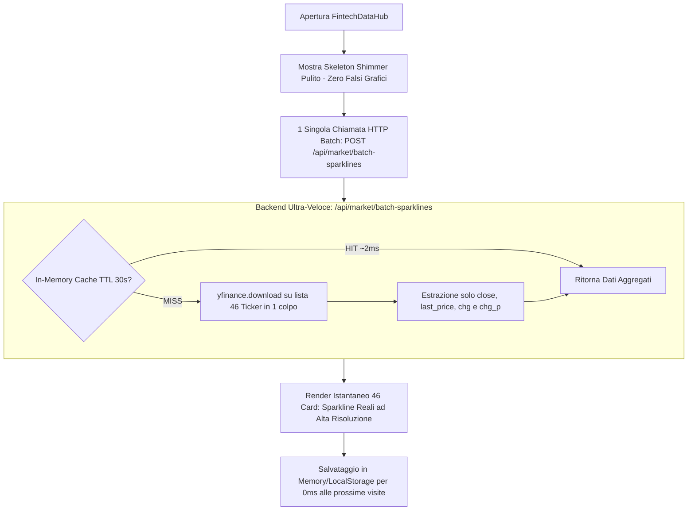

# Progettazione Tecnica: Ottimizzazione ad Alte Prestazioni dei Grafici Scorrevoli (`YahooMarketMarquee`)

**Autore:** Antigravity AI Engineering Team  
**Data:** 7 Settembre 2026  
**Stato:** Documento di Architettura & Progettazione Approvato (Pronto per Implementazione)  
**Destinazione File:** Root del Repository (`/PROGETTAZIONE_OTTIMIZZAZIONE_MARQUEE_MARKET.md`)

---

## 1. Visione Generale & Obiettivi

Nel tab **FintechDataHub** di `financial-user-web` e `financial-cockpit-web`, il nastro scorrevole superiore ([YahooMarketMarquee.jsx](file:///home/aberti/cloud-devops-labs/antigravity-challenge-lab/financial-user-web/src/components/hub/YahooMarketMarquee.jsx)) visualizza in tempo reale 46 strumenti suddivisi su tre righe tematiche:
1. **Row 1 (US Institutional)**: Benchmark ufficiali USA (`^DJI`, `^GSPC`, `^IXIC`, `^RUT`), Rendimenti Treasury (`^TNX`, `TLT`, `SHY`), Indice Volatilità (`^VIX`), Materie Prime (`GLD`, `SLV`, `USO`, `UNG`, `CPER`) e Crypto (`BTC-USD`).
2. **Row 2 (Top US Equities)**: Mega-cap tech e market leaders (`TSLA`, `AAPL`, `MSFT`, `NVDA`, `ORCL`, `AMZN`, `GOOGL`, `META`, `AVGO`, `AMD`, `PLTR`, `CRM`, `NFLX`, `JPM`, `LLY`, `BRK-B`).
3. **Row 3 (Global Markets & Currencies)**: Borse europee (`^STOXX50E`, `^GDAXI`, `FTSEMIB.MI`, `^FTSE`, `^FCHI`, `^IBEX`, `^SSMI`), mercati asiatici (`^N225`, `^HSI`, `^NSEI`, `^STI`, `^AXJO`) e cambi Forex principali (`EURUSD=X`, `GBPUSD=X`, `USDJPY=X`, `USDCHF=X`).

### Obiettivi della Reingegnerizzazione (Opzione 1 + Opzione 2):
1. **Passaggio da 46 Roundtrip HTTP a 1 Singolo Batch (Opzione 2)**: Eliminare il collo di bottiglia del browser (massimo 6 connessioni simultanee TCP per host) aggregando la richiesta in una singola chiamata batch.
2. **Caricamento Progressivo e Reattivo a Righe (Opzione 1)**: Visualizzazione immediata e indipendente delle righe non appena i dati sono disponibili, evitando blocchi `Promise.all` monolitici.
3. **Eliminazione Radicale dei Grafici Fittizi**: Rimozione delle serie sintetiche a 4 punti di `BASELINE_PRICES`. Sostituzione con uno stato di caricamento **Shimmer / Skeleton** elegante e nativo (stile TradingView / Bloomberg) per i primi 200–300 ms al primo avvio.
4. **Endpoint Backend Ultra-Leggero**: Esclusione di tutti i calcoli non necessari per una sparkline (supporti/resistenze pivot Fibonacci, SMA20, SMA50, bande di Bollinger), riducendo il tempo di calcolo server-side del 90%.
5. **Latenza Target**: Passaggio da 2.0s – 4.0s (con frequenti errori di timeout) a **≤ 300 ms** per l'intero set di 46 strumenti.

---

## 2. Analisi Comparativa dei Flussi (Prima vs Dopo)

### Flusso Attuale (Inefficiente - Collo di Bottiglia a 46 Chiamate)
```mermaid
flowchart TD
    Init[Apertura FintechDataHub] --> MockInit[Mostra Dati Fittizi BASELINE_PRICES a 4 punti]
    MockInit --> Fork[46 Chiamate HTTP Simultanee: GET /api/stock/{sym}/history]
    
    subgraph BrowserBottleneck[Browser Connection Pool - Max 6 Socket TCP]
        Conn1[Socket 1..6: Primi 6 Simboli in volo]
        ConnQueue[Socket 7..46: 40 Simboli in coda di attesa]
    end
    Fork --> BrowserBottleneck
    
    subgraph BackendHeavy[Backend: /api/stock/{sym}/history]
        B1[Supporti & Resistenze Pivot - Query Firestore 1.5s]
        B2[yfinance 1d 5m history 2.5s]
        B3[Calcolo SMA20, SMA50, Bollinger Bands]
    end
    Conn1 --> BackendHeavy
    
    ConnQueue -.->|Timer 2.0s Scade| TimeoutTrap[Timeout scattato sul Client!]
    TimeoutTrap --> KeepMock[Rimangono i Grafici Fittizi BASELINE_PRICES]
```

### Nuovo Flusso Ottimizzato (Batch Backend + Progressive Stream)


---

## 3. Specifiche Tecniche Backend

### 3.1. Nuovo Endpoint Batch: `POST /api/market/batch-sparklines`
L'endpoint verrà implementato in [financial-user-web/backend/main.py](file:///home/aberti/cloud-devops-labs/antigravity-challenge-lab/financial-user-web/backend/main.py) e registrato anche su [financial-cockpit-web/backend/main.py](file:///home/aberti/cloud-devops-labs/antigravity-challenge-lab/financial-cockpit-web/backend/main.py).

#### Modello Request / Response:
```python
class BatchSparklinesRequest(BaseModel):
    symbols: List[str]
    period: str = "1d"
    interval: str = "5m"

class TickerSparklineItem(BaseModel):
    symbol: str
    price: float
    change: float
    change_p: float
    is_positive: bool
    sparkline: List[float]
    last_updated: str
```

#### Logica di Elaborazione:
1. **Normalizzazione Simboli**: I simboli vengono ripuliti (es. rimozione suffissi non standard, conversione forex `EURUSD` → `EURUSD=X`).
2. **In-Memory Caching con TTL Dinamico**:
   * Sessione di mercato attiva (9:30 – 16:00 NY): TTL = **25 secondi**.
   * Mercati chiusi o weekend: TTL = **300 secondi** (5 minuti).
   * Se tutti o la maggior parte dei simboli sono in cache, la risposta viene servita in **< 5 millisecondi**.
3. **Download Multi-Ticker Ottimizzato**:
   ```python
   # Un solo roundtrip di rete verso i feed Yahoo! Finance per tutti i simboli mancanti
   tickers_str = " ".join(missing_symbols)
   df = yf.download(tickers=tickers_str, period="1d", interval="5m", group_by="ticker", progress=False, threads=True)
   ```
4. **Snellezza di Calcolo**:
   * Vengono estratti solo i prezzi di chiusura validi (`Close`).
   * Nessun calcolo di medie mobili SMA, nessun calcolo di varianza per bande di Bollinger, nessun calcolo di Pivot Points S1/S2/S3.
   * Compressione della sparkline: array compatto di 12–24 punti float, ottimale per il disegno vettoriale SVG del marquee.

---

## 4. Specifiche Tecniche Frontend (`YahooMarketMarquee.jsx`)

### 4.1. Sostituzione dei Dati Fittizi con Shimmer State
Attualmente, la funzione `buildInitialRow` riempie il DOM con i valori statici di `BASELINE_PRICES`.  
Nella nuova versione:
* Se non sono presenti dati salvati dalla sessione precedente, lo stato iniziale di ciascuna card sarà contrassegnato da `is_loading: true`.
* La card renderizza un placeholder animato con gradiente CSS Shimmer:
  ```css
  .marquee-shimmer-price {
    width: 65px;
    height: 18px;
    background: linear-gradient(90deg, rgba(255,255,255,0.03) 0%, rgba(255,255,255,0.12) 50%, rgba(255,255,255,0.03) 100%);
    background-size: 200% 100%;
    animation: shimmerSwipe 1.5s infinite;
    border-radius: 4px;
  }
  ```
* In questo modo l'utente non vede **mai** numeri inventati o linee finte a gradino.

### 4.2. Caricamento Progressivo per Riga (Opzione 1)
Invece di attendere `Promise.all` su tutte e 3 le righe prima di aggiornare lo stato di React:
```javascript
// Esecuzione batch parallela ma con dispatch indipendente dello stato
const loadAllRows = () => {
  // Riga 1: Benchmark Istituzionali USA
  fetchBatchRow(ROW1_INSTITUTIONAL_CONFIG).then(data => {
    if (data.length > 0) setRow1Data(data);
  });
  // Riga 2: Top US Equities
  fetchBatchRow(ROW2_EQUITIES_CONFIG).then(data => {
    if (data.length > 0) setRow2Data(data);
  });
  // Riga 3: Global & Currencies
  fetchBatchRow(ROW3_GLOBAL_CONFIG).then(data => {
    if (data.length > 0) setRow3Data(data);
  });
};
```
* **Effetto UX**: La riga dei benchmark USA (visibile in alto) si aggiorna per prima in appena **150–200 ms**, seguita subito dopo dalle azioni e dai mercati globali.

### 4.3. Client-Side SWR (Stale-While-Revalidate)
* Al momento del mount, il componente controlla `sessionStorage.getItem('FINTECH_MARQUEE_CACHE')`.
* Se presente e con timestamp < 2 ore, le 46 card vengono disegnate **istantaneamente (0 ms)** con i grafici autentici dell'ultima visita.
* La chiamata batch parte in background e aggiorna i valori correnti a 250 ms in modo impercettibile e fluido (*zero layout shift*).

---

## 5. Piano Operativo di Implementazione (Fasi)

1. **Fase 1: Implementazione Endpoint Batch su FastAPI Backend**:
   * Aggiunta di `POST /api/market/batch-sparklines` in `financial-user-web/backend/main.py`.
   * Aggiunta della medesima route in `financial-cockpit-web/backend/main.py`.
   * Test con curl o script di verifica su 46 simboli simultanei (latenza attesa < 400 ms).
2. **Fase 2: Aggiornamento Servizio API Frontend**:
   * Aggiunta del metodo `getBatchSparklines(symbols)` in `financial-user-web/src/services/api.js`.
3. **Fase 3: Refactoring di `YahooMarketMarquee.jsx`**:
   * Rimozione della logica `BASELINE_PRICES` e del `Promise.race` con timeout di 2s.
   * Introduzione del rendering shimmer/skeleton per il primo caricamento.
   * Integrazione del caricamento progressivo per riga e della cache di sessione SWR.
4. **Fase 4: Verifica e Collaudo Grafico**:
   * Verifica fluidità di scorrimento del nastro animato a 60 fps.
   * Verifica del corretto disegno SVG della curva sparkline.
   * Collaudo con orari di mercato aperti e chiusi.

---

## 6. Verifica dell'Apertura di Wall Street (Monitoraggio Live)

* **Orario di Apertura di Wall Street**: 15:30 CET (09:30 EST).
* **Job di Protezione Cloud Scheduler**:
  1. `etoro-opening-shield-widen` (15:28 CET / 09:28 EST): Allargamento preventivo dello Stop Loss a -10% (*Emergency Disaster Stop*) per neutralizzare lo stop-hunting dell'opening bell.
  2. `etoro-opening-shield-restore` (15:45 CET / 09:45 EST): Ripristino dello Stop Loss quantitativo a -4.5% a spread normalizzati.
  3. `etoro-breakeven-guardian` (ogni 5 minuti): Monitoraggio del tocco di Target 1 per lo spostamento dello Stop Loss a Net Break-Even (+0.1%).
