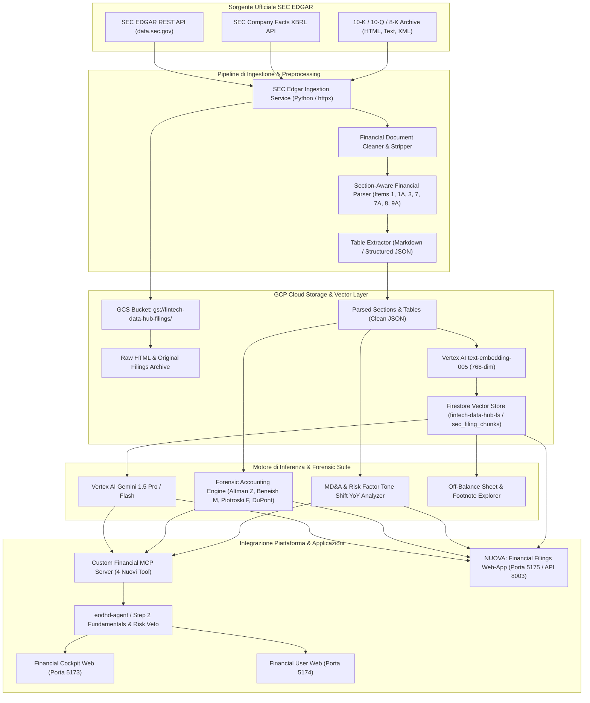
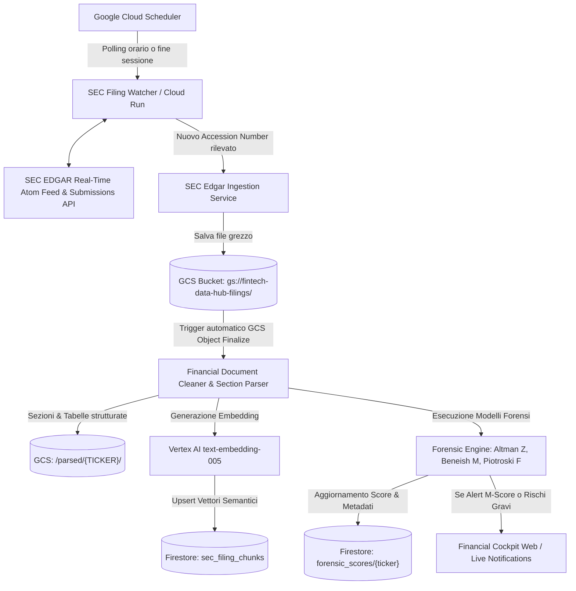

# Progettazione Architetturale & Metodologica: Infrastruttura RAG GCP per Bilanci Ufficiali (SEC EDGAR), Forensic Financial Intelligence & Financial Filings Web-App

**Autore:** Antigravity AI Engineering Team  
**Data:** 2 Settembre 2026  
**Stato:** Proposta Architetturale per Revisione & Approvazione  
**Destinazione File:** Root del Repository (`/PROGETTAZIONE_RAG_BILANCI_GCP.md`)

---

## 1. Executive Summary & Visione di Alto Livello

L'obiettivo strategico di questa nuova componente è dotare la nostra piattaforma quantitativa di un **motore di Financial Statement Intelligence di livello istituzionale**, basato su **RAG (Retrieval-Augmented Generation) gestita su Google Cloud Platform (GCP)**, capace di analizzare ed interpretare in profondità i documenti contabili e regolamentari ufficiali delle società quotate:
- **SEC Form 10-K** (Relazione Annuale completa, certificata da revisori contabili indipendenti).
- **SEC Form 10-Q** (Relazione Trimestrale di aggiornamento operativo e contabile).
- **SEC Form 8-K** (Notifiche di eventi societari rilevanti e non programmati).
- **XBRL Data Feeds** (Tassonomia contabile standardizzata US-GAAP e IFRS fornita direttamente dalla SEC).

### Principi Guida del Progetto
1. **Zero Costi Ricorrenti per Provider Dati Esterni**: Sfruttamento integrale delle **API ufficiali SEC EDGAR** (`https://data.sec.gov/`), pubbliche, legali e gratuite al 100%, con ingestione strutturata conforme ai requisiti di rate-limiting e User-Agent della SEC.
2. **Infrastruttura Enterprise su GCP Vertex AI & Cloud Storage**: Data Lake su Google Cloud Storage (`gs://fintech-data-hub-filings/`), chunking semantico finanziario specializzato per preservare la struttura tabellare e le note integrative, vettorizzazione ad alta fedeltà con `text-embedding-005` e memorizzazione indicizzata.
3. **Analisi Quantitativa & Forense da Analista Senior**: Integrazione di modelli consolidati di Forensic Accounting per smascherare manipolazioni dei profitti (Beneish M-Score), valutare la solvibilità strutturale (Altman Z-Score), la solidità complessiva (Piotroski F-Score) e la reale qualità degli utili (DuPont a 5 stadi, Cash Conversion Ratio, Sloan Accrual Index).
4. **Fusione nel DAG Quantitativo (`eodhd-agent`)**: I segnali qualitativi e forensi estratti dai bilanci alimentano direttamente lo **Step 2 (Catalysts & Fundamentals)** attraverso il coefficiente correttivo `M_forensic`, introducendo filtri di veto automatico prima dell'allocazione del capitale (Step 5).
5. **Nuovo Modulo & Servizio Indipendente (`financial-edgar-app`)**: Servizio dedicato in Python + FastAPI (porta 8004 / container Cloud Run 8080) focalizzato su acquisizione ufficiale SEC EDGAR, ricerca semantica con citazioni verificabili, ispezione forense dei bilanci (Beneish, Altman, Piotroski), diff temporale dei fattori di rischio (YoY Risk Changes) e fornitura dati a tutti gli altri moduli della piattaforma.

---

## 2. Architettura di Sistema End-to-End



---

## 3. Strategia di Ingestione Dati (SEC EDGAR Ufficiale)

### 3.1 Fonte Dati & Zero Costi di Abbonamento
Tutti i bilanci societari e le comunicazioni ufficiali negli Stati Uniti sono depositati obbligatoriamente sul sistema **EDGAR (Electronic Data Gathering, Analysis, and Retrieval)** della SEC.
- **Endpoint Submissions**: `https://data.sec.gov/submissions/CIK{cik.zfill(10)}.json`
  - Restituisce l'elenco cronologico di tutti i filing depositati dall'azienda con accession number, data deposito, tipo form, periodo di riferimento.
- **Endpoint Company Facts (XBRL strutturato)**: `https://data.sec.gov/api/xbrl/companyfacts/CIK{cik.zfill(10)}.json`
  - Fornisce l'intera serie storica di tutte le metriche finanziarie certificate (Revenues, NetIncome, OperatingIncome, TotalAssets, Liabilities, OperatingCashFlow, CapEx, DilutedShares, etc.) classificate secondo la tassonomia ufficiale `us-gaap` e `dei`.
- **Endpoint Documenti Originali**: `https://www.sec.gov/Archives/edgar/data/{cik}/{accession_clean}/{filename}`
- **Conformità Legale & Rate-Limiting**:
  - Limite SEC: massimo **10 richieste al secondo**.
  - Requisito di intestazione HTTP: `User-Agent: FinancialEngineeringTeam contact@fintech-data-hub.internal`.

### 3.2 Profondità Storica di Raccolta Dati (Tiered Depth Strategy)

Per massimizzare l'efficacia quantitativa ed evitare sia l'inquinamento semantico (*semantic noise* da eventi ormai obsoleti) sia consumi inutili di risorse di embedding, il sistema adotta una **strategia a profondità differenziata**:

| Dominio Dati | Formato Sorgente | Orizzonte Temporale | Motivazione & Modelli Coinvolti |
| :--- | :--- | :--- | :--- |
| **Dati Numerici di Bilancio (XBRL)** | `companyfacts` JSON | **5 Anni Fiscali** (o serie completa) | Analisi trend a lungo termine, CAGR ricavi a 3Y/5Y, evoluzione margini, serie storica di Altman Z-Score e Beneish M-Score. Dimensioni file ridotte (~1 MB per titolo), zero impatto su embedding. |
| **Form 10-K (Relazione Annuale)** | HTML / Testo pulito | **Ultimi 3 Anni Fiscali** | Confronto YoY rigoroso dei fattori di rischio (*Item 1A*), discussione del management (*Item 7 MD&A*) e note integrative (*Footnotes*) senza rumore semantico obsoleto. |
| **Form 10-Q (Relazione Trimestrale)** | HTML / Testo pulito | **Ultimi 8 Trimestri (2 Anni)** | Cattura la dinamica recente (*Quarter-over-Quarter* e *Year-over-Year*), la stagionalità e le revisioni di guidance infra-annuali. |
| **Form 8-K (Eventi Straordinari)** | HTML / Testo pulito | **Ultimi 12 Mesi** | Rilevamento cambi di leadership (CEO/CFO), accordi materiali straordinari, fusioni/acquisizioni e contenziosi legali recenti. |

> [!TIP]
> **Perché limitare il testo RAG a 3 anni?**  
> L'analisi testuale di bilanci depositati oltre 3 anni fa introduce falsi allarmi nei modelli semantici (es. cause legali archiviate, riferimenti normativi o shock temporanei superati). Un orizzonte di 3 anni garantisce il pieno supporto ai modelli contabili istituzionali (Beneish M-Score e Piotroski F-Score operano sul delta t vs t-1), limitando il database vettoriale a circa 1.500 chunk per azienda con latenze di retrieval inferiori a 150 ms.

### 3.3 Struttura del Data Lake su Google Cloud Storage
I file vengono archiviati nel bucket `gs://fintech-data-hub-filings/` con tassonomia gerarchica:
```
gs://fintech-data-hub-filings/
├── metadata/
│   ├── sec_cik_map.json                  # Mappa Ticker <-> CIK ufficiale
│   └── company_tickers_exchange.json     # Metadati aziende
└── companies/
    └── {TICKER}/
        ├── xbrl_facts.json               # Dati grezzi XBRL storici
        └── filings/
            ├── 10-K/
            │   └── FY2025/
            │       ├── raw.htm           # Filing originale scaricato da SEC
            │       ├── cleaned.md        # Documento normalizzato in Markdown
            │       ├── sections.json     # Sezioni estratte (Item 1, 1A, 7, 8, etc.)
            │       └── tables.json       # Tabelle contabili strutturate
            └── 10-Q/
                ├── Q1_2025/
                ├── Q2_2025/
                └── Q3_2025/
```

### 3.4 Rilevamento Continuo & Ingestione Automatica dei Nuovi Bilanci (Zero-Touch Event-Driven Pipeline)

Per garantire che la piattaforma si accorga in tempo reale della pubblicazione di nuovi bilanci (10-K, 10-Q, 8-K) e li scarichi/processi senza alcun intervento manuale o caricamento a mano su bucket, l'architettura implementa un flusso serverless a eventi combinato con una modalità on-demand.



#### 3.4.1 I Due Canali Ufficiali di Rilevamento SEC
La SEC mette a disposizione due canali programmatici gratuiti e reattivi:
1. **Feed Atom/RSS Real-Time della SEC**:
   - URL: `https://www.sec.gov/cgi-bin/browse-edgar?action=getcurrent&type=10-K,10-Q,8-K&owner=include&count=100&output=atom`
   - Il feed emette un evento per ogni nuovo documento depositato dalle società quotate (incluso orario di deposito, CIK, Ticker e Accession Number univoco). Il watcher filtra esclusivamente i ticker presenti nell'universo di monitoraggio (S&P 500, Nasdaq 100 o watchlist attiva).
2. **Delta-Check Incrementale su `submissions/CIK{cik}.json`**:
   - Per ciascuna società monitorata, Firestore conserva l'ultimo `accession_number` processato per ciascun form type.
   - Il watcher confronta il valore registrato con l'ultimo filing presente nel file JSON di EDGAR: se il valore è identico il check si conclude in 2 millisecondi a costo zero; se differente, scatta immediatamente la catena di ingestione.
3. **Anticipazione da Calendario Utili (*Upcoming Earnings*)**:
   - Sfruttando il tool MCP nativo `get_upcoming_earnings`, il sistema conosce in anticipo la data stimata di rilascio trimestrale dei candidati di portafoglio, intensificando la frequenza di polling nei giorni critici (*Earnings Season*).

#### 3.4.2 Automazione Serverless su GCP (Zero-Touch Pipeline)
1. **Trigger via Google Cloud Scheduler**:
   - Un job Cloud Scheduler richiama periodicamente l'endpoint `/api/sec/sync-feed` del microservizio `financial-edgar-app` (es. ogni 2 ore durante la sessione di Wall Street e una volta a chiusura mercati alle 22:30 IT). Costo: 0,00 €.
2. **Download & Archiviazione Raw**:
   - Il servizio effettua il download streaming del filing originale (HTML/XML) e dei fatti XBRL, archiviandoli con timestamp su Google Cloud Storage (`gs://fintech-data-hub-filings/companies/{TICKER}/filings/{TYPE}/{PERIOD}/raw.htm`).
3. **Event-Driven Parsing & Embedding**:
   - Il salvataggio del file su GCS attiva un evento **GCS Object Finalize** che risveglia il worker di estrazione:
     - Pulizia HTML e parsing strutturato delle sezioni chiave (*Item 1A Rischi*, *Item 7 MD&A*, *Item 8 Bilancio & Note*).
     - Chunking semantico finanziario con preservazione delle tabelle.
     - Calcolo degli embedding densi con **Vertex AI `text-embedding-005`** (768 dimensioni).
     - Upsert vettoriale nella collezione Firestore `sec_filing_chunks`.
4. **Scoring Forense Immediato & Alert**:
   - Contestualmente al salvataggio, vengono ricalcolati i parametri di qualità contabile: **Beneish M-Score**, **Altman Z-Score**, **Piotroski F-Score**, **Sloan Accrual Index**.
   - Se il Beneish M-Score supera la soglia di allerta (-1.78) o la sezione contenziosi (*Item 3*) segnala indagini SEC o rischi materiali, viene emesso un evento nella collezione `alerts` di Firestore, visualizzato con badge rosso nel Financial Cockpit Web.

#### 3.4.3 Modalità Just-In-Time (On-Demand / Cache-Aside)
Cosa accade se un utente nel Cockpit Web o l'agente DAG nello Step 2 analizza un titolo il cui bilancio è stato appena depositato o non è ancora presente nel Data Lake?
- **Pattern Cache-Aside**:
  1. Il sistema verifica la presenza del filing del trimestre corrente in `gs://fintech-data-hub-filings/` e nei record di Firestore.
  2. **Cache Hit**: Se presente e valido, il RAG risponde in meno di 200 ms.
  3. **Cache Miss / Stale**: Il servizio effettua l'acquisizione just-in-time via API SEC in 2-3 secondi, memorizza gli artefatti nel bucket e in Firestore per le future interrogazioni, ed esegue l'inferenza richiesta in tempo reale.

#### 3.4.4 State Machine di Vettorizzazione & Tracciamento dello Stato dei Documenti

Per garantire visibilità totale e prevenire attese o blocchi dell'interfaccia o del motore quantitativo, il ciclo di vita di ciascun bilancio è gestito tramite una **State Machine deterministica su Firestore** (`sec_filings_status/{accession_number}`):

1. **`DISCOVERED`**: Documento rilevato dal Watcher SEC Atom/RSS feed o richiesto on-demand.
2. **`DOWNLOADED`**: File raw (HTML/XML e JSON facts) archiviato nel bucket `gs://fintech-data-hub-filings/`.
3. **`PARSED`**: Sezioni finanziarie estratte (Item 1A, 7, 8), tabelle Markdown generate, conteggio esatto dei chunk totali calcolato (`total_chunks: N`).
4. **`EMBEDDING`**: Chiamate batch a **Vertex AI `text-embedding-005`** con avanzamento monitorato (`chunks_indexed / total_chunks`).
5. **`INDEXED` (RAG Ready)**: Tutti i chunk sono archiviati in `sec_filing_chunks` su Firestore Vector Search con timestamp `indexed_at`.
6. **`FAILED`**: In caso di errore durante l'ingestione, con log diagnostico e contatore di retry automatici.

> [!NOTE]
> **Perché Vertex AI non è lento nella nostra architettura (3-5 secondi vs 30+ minuti)?**  
> I lunghi tempi di elaborazione tipici di Vertex AI Search (25-45 minuti) derivano dalla compilazione batch di interi Data Store e indici distribuiti ScaNN/Tree-AH su cluster virtuali dedicati.  
> La nostra architettura adotta invece le **API di Embedding Diretto (`text-embedding-005`)** con payload fino a 250 testi per batch (latenza 80-150 ms) combinata con lo **streaming storage di Firestore Vector Search**: ogni vettore scritto è immediatamente ricercabile in tempo reale (`find_nearest`), azzerando qualsiasi attesa di compilazione dell'indice. Inoltre, le metriche contabili (Z-Score, M-Score, F-Score) non richiedono vettorizzazione e sono disponibili in **meno di 800 ms** direttamente da XBRL.

---

## 4. Chunking Semantico Finanziario (Section-Aware Chunking)

I documenti finanziari 10-K raggiungono tipicamente tra le 100 e le 250 pagine (50.000 – 120.000 parole). L'applicazione di un chunking generico a blocchi di dimensione fissa (es. 500 caratteri casuali) **distrugge le relazioni contabili**, spezza le tabelle a metà e disperde il contesto delle note a piè di pagina.

Il nostro motore implementa un **Section-Aware Chunking** basato sulla struttura obbligatoria dei filing SEC:

| Sezione SEC Form 10-K | Titolo Formale | Utilità Quantitativa & Forense |
| :--- | :--- | :--- |
| **Item 1** | *Business* | Modello di business, revenue streams per segmento, concentrazione clienti. |
| **Item 1A** | *Risk Factors* | Rilevamento nuovi rischi emergenti, cybersecurity, supply chain, geopolitica. |
| **Item 3** | *Legal Proceedings* | Contenziosi legali materiali, indagini antitrust, richieste risarcitorie pendenti. |
| **Item 7** | *MD&A (Management's Discussion & Analysis)* | **La sezione più preziosa per gli analisti**: spiegazione delle variazioni di margini, guidance, liquidità, covenant sul debito. |
| **Item 7A** | *Quantitative Disclosures About Market Risk* | Sensibilità a tassi di interesse, rischio cambio valutario, prezzi materie prime. |
| **Item 8** | *Financial Statements & Supplementary Data* | Bilancio consolidato e **Note Integrative (Footnotes)**: leasing, debito, stock-based compensation, imposte. |
| **Item 9A** | *Controls and Procedures* | Efficacia dei controlli interni SOX 404, rilievi di debolezze materiali (*material weaknesses*). |

### Regole di Chunking:
1. **Preservazione delle Tabelle**: Tutte le matrici numeriche vengono convertite in formato Markdown Tabellare con le intestazioni di colonna ripetute in ogni frammento, garantendo che il modello di embedding catturi il significato di ogni cifra.
2. **Metadati Arricchiti per Chunk**:
   - `ticker`: Simbolo azionario (es. "NVDA").
   - `fiscal_year`: Anno fiscale (es. 2025).
   - `fiscal_period`: "FY" (per 10-K) o "Q1"/"Q2"/"Q3" (per 10-Q).
   - `filing_type`: "10-K", "10-Q", "8-K".
   - `section_id`: "ITEM_1A", "ITEM_7", "ITEM_8_NOTE_12", etc.
   - `section_title`: Titolo leggibile della sezione.
   - `is_table`: Valore booleano per distinguere testo discorsivo da tabelle numeriche.
   - `chunk_index`: Indice progressivo all'interno della sezione.

---

## 5. Vettorizzazione & Architettura Vector Store

### 5.1 Modello di Embedding
- **GCP Vertex AI `text-embedding-005`**:
  - Dimensione vettoriale: **768 dimensioni** (ottimale per accuratezza e velocità).
  - Parametro `task_type`:
    - `RETRIEVAL_DOCUMENT`: impiegato durante l'indicizzazione dei chunk di bilancio.
    - `RETRIEVAL_QUERY`: impiegato per la query semantica dell'utente o dell'agente.

### 5.2 Storage Vettoriale: Scelta di Firestore Vector Search
Per archiviare i vettori e consentire ricerche congiunte (vettoriali + filtri relazionali), la soluzione ottimale è **Firestore Vector Search** sul database già attivo `fintech-data-hub-fs`:
- **Collezione**: `sec_filing_chunks`
- **Vantaggi Tecnici & Economici**:
  - **Zero Costi Fissi**: Non richiede cluster o endpoint dedicati attivi 24/7 (come Vertex AI Vector Search Index con nodi `e2-standard-4`, che comporterebbero un costo fisso di oltre 150 $ al mese).
  - **Query Ibride Native**: È possibile filtrare in modo composito per metadati esatti prima della ricerca del vicino più prossimo:
    ```python
    query = (
        db.collection("sec_filing_chunks")
        .where("ticker", "==", "NVDA")
        .where("fiscal_year", "==", 2025)
        .where("section_id", "in", ["ITEM_1A", "ITEM_7"])
        .find_nearest(
            vector_field="embedding",
            query_vector=query_embedding,
            distance_measure=DistanceMeasure.COSINE,
            limit=8,
        )
    )
    ```
  - **Integrazione Immediata**: Nessun nuovo componente infrastrutturale da orchestrare; piena continuità con il DB Firestore già operativo nel progetto.

---

## 6. Metriche Quantitative & Suite Forense da Analista Senior

I bilanci non sono soltanto testo: per comprendere la reale salute aziendale, il sistema calcolerà in modo deterministico e automatico le metriche utilizzate dai top analyst di Wall Street:

### 6.1 Beneish M-Score (Rilevatore di Frodi ed Earnings Manipulation)
Il Beneish M-Score è un modello matematico a 8 variabili sviluppato dal Prof. Messod Beneish per quantificare la probabilità che un'azienda stia manipolando i propri utili:

1. **DSRI (Days Sales in Receivables Index)**:  
   `DSRI = (Crediti_Clienti_t / Ricavi_t) / (Crediti_Clienti_t-1 / Ricavi_t-1)`  
   *Se DSRI >> 1.0, i crediti crescono molto più rapidamente dei ricavi, segnale di fatturazioni aggressive o vendite fittizie.*
2. **GMI (Gross Margin Index)**:  
   `GMI = ((Ricavi_t-1 - COGS_t-1) / Ricavi_t-1) / ((Ricavi_t - COGS_t) / Ricavi_t)`  
   *Se GMI > 1.0, i margini lordi si stanno deteriorando, incentivando il management a gonfiare altre voci.*
3. **AQI (Asset Quality Index)**:  
   `Non_Current_Assets_non_PPE = Tot_Assets - Current_Assets - PPE`  
   `AQI = (1 - (Current_Assets_t + PPE_t) / Tot_Assets_t) / (1 - (Current_Assets_t-1 + PPE_t-1) / Tot_Assets_t-1)`  
   *Misura la capitalizzazione indebita di costi operativi tra le immobilizzazioni immateriali.*
4. **SGI (Sales Growth Index)**:  
   `SGI = Ricavi_t / Ricavi_t-1`  
   *Aziende a forte crescita affrontano pressioni elevate per mantenere le attese del mercato.*
5. **DEPI (Depreciation Index)**:  
   `Depr_Rate = Ammortamenti / (PPE + Ammortamenti)`  
   `DEPI = Depr_Rate_t-1 / Depr_Rate_t`  
   *Se DEPI > 1.0, l'azienda ha allungato la vita utile stimata degli asset per abbattere la quota di ammortamento e aumentare gli utili correnti.*
6. **SGAI (Sales, General and Administrative expenses Index)**:  
   `SGAI = (SG&A_t / Ricavi_t) / (SG&A_t-1 / Ricavi_t-1)`  
   *Valuta l'efficienza dei costi commerciali e di struttura.*
7. **LVGI (Leverage Index)**:  
   `Leva = (Debito_Breve + Debito_Lungo) / Tot_Assets`  
   `LVGI = Leva_t / Leva_t-1`  
   *Misura l'incremento di indebitamento.*
8. **TATA (Total Accruals to Total Assets)**:  
   `TATA = (Utile_Netto_t - Flusso_Cassa_Operativo_t) / Tot_Assets_t`  
   *Misura quanto l'utile dipenda da poste contabili non monetarie rispetto alla cassa reale generata.*

**Formula Complessiva dell'M-Score**:  
`M-Score = -4.84 + (0.920 × DSRI) + (0.528 × GMI) + (0.404 × AQI) + (0.892 × SGI) + (0.115 × DEPI) - (0.172 × SGAI) + (4.037 × TATA) + (0.0327 × LVGI)`

- **Soglia Operativa**:  
  - `M-Score > -1.78`: **Alta probabilità di manipolazione contabile** (Red Flag grave).
  - `M-Score ≤ -1.78`: Azienda contabile trasparente.

---

### 6.2 Altman Z-Score (Probabilità di Insolvenza & Rischio Default a 24 Mesi)
Formula classica per aziende industriali/commerciali quotate:  
`Z = (1.2 × X1) + (1.4 × X2) + (3.3 × X3) + (0.6 × X4) + (0.999 × X5)`

Dove:
- `X1 = Working Capital / Total Assets` (Liquidità a breve termine).
- `X2 = Retained Earnings / Total Assets` (Redditività cumulativa nel tempo).
- `X3 = EBIT / Total Assets` (Produttività del capitale investito prima di tasse e oneri finanziari).
- `X4 = Market Value of Equity / Total Liabilities` (Rapporto tra valore di mercato e debito complessivo).
- `X5 = Sales / Total Assets` (Rotazione dell'attivo).

- **Classificazione delle Zone di Rischio**:  
  - `Z ≥ 2.99`: **Safe Zone** (Azienda solida, rischio default trascurabile).
  - `1.81 ≤ Z < 2.99`: **Grey Zone** (Zona grigia, vulnerabilità a shock di liquidità).
  - `Z < 1.81`: **Distress Zone** (Rischio significativo di insolvenza entro 2 anni).

---

### 6.3 Piotroski F-Score (Solidità Fondamentale su 9 Indicatori Binari)
Punteggio complessivo compreso tra **0 e 9** (ogni segnale positivo vale 1 punto):

1. **Redditività (4 Punti)**:
   - `ROA_t > 0` (+1)
   - `Operating Cash Flow (CFO)_t > 0` (+1)
   - `ROA_t > ROA_t-1` (+1)
   - `Accrual: CFO_t > Utile_Netto_t` (+1, indica che gli utili sono coperti da cassa reale).
2. **Leva, Liquidità & Diluizione (3 Punti)**:
   - `Leva a Lungo Termine_t < Leva a Lungo Termine_t-1` (+1, debito in riduzione).
   - `Current Ratio_t > Current Ratio_t-1` (+1, liquidità a breve migliorata).
   - `N_Azioni_t ≤ N_Azioni_t-1` (+1, nessuna emissione diluitiva di nuove azioni ordinarie).
3. **Efficienza Operativa (2 Punti)**:
   - `Gross Margin_t > Gross Margin_t-1` (+1, potere di prezzo e controllo costi del venduto).
   - `Asset Turnover_t > Asset Turnover_t-1` (+1, maggiore produttività del capitale investito).

- **Interpretazione**:  
  - Score `8 – 9`: **Eccellenza Finanziaria Assoluta**.
  - Score `5 – 7`: Azienda Stabile.
  - Score `0 – 4`: **Fragilità Strutturale** (scartare dai candidati long).

---

### 6.4 DuPont Analysis a 5 Stadi (Decomposizione Analitica del ROE)
Permette di isolare con precisione la causa scatenante della variazione della redditività del capitale proprio:

`ROE = Tax Burden × Interest Burden × Operating Margin × Asset Turnover × Financial Leverage`

Dove:
- `Tax Burden = Net Income / EBT` (Impatto dell'aliquota fiscale effettiva).
- `Interest Burden = EBT / EBIT` (Peso degli oneri finanziari sul debito).
- `Operating Margin = EBIT / Revenues` (Margine operativo caratteristico).
- `Asset Turnover = Revenues / Total Assets` (Efficienza nell'utilizzo del capitale).
- `Financial Leverage = Total Assets / Shareholders' Equity` (Moltiplicatore di leva finanziaria).

*Analisi*: Un ROE elevato guidato solo dalla leva finanziaria (`Financial Leverage > 3.5`) o da sgravi fiscali una tantum (`Tax Burden ≈ 1.0`) è un segnale di allarme; un ROE sostenuto da `Operating Margin` e `Asset Turnover` denota un reale vantaggio competitivo strutturale (*Economic Moat*).

---

### 6.5 Analisi Comparativa MD&A & Tone Shift YoY
Confrontando il testo dell'Item 7 dell'ultimo bilancio con quello dell'anno precedente tramite modelli LLM Gemini:
- **Calcolo del Tone Differential (ΔTone)**: Variazione percentuale dell'uso di termini positivi vs negativi secondo il dizionario specialistico finanziario *Loughran-McDonald*.
- **Nuove Clausole di Rischio**: Isolamento automatico di paragrafi aggiunti o rimossi in Item 1A.
- **Vaghezza Linguistica (Fog Index)**: Misurazione della lunghezza media delle frasi e della percentuale di parole complesse; la letteratura dimostra che l'aumento della complessità sintattica coincide con il tentativo del management di celare criticità operative.

---

## 7. Incrocio con la Piattaforma Esistente (`eodhd-agent` & Cockpit)

### 7.1 Integrazione nello Step 2 (Catalysts & Fundamentals) del DAG
Nel workflow attuale (`eodhd-agent`), lo **Step 2** analizza sorprese utili, accordi commerciali e scambi di insider/Congresso. L'infrastruttura RAG introduce un nuovo pilastro: il **Filing Forensic & Health Multiplier (`M_forensic`)**:

- Formula di Correzione dello Score di Fondamentali:  
  `Score_Catalyst_Final = Score_Catalyst_Base × M_forensic`

- **Regole di Calcolo di `M_forensic`**:
  - Se `Beneish M-Score > -1.78` (Sospetto Manipolatore): `M_forensic = 0.20` (**Penalizzazione drastica dell'80%**).
  - Se `Altman Z-Score < 1.81` (Distress Zone): `M_forensic = 0.50` (**Taglio del 50%**).
  - Se `Piotroski F-Score ≥ 8` E `M-Score ≤ -2.22` E `Z-Score ≥ 3.0`: `M_forensic = 1.25` (**Bonus di Qualità +25%**).
  - Se `Piotroski F-Score ≤ 3`: `M_forensic = 0.60`.

### 7.2 Hard Veto sullo Step 5 (Portfolio Synthesis)
Se un titolo selezionato dallo screening tecnico e statistico (Step 1) presenta:
1. `Beneish M-Score > -1.49` (segnalazione gravissima di falso in bilancio), oppure
2. Giudizio del revisore contabile negativo o con rilievi di continuità aziendale (*Going Concern Warning* estratto dall'Item 9A/Item 8),

**il titolo viene immediatamente escluso dal portafoglio (Hard Veto)**, registrando nel report Firestore (`runs/{run_id}`) la motivazione forense che ha impedito l'acquisto incauto.

### 7.3 Nuovi Tool Registrati nel Custom Financial MCP Server
Verranno aggiunti 4 nuovi tool al `financial-mcp-server`:
1. `get_sec_filings_list`: Elenco dei filing storici con CIK, date e form.
2. `query_sec_filings_rag`: Ricerca semantica avanzata con citazioni testuali e coordinate di sezione.
3. `get_forensic_accounting_report`: Calcolo completo di Altman Z, Beneish M, Piotroski F, DuPont 5-Way e Sloan Accrual.
4. `get_filing_risk_factors_yoy_diff`: Estrazione delle variazioni nette (aggiunti/cancellati) nei fattori di rischio tra due esercizi consecutivi.

---

## 8. Modulo Microservizio Autonomo: `financial-edgar-app`

Per garantire totale separazione delle responsabilità e isolamento computazionale rispetto al Cockpit e al DAG quantitativo, l'intera pipeline è implementata nel microservizio autonomo **`financial-edgar-app`**:

```
financial-edgar-app/
├── Dockerfile                      # Container Cloud Run (Python 3.12-slim)
├── pyproject.toml                  # Dipendenze (FastAPI, httpx, BeautifulSoup4, GCS, Firestore)
├── src/financial_edgar_app/
│   ├── config.py                   # Configurazione SEC User-Agent, Bucket GCS, Firestore
│   ├── api/
│   │   ├── main.py                 # FastAPI REST App (porte 8004 / 8080)
│   ├── client/
│   │   └── sec_edgar_client.py     # Client SEC EDGAR con rate limiter <= 10 req/s
│   └── services/
│       ├── forensic_engine.py      # Motore Formule: Beneish M, Altman Z, Piotroski F, Sloan
│       ├── section_parser.py       # Parser e Cleaner HTML -> Sezioni 10-K/10-Q
│       └── rag_engine.py           # Vertex AI Embeddings & Vector Search
└── tests/                          # Suite di test unitari (Forensic, SEC Client, API)
```
### 8.1 Integrazione Visuale nel Financial Cockpit Web
Le funzionalità visive, i radar chart forensi e l'interfaccia di interrogazione documentale vengono integrati direttamente nel **Financial Cockpit Web** (e nel portale User in modalità read-only), interrogando via REST le API di `financial-edgar-app`:

### 8.2 Le 5 Viste Principali dell'Applicazione

#### Vista 1: Global Filing Explorer & Document Reader
- Selettore del titolo con ticker, nome società, CIK e data dell'ultimo bilancio depositato.
- Albero delle sezioni a sinistra (Item 1, Item 1A, Item 7, Item 8 con elenco note).
- Viewer centrale responsive con rendering pulito di testo e tabelle contabili.
- Ricerca full-text e semantica contestuale con evidenziazione in giallo dei passaggi rilevanti.

#### Vista 2: Forensic Health & Solvency Lab
- **Gauges Grafici Interattivi**:
  - Altman Z-Score con bande colorate (Rosso < 1.81, Giallo 1.81-2.99, Verde > 2.99).
  - Beneish M-Score con soglia di allarme tratteggiata a -1.78.
  - Piotroski F-Score con checklist dei 9 criteri e badge di superamento.
- **Decomposizione DuPont a Cascata**: Grafico a blocchi connessi che mostra l'albero matematico dal ROE fino a margini, rotazione asset e leva.
- **Matrice Cash Conversion**: Confronto storico tra Net Income e Cash Flow from Operations per smascherare divergenze contabili.

#### Vista 3: Risk Factors & MD&A Diff Viewer (YoY)
- Interfaccia comparativa a due colonne (Anno Precedente vs Anno Corrente):
  - Evidenziazione in **verde** dei fattori di rischio rimossi (mitigati o superati).
  - Evidenziazione in **rosso/arancione** dei fattori di rischio inediti introdotti quest'anno.
  - Sintesi generata da Gemini: *"Focus sui cambiamenti sostanziali di quest'anno: aggiunta clausola di rischio su embargo semiconduttori e contenzioso antitrust UE"*.

#### Vista 4: Institutional Equity Research RAG Chat
- Interfaccia conversazionale guidata con template di prompt predefiniti:
  - *"Quali sono gli impegni contrattuali e il debito in scadenza nei prossimi 24 mesi?"*
  - *"Esistono passività potenziali o garanzie non iscritte nello Stato Patrimoniale?"*
  - *"Come spiega il management la contrazione del margine lordo nel trimestre?"*
  - *"Qual è l'incidenza della Stock-Based Compensation sul Free Cash Flow?"*
- Ogni risposta include:
  - Risposta argomentata con numeri precisi.
  - **Citazioni verificabili con un click**: salto diretto alla pagina e al paragrafo del documento SEC originale.

#### Vista 5: Executive Committee Briefing (One-Pager)
- Scheda riepilogativa esecutiva esportabile, pensata per il Portfolio Manager:
  - Moat e posizionamento competitivo.
  - Qualità del management e trasparenza contabile.
  - Verdetto finale: **INVESTABLE / CAUTION / UNINVESTABLE**.
  - Impatto sul coefficiente `M_forensic` per il trading bot.

### 8.3 Integrazione nel Modale "Dettaglio Analisi" del Live Screener (`StockDetailModal.jsx`)

Per rendere i dati contabili immediatamente azionabili senza costringere l'utente ad abbandonare la sessione di screening operativo, la scheda di ciascun titolo nel modale `StockDetailModal.jsx` include la sezione dedicata:

**🏛️ Salute Finanziaria Forense & Sintesi Bilancio Ufficiale (SEC EDGAR)**:
1. **Banner Verdetto di Salute Aziendale**:
   - Badge di rating sintetico immediato: 🟢 **ECCELLENTE / SOLIDA (Safe Zone)**, 🟡 **NEUTRA / DA MONITORARE**, 🔴 **ALLERTA FORENSE**.
   - Spiegazione testuale dell'analista sulla solidità patrimoniale e sulla copertura dei debiti.
2. **Trio di Score Forensi Certificati**:
   - **Altman Z-Score**: probabilità di insolvenza a 24 mesi (Safe Zone se Z ≥ 2.99).
   - **Beneish M-Score**: probabilità di frode o manipolazione degli utili (Trasparente se M ≤ -1.78).
   - **Piotroski F-Score**: solidità fondamentale complessiva su 9 criteri contabili (0–9).
3. **I 4 Dati di Bilancio Chiave dell'Ultimo Deposito SEC (Form 10-K / 10-Q)**:
   - **Fatturato & Crescita YoY** (es. `+14.2% YoY`).
   - **Margine Operativo EBIT / Lordo** (es. `32.5% in espansione`).
   - **Free Cash Flow (FCF) & Tasso di Conversione Cassa** (es. `$755M (Conversione +14%)`).
   - **Posizione Finanziaria Netta** (Cassa Netta vs Debito Netto / EBITDA).
4. **Notizie di Bilancio & Sintesi Management (SEC Item 7 MD&A & Form 8-K)**:
   - Sintesi delle comunicazioni ufficiali depositate dal CEO e dal CFO relative a guidance future, allocazione del capitale (Capex e Buyback) e verifica dell'assenza di contenziosi legali materiali nella sezione *Item 3 (Legal Proceedings)*.

---

## 9. Strategia dei Costi, Quote GCP & Zero Fornitori a Pagamento

| Componente | Provider / Tecnologia | Costo Mensile Stimato | Note & Ottimizzazioni |
| :--- | :--- | :--- | :--- |
| **SEC EDGAR Filings & XBRL** | SEC EDGAR API (`data.sec.gov`) | **0.00 $** (Gratuito al 100%) | API pubblica federale USA, nessun limite o credito a pagamento. |
| **Object Storage (PDF/HTML)** | Google Cloud Storage (`gs://...`) | **< 0.50 $ / mese** | Per 100 aziende (~50 GB di storico compresso). |
| **Vector Storage & Indici** | Cloud Firestore (`sec_filing_chunks`) | **< 1.50 $ / mese** | Nessun costo fisso orario di istanze VM. Solo scritture e letture. |
| **Generazione Embeddings** | Vertex AI `text-embedding-005` | **< 0.80 $ / run** | 0.00002 $ per 1.000 caratteri; indicizzazione incrementale una tantum per filing. |
| **Inferenza LLM & RAG** | Vertex AI Gemini 1.5 Flash / Pro | **< 3.00 $ / mese** | Gemini Flash per estrazioni e ranking; Gemini Pro per briefing di sintesi. |
| **Compute Web-App & API** | Cloud Run o Locale Docker | **0.00 $ / locale** | Serverless a consumo se distribuito su Cloud Run. |
| **TOTALE MENSILE STIMATO** |  | **< 6.00 $ / mese** | **Costo praticamente nullo rispetto a Bloomberg o FactSet (25.000 $/anno).** |

---

## 10. Domande di Chiarimento per l'Utente & Decisioni Progettuali

Prima di avviare l'implementazione pratica del codice nella giornata di domani, si sottopongono all'utente i seguenti quesiti architetturali:

1. **Scelta del Paniere Iniziale di Titoli**:
   - *Opzione A (Focalizzata & Veloce)*: Indicizzare prioritariamente le prime 30-50 società Mega-Cap del paniere quantitativo del DAG (es. NVDA, AAPL, MSFT, AMZN, GOOGL, META, TSLA, V, JPM, UNH, LLY, etc.).
   - *Opzione B (Completa)*: Estendere il caricamento all'intero paniere dell'indice S&P 500 (~500 titoli, richiede pipeline batch di ingestione programmata notturna).
2. **Profondità Storica dei Bilanci da Scaricare**:
   - *Opzione A*: Ultimi **3 anni fiscali** (es. 2023, 2024, 2025) di 10-K e relativi 10-Q (sufficiente per tutti i trend YoY, Beneish M-Score, Altman Z-Score e Piotroski F-Score).
   - *Opzione B*: Ultimi **10 anni fiscali** per coprire un intero ciclo economico e stress-test storico.
3. **Architettura della Nuova Web-App**:
   - *Opzione 1 (Consigliata per modularità)*: **Nuova applicazione web dedicata** `financial-filings-web` (porta 5175 frontend, porta 8003 backend), indipendente e scalabile, collegata con link incrociati alle altre due app.
   - *Opzione 2 (Monolitica)*: Integrare le 5 nuove viste come una macro-sezione aggiuntiva ("SEC Filings & Forensic Lab") direttamente all'interno del `financial-cockpit-web` esistente.
4. **Politica di Veto sul Trading Automatico**:
   - Preferisci che un `Beneish M-Score` sopra la soglia critica blocchi categoricamente l'operazione di acquisto (Hard Veto a livello di Step 5), oppure che si limiti a ridurre la dimensione della posizione al 50% lasciando la decisione finale al report quantitativo?

---

## 11. Roadmap di Implementazione Passo-Passo (per Domani)

- [x] **Fase 1: GCP Setup, SEC Watcher & Ingestion Engine (COMPLETATA)**
  - Creazione del bucket `gs://fintech-data-hub-filings/`.
  - Sviluppo del client `SecEdgarClient` con conformità rate-limit 10 req/s e recupero automatico XBRL + 10-K/10-Q.
  - Implementazione del **SEC Filing Watcher** (feed Atom/RSS + delta check `submissions/CIK.json`) e configurazione del job Google Cloud Scheduler (`sec-edgar-sync-watcher`, `POST /api/sec/sync-feed` ogni 2 ore nei giorni di Wall Street).
- [x] **Fase 2: Financial Section Parser & Structured Chunking (COMPLETATA)**
  - Estrazione pulita delle sezioni Item 1, 1A, 3, 7, 7A, 8, 9A con silenziamento automatico warning iXBRL (`XMLParsedAsHTMLWarning`).
  - Chunking semantico finanziario con metadati gerarchici preservati.
- [x] **Fase 3: Embedding & Firestore Vector Indexing (COMPLETATA)**
  - Integrazione `text-embedding-005` su Vertex AI con **Dynamic Token-Aware Batching** (≤ 10 chunk e ≤ 10.000 token per richiesta) per prevenire quote limits.
  - Salvataggio vettoriale e metadati su Firestore `sec_filing_chunks` (3.414 chunk indicizzati per la Top 10) e state machine in `sec_filings_status`.
  - Script CLI di bootstrap e pulizia (`bootstrap_ingest.py --clean`, `purge_data.py`).
- [x] **Fase 4: Forensic Accounting Calculator (COMPLETATA)**
  - Implementazione deterministica in Python delle formule di Altman Z-Score, Beneish M-Score, Piotroski F-Score e Sloan Accrual Ratio in `forensic_engine.py`.
- [ ] **Fase 5: Integrazione MCP Server & DAG `eodhd-agent`**
  - Esposizione Tool MCP o integrazione diretta nel DAG quantitativo per calcolare il modificatore `M_forensic` nello Step 2.
- [x] **Fase 6: Sviluppo & RAG Integration in `financial-edgar-app` (COMPLETATA)**
  - Backend FastAPI (porta 8004) con endpoint RAG, ricerca e forensic (`/facts`, `/forensic/evaluate`, `/sync-feed`, `/rag/query`, `/forensic/briefing/{ticker}`).
  - Generazione di Forensic Briefing con LLM Gemini 2.5 / 3.6 Flash grounded sui chunk ufficiali dei bilanci SEC.
  - Integrazione con modale Frontend React (`StockDetailModal.jsx`) nel Financial Cockpit.
- [x] **Fase 7: Collaudo E2E & Validazione (COMPLETATA)**
  - Esecuzione bootstrap completata con 10/10 successi e 0 errori per i Top 10 titoli US.
  - Validazione e test unitari del motore forense e dell'evaluator LLM.
