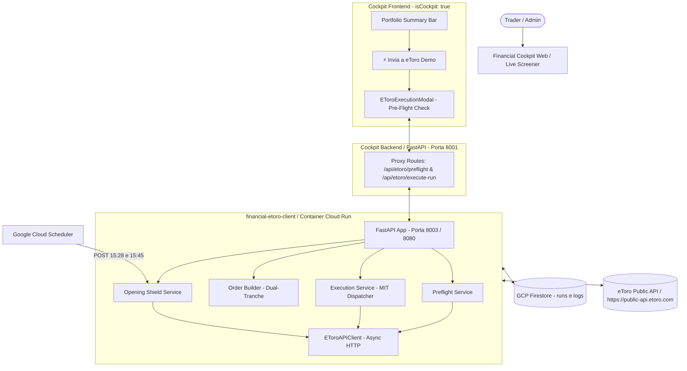

# Progettazione Tecnica: Sistema di Trading Automatico su eToro & Microservizio `financial-etoro-client`

**Autore:** Antigravity AI Engineering Team  
**Data:** 3 Settembre 2026  
**Stato:** Implementato & Operativo in Produzione  
**Destinazione File:** Root del Repository (`/PROGETTAZIONE_TRADING_ETORO_CLIENT.md`)

---

## 1. Visione e Obiettivi del Progetto

Il sistema realizza l'esecuzione automatizzata delle raccomandazioni quantitative generate dall'ADK DAG Engine (`eodhd-agent`) direttamente sul broker **eToro** tramite le sue **Public API ufficiali**.

### Obiettivi Primari:
1. **Zero Attrito Operativo**: Inserimento ordini con un solo clic dal **Live Screener** di `financial-cockpit-web`.
2. **Dual-Tranche Order Splitting**: Sdoppiamento matematico di ciascun candidato quantitativo in due tranche separate (Tranche 1 per la presa di profitto a Target 1 a +1.5R, Tranche 2 per il target esteso Target 2 a +3.0R Runner) con Stop Loss dinamico calcolato sulla volatilità reale ATR(14).
3. **Pre-Flight Safety Shield**: Verifica real-time della capienza di cassa su eToro, del nozionale richiesto e prevenzione attiva di ordini duplicati.
4. **Opening Shield (Protezione Anti Stop-Hunting)**: Protezione automatica dell'apertura di Wall Street (15:28 - 16:00 IT / 09:28 - 10:00 NY) a costo zero via **Google Cloud Scheduler + GCP Cloud Run** con salvataggio dello Stop Loss originario su Firestore (`positions_shield/{pos_id}`) per resistere ai riavvii serverless.
5. **Isolamento Rigido dei Privilegi**: La funzionalità di invio ordini è attiva esclusivamente in ambiente amministrativo (`isCockpit === true`). Il portale pubblico `financial-user-web` rimane al 100% Read-Only.
6. **Persistenza e Audit Completo**: Tracciamento di ogni ordine e degli ID eToro nel documento del Run su **GCP Firestore** (`runs/{run_id}/execution_orders`).

---

## 2. Architettura dei Componenti



---

## 3. Specifica eToro Public API & Credenziali

### Autenticazione & Endpoint
* **Base URL**: `https://public-api.etoro.com`
* **Ambiente**: **Demo** (Account CID: `33932108`)
* **Headers Obbligatori**:
  * `x-api-key`: Chiave pubblica applicativa (`ETORO_PUBLIC_KEY` in `.env`)
  * `x-user-key`: Chiave utente JWT (`ETORO_PRIVATE_KEY` in `.env`)
  * `x-request-id`: GUID univoco generato ex novo per ogni chiamata (`str(uuid.uuid4())`)
  * `Content-Type: application/json`

### Endpoint eToro Utilizzati

| Operazione | Metodo HTTP | Endpoint eToro | Descrizione |
| :--- | :--- | :--- | :--- |
| **Profilo & Scopes** | `GET` | `/api/v1/me` | Verifica credenziali e Account CID |
| **Sintesi Portafoglio** | `GET` | `/api/v1/trading/info/demo/aggregate-portfolio` | Cassa disponibile (`availableCash`), equity e saldo |
| **Ordini Pendenti** | `GET` | `/api/v2/trading/info/demo/orders:lookup` | Lookup ordini attivi per deduplicazione |
| **Posizioni Aperte** | `GET` | `/api/v2/trading/info/demo/instrument-breakdown` | Elenco delle posizioni aperte a mercato |
| **Inserimento Ordine** | `POST` | `/api/v2/trading/execution/demo/orders` | Inserimento ordini a limite (`MIT`) con SL e TP |
| **Modifica Posizione** | `PATCH` | `/api/v2/trading/demo/positions/{positionId}` | Aggiornamento dinamico di `stopLossRate` / `clearStopLoss` |

---

## 4. Logica Quantitativa: Dual-Tranche Order Splitting

Poiché l'API di eToro accetta un solo `takeProfitRate` per ordine e il nostro DAG calcola due target asimmetrici (**Target 1 a R1** e **Target 2 esteso**):

```
                        Dossier Titolo Quantitativo
                          (es. NVDA: 10 azioni)
                                    │
           ┌────────────────────────┴────────────────────────┐
           ▼                                                 ▼
       Tranche 1 (50%)                                   Tranche 2 (50%)
    5 azioni @ Entry S1                               5 azioni @ Entry S1
    Stop Loss: S1 - 2.2×ATR                           Stop Loss: S1 - 2.2×ATR
    Take Profit: Target 1 (+1.5R)                     Take Profit: Target 2 (+3.0R)
    (Scale-out 50% + Break-Even Trigger)              (Runner / Massimizzazione Alpha)
```

### Regole di Assegnazione Quote:
* **Quote Pari (es. 10 azioni)**: 5 quote a Tranche 1 (T1) + 5 quote a Tranche 2 (T2).
* **Quote Dispari (es. 9 azioni)**:
  * Tranche 1: `(quote + 1) // 2` = 5 quote (priorità alla certezza del primo target).
  * Tranche 2: `quote - tranche1` = 4 quote.
* **Quota Singola (1 sola azione)**: 0 quote a Tranche 1, 1 quota a Tranche 2 (profilo di massimo rendimento).
* **Strategia Single Target (Opzionale)**: Se selezionata dall'utente nel modale, invia un unico ordine con il 100% delle quote puntato su Target 2.

### Struttura Payload Ordine MIT inviato a eToro:
```json
{
  "action": "open",
  "transaction": "buy",
  "symbol": "NVDA",
  "orderType": "mit",
  "triggerRate": 118.50,
  "units": 5.0,
  "leverage": 1,
  "orderCurrency": "usd",
  "stopLossRate": 113.17,
  "takeProfitRate": 128.57,
  "stopLossType": "fixed"
}
```

---

## 5. Pre-Flight Risk & Liquidity Safety Check

Prima di inviare qualsiasi ordine al mercato, il servizio esegue una verifica automatica a tre livelli:

1. **Capienza di Cassa**:
   * Interroga eToro in tempo reale per leggere la cassa disponibile (`availableCash`).
   * Calcola la somma del nozionale di tutti i titoli selezionati: `Σ (quote × entry_zone)`.
   * Blocca l'invio o avvisa l'utente se la liquidità è insufficiente.
2. **Prevenzione Ordini Duplicati**:
   * Scarica gli ordini pendenti attuali su eToro.
   * Se un titolo selezionato ha già un ordine MIT pendente sul book, la UI mostra un badge informativo (es. `Già pendente #389102`) e disattiva la spunta automatica per evitare doppi acquisti accidentali.
3. **Selezione Discrezionale Utente**:
   * L'utente ha una checkbox per ogni titolo con cui può escludere singoli candidati prima del lancio.

---

---

## 6. Servizi Schedulati su Google Cloud (Opening Shield & Break-Even Guardian)

L'architettura serverless combina **Google Cloud Scheduler** (il cron manager gestito di GCP) e **GCP Cloud Run** (`financial-etoro-client`).
Il container scala a zero (*scale to zero*) quando non ci sono ordini o invocazioni attive, riducendo i costi di infrastruttura a **0,00 €**.

### I 3 Job Schedulati su Google Cloud Platform:

| Nome Job Cloud Scheduler | Orario (Fuso New York / Fuso IT) | Cron Expression | Endpoint Cloud Run | Scopo e Azione Eseguita |
| :--- | :--- | :--- | :--- | :--- |
| **`etoro-opening-shield-widen`** | **09:28:00 NY** (15:28 IT) | `28 9 * * 1-5` | `POST /api/scheduler/opening-shield?action=widen&account=demo` | **Protezione Apertura**: allarga lo Stop Loss a **-10%** (*Emergency Disaster Stop*) su tutte le posizioni aperte per neutralizzare la caccia agli stop algoritmica di Wall Street (9:30-10:00 NY) e persiste lo Stop Loss dinamico originario su Firestore (`positions_shield/{pos_id}`). |
| **`etoro-opening-shield-restore`** | **10:00:00 NY** (16:00 IT) | `00 10 * * 1-5` | `POST /api/scheduler/opening-shield?action=restore&account=demo` | **Ripristino Stop Rigoroso**: a book disteso e spread normalizzati dopo i primi 30 min di negoziazione, ripristina lo Stop Loss quantitativo dinamico ATR salvato su Firestore. |
| **`etoro-breakeven-guardian`** | **Ogni 5 min 09:30–16:00 NY** (15:30–22:00 IT) | `*/5 9-16 * * 1-5` | `POST /api/scheduler/breakeven-guardian?account=demo` | **Break-Even & Dynamic Trailing Lock-In Guardian**: verifica se la Tranche 1 ha toccato Target 1 (T1) spostando lo Stop Loss al **Net Break-Even** (+0.1%). Oltre il Break-Even, applica un **Profit Ratchet continuo a scaglioni di +6%** (Gain $\ge +12\% \rightarrow$ Lock $+6\%$, Gain $\ge +18\% \rightarrow$ Lock $+12\%$, Gain $\ge +24\% \rightarrow$ Lock $+18\%$, Gain $\ge +30\% \rightarrow$ Lock $+24\%$) fino al Take Profit finale T2, garantendo la non-regressività dello Stop Loss. |

> [!NOTE]
> Il fuso orario configurato sui job è **`America/New_York`**, rendendo il sistema **completamente immune al gap di cambio ora legale (DST)** tra Stati Uniti ed Europa.

---

### Provisioning Infrastruttura, Secret Manager & Scheduler (Zero-Touch Bootstrap)

Per garantire la riproducibilità totale dell'ambiente su qualsiasi nuovo progetto GCP, sono disponibili due script di automazione idempotenti:

1. **Bootstrap Completo Infrastruttura & Secret Manager**:
   [`scripts/setup_gcp_infra.sh`](file:///home/aberti/cloud-devops-labs/antigravity-challenge-lab/scripts/setup_gcp_infra.sh)
   - Abilita tutte le API (Cloud Run, Cloud Build, Secret Manager, Firestore, Vertex AI, Cloud Scheduler, Artifact Registry).
   - Inizializza il database Firestore Nativo (`fintech-data-hub-fs`).
   - Crea il repository Docker Artifact Registry (`fintech-apps`).
   - Configura i Service Account (`cloudrun-sa` e `etoro-scheduler-invoker`) con ruoli IAM a minimo privilegio.
   - **Configura Google Secret Manager**: crea automaticamente i secret `etoro-public-key` e `etoro-private-key` leggendoli dal file locale `.env` e concede `roles/secretmanager.secretAccessor` al SA di Cloud Run.

2. **Registrazione Job Google Cloud Scheduler**:
   [`scripts/setup_gcp_cloud_scheduler.sh`](file:///home/aberti/cloud-devops-labs/antigravity-challenge-lab/scripts/setup_gcp_cloud_scheduler.sh)
   - Individua in automatico l'URL live di `financial-etoro-client` su Cloud Run.
   - Configura i 3 Cron Job HTTP con token OIDC e audience dedicata per l'autenticazione sicura tra Cloud Scheduler e Cloud Run.

---


## 7. Frontend Cockpit Web & Isolamento Read-Only

### Regola Architetturale Cockpit vs User Portal:
* **Cockpit Web (`financial-cockpit-web`, `isCockpit === true`)**:
  * Il banner `PortfolioSummary` mostra il pulsante primario stilizzato:
    `⚡ Invia a eToro (Demo)`
  * Cliccando si apre `EToroExecutionModal`: visualizza i dati preflight, le quote, la divisione T1/T2, il nozionale e il pulsante di esecuzione con feedback live.
  * Una volta inviati gli ordini, il pulsante si trasforma in badge verde permanente:
    `✓ Ordini eToro Inviati`.
* **User Web (`financial-user-web`, `isCockpit === false`)**:
  * Come prescritto dal documento `GEMINI.md`, l'interfaccia resta **100% Read-Only**.
  * Il pulsante `⚡ Invia a eToro` e il modale di esecuzione **non vengono renderizzati**.

---

## 8. Persistenza & Tracciabilità Firestore

Ogni volta che gli ordini vengono inseriti con successo, il servizio aggiorna atomicamente il documento del Run su GCP Firestore:

* **Collezione**: `runs`
* **Documento**: `{run_id}` (es. `run_20260903_183112_b6ac1c`)
* **Nuovo Campo**: `execution_orders`
```json
{
  "mode": "demo",
  "strategy": "dual_tranche",
  "executed_at": "2026-09-03T21:55:00+02:00",
  "total_orders": 16,
  "successful_orders": 16,
  "total_notional_deployed": 12450.80,
  "orders": [
    {
      "order_id": 3892011,
      "reference_id": "4b5e2a10-...",
      "symbol": "NVDA",
      "tranche": "T1",
      "units": 5.0,
      "limit_price": 118.50,
      "stop_loss": 113.17,
      "take_profit": 128.57,
      "status": "SUBMITTED",
      "created_at": "2026-09-03T21:55:01+02:00"
    },
    {
      "order_id": 3892012,
      "reference_id": "6c1f9d44-...",
      "symbol": "NVDA",
      "tranche": "T2",
      "units": 5.0,
      "limit_price": 118.50,
      "stop_loss": 113.17,
      "take_profit": 140.07,
      "status": "SUBMITTED",
      "created_at": "2026-09-03T21:55:02+02:00"
    }
  ]
}
```

---

## 9. Struttura dei File del Progetto

```
antigravity-challenge-lab/
├── financial-etoro-client/              # Microservizio autonomo per trading eToro
│   ├── pyproject.toml                   # Dipendenze FastAPI, uvicorn, httpx, firestore
│   ├── Dockerfile                       # Container Cloud Run (Python 3.12-slim)
│   ├── README.md
│   ├── src/financial_etoro_client/
│   │   ├── config.py                    # Risoluzione chiavi e configurazione
│   │   ├── client/
│   │   │   ├── models.py                # Modelli Pydantic (MIT, Tranches, Preflight)
│   │   │   └── etoro_api.py             # Client asincrono eToro Public API
│   │   ├── services/
│   │   │   ├── order_builder.py         # Sdoppiamento Dual-Tranche T1/T2
│   │   │   ├── preflight_service.py     # Check liquidità, nozionale, duplicati
│   │   │   ├── execution_service.py     # Invio ordini e salvataggio ricevute
│   │   │   └── opening_shield_service.py# Scheduler anti stop-hunting (15:28 - 15:45)
│   │   └── api/
│   │       └── main.py                  # Router FastAPI (porta 8003 locale / 8080 Cloud)
│   └── tests/
│       ├── test_order_builder.py        # Test di sdoppiamento quote e quote dispari
│       └── test_api.py                  # Test endpoint FastAPI e preflight
│
├── financial-user-web/                  # Master Portal & Single Source of Truth UI
│   ├── src/components/
│   │   ├── EToroExecutionModal.jsx      # Modale interattivo Pre-Flight ed Invio
│   │   └── PortfolioSummary.jsx         # Pulsante "Invia a eToro" (solo se isCockpit)
│   └── src/services/api.js              # Client API Frontend per rotte /api/etoro/*
│
└── financial-cockpit-web/               # Cockpit Amministrativo (isCockpit = true)
    └── backend/main.py                  # Proxy routes e integrazione financial-etoro-client
```

---

## 10. Comandi di Esecuzione e Test

### 1. Esecuzione Test Unitari:
```bash
# Esegue tutti gli 8 test di verifica dell'Order Builder e degli endpoint
uv run pytest financial-etoro-client/tests/
```

### 2. Avvio dei Servizi in Locale:
```bash
# Microservizio eToro Client (Porta 8003)
cd financial-etoro-client && uv run uvicorn financial_etoro_client.api.main:app --port 8003 --reload

# Cockpit Web Backend (Porta 8001)
cd financial-cockpit-web && uv run uvicorn backend.main:app --port 8001 --reload

# Cockpit Web Frontend (Porta 5173)
cd financial-cockpit-web && npm run dev
```

### 3. Compilazione Build di Produzione (Vite):
```bash
# Verifica correttezza bundling frontend (0 errori in ~1.28s)
cd financial-cockpit-web && npx vite build
cd financial-user-web && npx vite build
```
