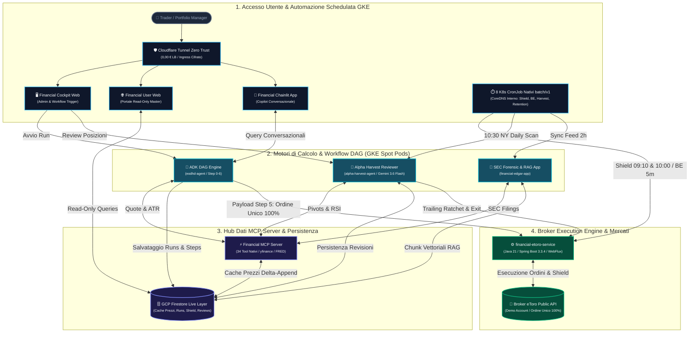

# FintechDataHub: Enterprise Quantitative Trading Platform & Cloud Financial Cockpit

[-orange.svg?logo=cloudflare)](https://cloudflare.com)

---

## 1. Visione Generale

**FintechDataHub** è una piattaforma di trading quantitativo istituzionale e cockpit finanziario end-to-end indipendente al 100% da provider API a pagamento. La piattaforma unisce calcolo quantitativo deterministico, elaborazione agentica LLM grounded (Google ADK & Gemini 3.6 Flash), modelli contabili forensi SEC EDGAR, architettura a microservizi su Google Kubernetes Engine (GKE Autopilot) ed esecuzione automatizzata transazionale su broker eToro.

### Caratteristiche Distintive:
- **Zero Costi Dati Finanziari:** Calcolo locale con fallback concorrente `yfinance`, feed macro FRED API, indicatori tecnici deterministici, analisi opzioni Black-Scholes e bilanci SEC EDGAR a costo zero.
- **Strategia Adattiva a Ordine Unico 100% (Zero Dual-Tranche Splitting):** Esecuzione broker deterministica con Opening Shield esteso (15:10 - 16:00 IT / 09:10 - 10:00 NY), Break-Even Dynamic Trailing Guardian (+3% ratchet) e Order TTL Guardian a 48h feriali.
- **Infrastruttura GKE Autopilot Spot Pods & Cloudflare Tunnel:** Tutti i microservizi operano in rete privata Kubernetes su pod Spot attivi durante l'orario di borsa di Wall Street (15:00 - 22:30 IT), azzerando i costi di Load Balancer con tunnel Cloudflare Zero Trust (< 8 €/mese di costo cloud complessivo).
- **Hard Veto Forense SEC EDGAR:** Modelli quantitativi deterministici (Altman Z-Score, Beneish M-Score, Piotroski F-Score, Sloan Accrual Index) e RAG semantico vettoriale con Google Vertex AI (`text-embedding-005` a 768 dimensioni).

---

## 2. Architettura del Sistema

---

## 3. Matrice dei Moduli del Repository

Il repository è strutturato con un modello ibrido che espone i frontend e i componenti dimostrativi mantenendo segregata la proprietà intellettuale (IP) dei motori core:

| Modulo | Descrizione & Ruolo | Stato nella Repository | Stack Tecnologico |
| :--- | :--- | :---: | :--- |
| [`financial-user-web`](file:///financial-user-web) | Master Web Portal pubblico (Live Screener, Candlestick interattivo, Quant Audit Lab) | **Codice Completo** | React 18, Vite, FastAPI, Firestore SDK |
| [`eodhd-mini-agent`](file:///eodhd-mini-agent) | Agente router leggero dimostrativo per interazione conversazionale | **Codice Completo** | Python 3.12, Google ADK, MCP Client |
| [`financial-chainlit-app`](file:///financial-chainlit-app) | Interfaccia utente conversazionale interattiva Chainlit Copilot | **Codice Completo** | Python 3.12, Chainlit, WebSockets |
| [`financial-mcp-server`](file:///financial-mcp-server) | Hub dati MCP (34 tool nativi Python, yfinance concorrente, FRED, bilanci) | **Stub Architetturale** | Python 3.12, FastMCP, Vertex AI, Black-Scholes |
| [`financial-cockpit-web`](file:///financial-cockpit-web) | Console di comando amministrativa e trigger DAG riservata | **Stub Architetturale** | React 18, Vite, FastAPI Admin, WebSockets |
| [`financial-etoro-service`](file:///financial-etoro-service) | Execution engine autonomo broker eToro con strategia ad Ordine Unico 100% | **Stub Architetturale** | Java 21, Spring Boot 3.3.4, WebFlux, Resilience4j |
| [`alpha-harvest-agent`](file:///alpha-harvest-agent) | Reviewer clinico autonomo delle posizioni aperte (Gemini 3.6 Flash & Stagnation Defense) | **Stub Architetturale** | Python 3.12, Google ADK, Gemini 3.6 Flash |
| [`financial-edgar-app`](file:///financial-edgar-app) | Microservizio SEC EDGAR, chunking vettoriale Vertex AI & Forensic RAG | **Stub Architetturale** | Python 3.12, FastAPI, Vertex AI Embedding, Gemini |
| [`eodhd-agent`](file:///eodhd-agent) | ADK Financial DAG Engine quantitativo a 7 nodi con Equal-Dollar Risk Parity | **Stub Architetturale** | Python 3.12, Google ADK, asyncio |

> [!NOTE]
> I moduli contrassegnati come **Stub Architetturale** includono una documentazione approfondita che dettaglia lo stack tecnologico, i diagrammi di sequenza, i contratti API REST/gRPC e le motivazioni della segregazione proprietaria.

---

## 4. Risorse di Piattaforma & Infrastruttura Incluse

- **`terraform/`**: Infrastructure as Code (IaC) per Google Cloud (GKE Autopilot, Cloud Firestore Native, Artifact Registry, Secret Manager, IAM e Workload Identity).
- **`deploy/k8s/`**: Manifest Kubernetes nativi per l'allocazione su Spot Pods, RBAC, health probes e gli 8 Kubernetes CronJob (`batch/v1`) per l'automazione interna a costo zero su CoreDNS.
- **`deploy/cloudrun/`**: Configurazioni di deployment e servizi container.
- **`.agents/`**: Framework agentico completo con skills specialistiche, rules di conformità Google Cloud e plugin di sicurezza SecureCoder.
- **`docs/`**: Manualistica operativa, guide di deploy e asset istituzionali.
- **Design & Architettura Master**: Documentazione quantitativa completa (`GEMINI.md`, `GRAPH_WORKFLOW_DESIGN.md`, `PROGETTAZIONE_*.md`).

---

## 5. Continuous Integration & Mirroring Automatico

Questo repository è mantenuto continuamente aggiornato e allineato al repository master di sviluppo tramite una pipeline GitHub Actions automatica configurata con filtraggio granulare e rigorosi controlli di sicurezza (prevenzione leak di credenziali, state Terraform e file `.env`).

---

**© 2026 FintechDataHub Engineering Team. All Rights Reserved.**
