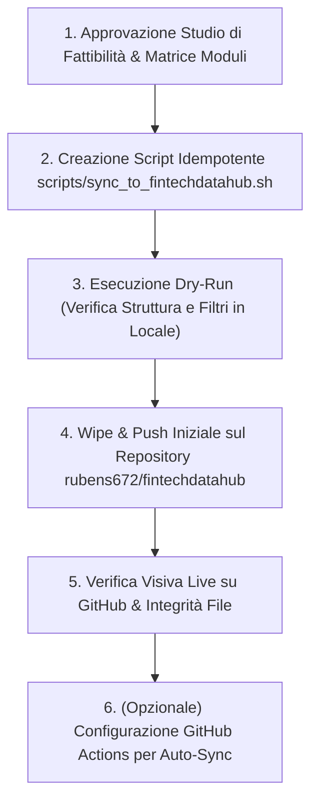

# Studio di Fattibilità & Architettura di Sincronizzazione: Mirroring Selettivo su `rubens672/fintechdatahub`

**Autore:** Antigravity AI Engineering Team  
**Data:** 8 Ottobre 2026  
**Stato:** Documento di Analisi, Valutazione Rischi & Piano Operativo di Sincronizzazione  
**Destinazione File:** Root del Repository (`/STUDIO_FATTIBILITA_SYNC_FINTECHDATAHUB.md`)  
**Repository Sorgente (Master/Dev):** `rubens672/antigravity-challenge-lab`  
**Repository Destinazione (Showcase/Mirror):** `rubens672/fintechdatahub`

---

## 1. Executive Summary & Obiettivi

L'obiettivo di questo studio è definire la strategia ingegneristica per esportare e mantenere continuamente sincronizzato un secondo repository GitHub pubblico/selezionato:
👉 **`https://github.com/rubens672/fintechdatahub`**

### Requisiti Chiave Ricevuti:
1. **Clean-Slate / Reset Totale:** Il repository target `fintechdatahub` contiene attualmente file obsoleti o non pertinenti. Tutti i contenuti preesistenti devono essere rimossi e sostituiti con la nuova struttura.
2. **Inclusione Obbligatoria al 100%:**
   - La cartella agentica completa `.agents/` (Skills, Plugins, Rules, Hooks).
   - Tutta l'infrastruttura `terraform/` (esclusi rigorosamente stati e segreti).
   - Tutti i manifest Kubernetes e Cloud Run `deploy/` (`k8s/base`, `k8s/overlays`, `cloudrun/`).
   - La cartella documentale e visuale completa `docs/` (loghi, guide, manuali).
   - Tutti i file di configurazione CI/CD e deployment `.yaml` / `.yml` alla radice e nei sotto-moduli.
   - Tutti i documenti di architettura, design e strategia master (`GEMINI.md`, `GRAPH_WORKFLOW_DESIGN.md`, `PROGETTAZIONE_*.md`, `LINKEDIN_STRATEGY_MASTERPLAN.md`, ecc.).
3. **Politica Modulare Differenziata (Codice Completo vs Stub):**
   - Riportare alcuni moduli applicativi con il loro codice sorgente completo.
   - Riportare gli altri moduli come cartella "stub" contenente esclusivamente un `README.md` tecnico-descrittivo (per preservare proprietà intellettuale, segretezza degli algoritmi o separazione delle responsabilità).
4. **Sincronizzazione Continua & Automatica:**
   - Il repository destinazione non deve essere aggiornato una tantum manualmente, ma deve disporre di un meccanismo automatico e idempotente per riflettere le modifiche future introdotte nel repository master.

---

## 2. Perimetro Dati & Matrice dei Componenti (Scope Matrix)

### 2.1 File & Directory da Esportare al 100% (Full Inclusion)

| Risorsa | Descrizione & Motivazione | Strategia di Esportazione |
| :--- | :--- | :--- |
| **`.agents/`** | Framework agentico completo: cataloghi skills, rules, plugins Google Cloud e SecureCoder. | Copia ricorsiva integrale |
| **`terraform/`** | Codice IaC per Google Cloud (GKE Autopilot, Firestore, Artifact Registry, Secrets, IAM). | Copia integrale `.tf`, `.md`, `terraform.tfvars.example` (Filtro restrittivo su `.tfstate`) |
| **`deploy/`** | Manifest Kubernetes (`k8s/base`, `k8s/overlays/prod`), Cloudflare Tunnel e Cloud Run. | Copia ricorsiva integrale |
| **`docs/`** | Manuali operativi, loghi istituzionali (`docs/logos/*`), guide deploy. | Copia ricorsiva integrale |
| **File `.yaml` / `.yml` Root** | `cloudbuild.yaml`, `cloudbuild-etoro-service.yaml`, `clouddeploy.yaml`, `skaffold.yaml`, `docker-compose.yml`. | Copia 1-to-1 dei file di configurazione |
| **Design & Architettura (.md)** | Documenti master di progettazione quantitativa, FinOps e ingegneria: `GEMINI.md`, `GRAPH_WORKFLOW_DESIGN.md`, `PROGETTAZIONE_ARCHITETTURA_GKE_AUTOPILOT.md`, `PROGETTAZIONE_EXIT_REVIEWER_AGENT.md`, `PROGETTAZIONE_RAG_BILANCI_GCP.md`, `PROGETTAZIONE_TRADING_ETORO_CLIENT.md`, `MIGRATION_PLAN_ETORO_SERVICE.md`, `PROGETTAZIONE_OTTIMIZZAZIONE_MARQUEE_MARKET.md`, `PROMEMORIA_PROCESSI_SCHEDULATI.md`, `FINANCIAL_AGENT_CHAINLIT_DESIGN.md`, `AUDIT_CONTINUOUS_LEARNING.md`, `LINKEDIN_STRATEGY_MASTERPLAN.md`, `TODO.md`, `SUPERPROMPT.md`. | Copia 1-to-1 |

---

### 2.2 Matrice dei 9 Moduli Software Applicativi

Proponiamo la seguente suddivisione ingegneristica tra **Moduli Completi** (Full Code) e **Moduli Stub** (Directory con solo `README.md` architettonico):

| Modulo | Ruolo nel Sistema | Proposta: Tipo Esportazione | Motivazione Ingegneristica |
| :--- | :--- | :---: | :--- |
| **`financial-user-web`** | Master Web Portal pubblico (React + Vite + FastAPI Read-Only) | **CODICE COMPLETO e README.md** | È il frontend di punta pubblico per gli utenti e per la visualizzazione dei dati in real-time. |
| **`financial-mcp-server`** | Hub dati MCP (34 tool nativi Python, yfinance, FRED, bilanci, calcoli) | **STUB (Solo README.md)** | **Proprietà intellettuale critica:** Fornisce la dimostrazione dell'integrazione Model Context Protocol standard e degli indicatori. |
| **`financial-cockpit-web`** | Console di amministrazione e trigger workflow | **STUB (Solo README.md)** | È la console ad accesso riservato per portfolio manager e trigger DAG; protegge endpoint sensibili. |
| **`financial-etoro-service`** | Execution engine Java 21 / Spring Boot con trading live su broker | **STUB (Solo README.md)** | **Proprietà intellettuale critica:** logica transazionale broker, shield e gestione ordini demo/real. |
| **`alpha-harvest-agent`** | Autonomous Portfolio Exit & Reinvestment Reviewer (Gemini 3.6 Flash) | **STUB (Solo README.md)** | **Proprietà intellettuale quantitativa:** criteri clinici di dismissione, Stagnation Defense e rating. |
| **`financial-edgar-app`** | Microservizio SEC EDGAR, chunking vettoriale Vertex AI & Forensic RAG | **STUB (Solo README.md)** | **Proprietà intellettuale critica:** Modelli forensi deterministici e RAG SEC bilanci con Vertex AI. |
| **`eodhd-agent`** | ADK Financial DAG Engine quantitativo a 7 nodi | **STUB (Solo README.md)** | **Core Alpha Engine:** modelli matematici Z-Score, ATR stop e pesature di portafoglio proprietarie. |
| **`eodhd-mini-agent`** | Agente router leggero conversazionale | **CODICE COMPLETO e README.md** | Semplice agente dimostrativo per interazioni testuali con MCP server. |
| **`financial-chainlit-app`** | UI conversazionale interattiva Chainlit | **CODICE COMPLETO e README.md** | Frontend UI conversazionale per chatbot copilot. |

> [!NOTE]
> Per ogni modulo contrassegnato come **STUB**, verrà generata una cartella dedicata contenente un `README.md` dettagliato che illustra:
> 1. Lo stack tecnologico impiegato (es. Java 21 / Spring Boot 3.3.4 per `financial-etoro-service` o Python ADK per `eodhd-agent`).
> 2. L'architettura e il diagramma a blocchi delle responsabilità.
> 3. Le API REST/gRPC esposte e consumate.
> 4. La motivazione della segregazione della codebase (Enterprise IP Protection).

---

### 2.3 Elementi da Escludere Categoricamente (Blacklist di Sicurezza)

Per prevenire incidenti di sicurezza o "rumore" nel repository target:
1. **Segreti e Credenziali:** File `.env`, file JSON di service account Google Cloud (`*.json`), token API o chiavi private SSH.
2. **Stato Terraform:** `terraform.tfstate`, `terraform.tfstate.backup`, `.terraform/`, `.terraform.lock.hcl`.
3. **Artifact di compilazione e dipendenze:** `node_modules/`, `dist/`, `target/` (Maven), `__pycache__/`, `.pytest_cache/`, `.venv/`.
4. **Laboratori e cartelle sperimentali legacy della root:**
   - `1_Use_Skills_with_ADK_Agents/`
   - `2_Deploy_an_Agent_with_Agent_Development_Kit/`
   - `3_Evaluate_and_Improve_Agent_Development_Kit_Agents/`
   - `caveman-agent/`
   - `eodhd-claude-skills/`
   - `eodhd-python/`
   - `firestore-data/`
   - `.files/`
   - `tmp.md` e file di appunti non strutturati (`tore`, `appunti.md`).

---

## 3. Studio della Strategia di Reset & Wipe di `fintechdatahub`

Il repository `https://github.com/rubens672/fintechdatahub` contiene attualmente una struttura pregressa differente.  
Per effettuare una pulizia totale (clean-slate) senza lasciare residui di vecchi file:

### Metodo Scelto: Clean Staging Directory con Git Orphan Reset
1. Viene creata una directory di staging isolata (es. `/tmp/fintechdatahub-sync`).
2. Viene clonato il repository `fintechdatahub`.
3. Vengono rimossi tutti i file tracciati esistenti (`git rm -rf .`).
4. Viene popolata la directory con i soli file permessi dal repository master, secondo la matrice di esportazione.
5. Viene generato un commit pulito:  
   `feat(architecture): initial sync of fintechdatahub platform architecture and modules`
6. Viene eseguito un `git push origin main --force`.

---

## 4. Architettura di Sincronizzazione Continua (Continuous Sync Pipeline)

Abbiamo valutato tre possibili opzioni architetturali per garantire che `fintechdatahub` rimanga costantemente aggiornato ad ogni avanzamento di `antigravity-challenge-lab`:

### Opzione A: Script Bash Idempotente Locale (`scripts/sync_to_fintechdatahub.sh`)
- **Meccanismo:** Uno script bash presente nella cartella `scripts/` del repository master. Quando eseguito dallo sviluppatore (o da un alias `make sync-mirror` / `npm run sync-mirror`), sincronizza i file secondo la whitelist, crea il commit e pusha sul remote `fintechdatahub`.
- **Vantaggi:**
  - Controllo manuale assoluto: zero rischio di push involontari o incontrollati.
  - Nessuna necessità di configurare segreti complessi (usa le credenziali Git/SSH già presenti nell'ambiente dello sviluppatore).
  - Rapidità di esecuzione (< 15 secondi).
- **Svantaggi:** Richiede il lancio manuale o l'aggancio a un git-hook locale.

---

### Opzione B: Git Multi-Remote Push Hook (`post-commit` o Git Dual Remote)
- **Meccanismo:** Configurare un hook Git locale o una configurazione `remote.origin.pushUrl` multipla.
- **Svantaggi:** **Non applicabile direttamente**, perché il repository target ha una struttura *filtrata* (alcuni moduli sono completi, altri sono solo stub). Un semplice push git trasmetterebbe tutti i sorgenti completi inclusi quelli riservati.

---

### Opzione C: GitHub Actions CI/CD Automatica ad ogni Push su `main` (CONSIGLIATA come step 2)
- **Meccanismo:** Un workflow GitHub Actions (`.github/workflows/sync-fintechdatahub.yml`) nel repository master `antigravity-challenge-lab`.  
  Ogni volta che viene fatto un push su `main`, la pipeline:
  1. Fa il checkout del repository master.
  2. Esegue lo script di filtraggio per preparare l'albero `fintechdatahub`.
  3. Clona `rubens672/fintechdatahub` usando un GitHub Personal Access Token (PAT) salvato nei GitHub Secrets (`FINTECHDATAHUB_SYNC_PAT`).
  4. Confronta le modifiche (`git status`): se ci sono variazioni, committa e pusha automaticamente.
- **Vantaggi:** 100% automatico, "zero-click", nessun ritardo di disallineamento.

### Raccomandazione Ingegneristica:
Adottare un **approccio a due fasi (Dual-Phase Strategy)**:
1. **Fase Immediata (Fase 1):** Creazione dello script idempotente verificabile `scripts/sync_to_fintechdatahub.sh` per eseguire il reset iniziale, la validazione a secco e il primo caricamento pulito con feedback interattivo.
2. **Fase di Automazione (Fase 2):** Registrazione del workflow GitHub Actions con Secret PAT per l'aggiornamento automatico ad ogni futuro `git push`.

---

## 5. Analisi dei Rischi & Misure di Mitigazione

| Rischio Identificato | Probabilità | Impatto | Misura di Mitigazione Adottata |
| :--- | :---: | :---: | :--- |
| **Leak di Segreti / File `.env` o State Terraform** | Media | Critico | Implementazione di un filtro esplicito "Allowlist-based" (vengono inclusi solo i percorsi autorizzati, non una blacklist) + controllo pre-push di sicurezza. |
| **Sovrascrittura Involontaria del Repo Master** | Bassa | Catastrofico | Lo script di sync opera esclusivamente su una cartella clone temporanea dedicata e verifica che il remote target sia esplicitamente `fintechdatahub.git`. |
| **Rottura di Link o Documentazione** | Media | Basso | Revisione dei link relativi nei `README.md` dei moduli stub affinché puntino correttamente alla documentazione di progettazione inclusa. |
| **Divergenze di Branch (main vs master)** | Media | Basso | Lo script forza il targeting del branch `main` standardizzato. |

---

## 6. Piano Operativo di Implementazione Passo-Passo

### Stato di Avanzamento:
- [x] **1. Approvazione Studio di Fattibilità & Matrice Moduli:** Convalidata con policy differenziata Full Code vs Stub.
- [x] **2. Creazione Template Stub & README Istituzionali:** Generati in `scripts/stubs/` per tutti i 6 moduli protetti e per la root.
- [x] **3. Creazione Script Idempotente:** Implementato e collaudato in `scripts/sync_to_fintechdatahub.sh` con filtri rsync e safety checks.
- [x] **4. Esecuzione Dry-Run:** Validazione superata a zero errori (nessun secret, tfstate o file vietato rilevato).
- [x] **5. Wipe & Push Iniziale:** Eseguito con successo su `rubens672/fintechdatahub` (branch `main`).
- [x] **6. Pipeline GitHub Actions CI/CD (Opzione C):** Configurata in `.github/workflows/sync-fintechdatahub.yml` per la sincronizzazione continua automatica ad ogni `git push` su `main`.
