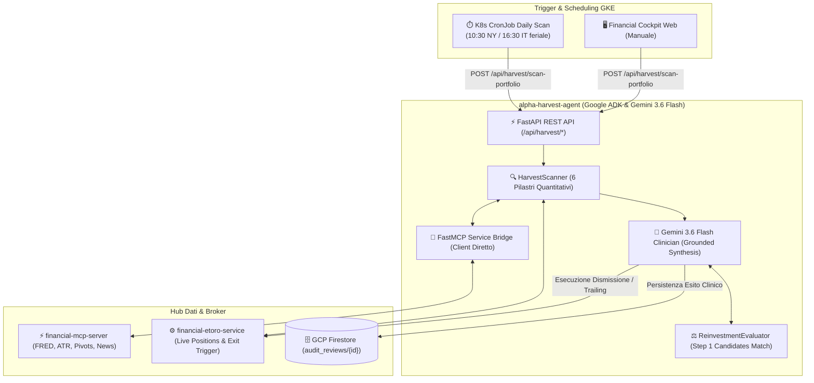

# Alpha Harvest Reviewer Agent

**Autore:** Antigravity AI Engineering Team  
**Stack Tecnologico:** Python 3.12 + Google ADK (Agent Development Kit) + Gemini 3.6 Flash + FastAPI + MCP Bridge  
**Stato Repository:** Modulo Segregato (Enterprise Intellectual Property Protection)

---

## 1. Visione & Ruolo Architetturale

`alpha-harvest-agent` è un microservizio autonomo basato su intelligenza artificiale agentica avanzata (Google ADK e Gemini 3.6 Flash) per il monitoraggio clinico e la gestione attiva delle uscite dal portafoglio su posizioni aperte.  
A differenza dei tradizionali sistemi statici di Take Profit, l'agente esamina continuamente lo stato delle posizioni combinando metriche quantitative deterministiche con ragionamento LLM grounded:

- **I 6 Pilastri Quantitativi di Dismissione:**
  1. **Surriscaldamento RSI & Resistenze:** Rilevazione di ipercomprato estremo ($RSI \ge 78$) o respingimenti violenti su livelli Pivot R2/R3.
  2. **Accelerazione della Volatilità ATR:** Espansione anomala del range Wilder ATR ($ATR > 1.8 \times \text{Media 20gg}$) indicativa di climax run o esaurimento del trend.
  3. **Rischio Evento Earnings Imminente:** Valutazione del calendario degli utili trimestrali (<48h) con calcolo del rischio asimmetrico di gap down.
  4. **Segnali Forensi & SEC Form 4:** Monitoraggio di vendite insider massive o deterioramento dei punteggi contabili forensi deterministici.
  5. **Breakeven Trailing Dinamico a Scaglioni:** Ratchet progressivo dello Stop Loss a scaglioni continui di +3% di profitto non appena superato Target 1.
  6. **Stagnation Defense:** Protezione del capitale immobilizzato; scatta un lock del cuscino di profitto a 10 giorni e una liquidazione controllata per decadimento temporale (Time Decay) a 15 giorni per liberare liquidità verso opportunità più reattive.
- **Valutazione del Reinvestimento ad Alpha Superiore:** Confronto dinamico tra il rendimento atteso residuo della posizione attuale e i nuovi candidati top-tier identificati dallo Step 1 dello screener DAG.

---

## 2. Diagramma Architetturale delle Responsabilità

---

## 3. Contratti API REST Esposti

- **`POST /api/harvest/scan-portfolio`**: Esecuzione della scansione diagnostica clinica su tutte le posizioni attualmente aperte a mercato.
- **`POST /api/harvest/execute-exit`**: Invio della direttiva di chiusura immediata o modifica del trailing stop a `financial-etoro-service`.
- **`GET /api/harvest/reviews/latest`**: Recupero dell'ultimo report clinico dettagliato generato da Gemini 3.6 Flash con motivazioni per ogni singolo titolo.

---

## 4. Motivazione della Segregazione della Codebase (Enterprise IP Protection)

I pesi ponderati dei 6 pilastri, le soglie matematiche di Stagnation Defense e i prompt agentici specializzati di Gemini 3.6 Flash costituiscono asset proprietari fondamentali della strategia quantitativa.  
Pertanto, la logica sorgente dell'agente è preservata in repository privato.
