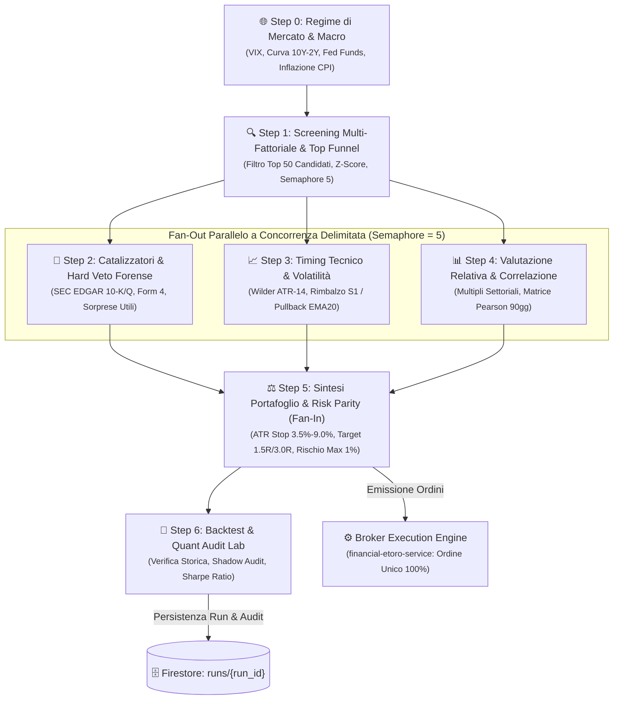

# ADK Financial DAG Engine (7-Node Quantitative Workflow)

**Autore:** Antigravity AI Engineering Team  
**Stack Tecnologico:** Python 3.12 + Google ADK (Agent Development Kit) + asyncio + Google Cloud Firestore SDK  
**Stato Repository:** Modulo Segregato (Enterprise Intellectual Property Protection)

---

## 1. Visione & Ruolo Architetturale

`eodhd-agent` è il cuore quantitativo e motore decisionale della piattaforma FintechDataHub. Implementa un grafo aciclico diretto (**DAG a 7 Nodi**) orchestrato tramite Google ADK per trasformare milioni di dati grezzi di borsa in un portafoglio azionario ottimizzato e protetto:

- **Approccio Rigorosamente Scientifico:** Nessun segnale è affidato a euristiche arbitrarie. Ogni decisione si basa su regimi macroeconomici, score statistici multi-fattoriali (Z-Scores), analisi della volatilità Wilder ATR e parità di rischio equal-dollar.
- **Concorrenza Delimitata (Semaphore 5):** Durante il fan-out parallelo degli Step 2, 3 e 4, un semaforo asincrono limita i task concorrenti a un massimo di 5 worker, prevenendo colli di bottiglia, burst di rete e crash per memoria (OOM) sui pod GKE Autopilot.
- **Top Funnel Filter (50 Candidati):** Nello Step 1 viene selezionato un paniere ristretto di 50 titoli (15 Mega-Cap + 35 Mid/Large-Cap ad alto Profitability Score) che garantisce statisticamente l'identificazione di 8-10 eccellenze assolute post-veto ($P(X \ge 8) = 94.9\%$).

---

## 2. Il Workflow Quantitativo a 7 Nodi

---

## 3. Specifiche dei Nodi di Calcolo

1. **Step 0 — Regime di Mercato & Macro:** Classifica lo stato di mercato in `RISK_ON`, `RISK_OFF` o `NEUTRAL_CHOPPY` ponderando la volatilità implicita (VIX), l'inversione della curva dei rendimenti USA (10Y-2Y Par Yield Curve) e la traiettoria dei tassi Fed.
2. **Step 1 — Screening Multi-Fattoriale & Top Funnel:** Calcola Z-Score su ROE, Free Cash Flow Yield, Debt/Equity e Momentum, filtrando i 50 migliori titoli conformi al regime.
3. **Step 2 — Catalizzatori & Veto Forense:** Scarta categoricamente i titoli con anomalie di bilancio rilevate da SEC EDGAR (Beneish $M > -1.78$, Altman $Z < 1.81$ o Sloan Accrual Index anomalo) o vendite insider Form 4 sospette.
4. **Step 3 — Timing Tecnico & Volatilità:** Calcola l'ATR Wilder a 14 periodi (`atr_14`). Esige che l'ingresso sia vicino al supporto S1 (entro il 2.5%) o su pullback verso EMA20, impedendo l'acquisto di minimi in caduta libera.
5. **Step 4 — Valutazione Relativa & Diversificazione:** Analizza la divergenza dai multipli mediani di settore e costruisce la matrice di correlazione di Pearson a 90 giorni per scartare asset sovrapposti.
6. **Step 5 — Sintesi di Portafoglio & Equal-Dollar Risk Parity:**
   - **Stop Loss Dinamico ATR:** Posizionato a $P_{\text{stop}} = P_{\text{entry}} - (2.2 \times ATR_{14})$ con floor prudenziale al 3.5% e tetto massimo al 9.0%.
   - **Take Profit Asimmetrici R:** Target 1 a $+1.5R$ e Target 2 a $+3.0R$ (Alpha Runner).
   - **Sizing Equal-Dollar Risk Parity:** Ogni posizione rischia esattamente l'1.0% del patrimonio totale ($N_{\text{shares}} = \text{Floor}\left(\frac{\text{Capitale} \times 0.01 \times M_{\text{risk}}}{R}\right)$), con cap settoriale al 30%.
7. **Step 6 — Backtest & Quant Audit Lab:** Calcola retrospettivamente Win Rate atteso, Profit Factor e Sharpe Ratio, memorizzando il report completo su Google Cloud Firestore.

---

## 4. Motivazione della Segregazione della Codebase (Enterprise IP Protection)

I modelli quantitativi del DAG, la formulazione dei pesi Z-score multi-fattoriali e gli algoritmi di sizing e parità di rischio costituiscono il "motore alpha" proprietario primario.  
Per salvaguardare il valore intellettuale aziendale e prevenire il reverse engineering, il codice sorgente è segregato nel repository master privato.
