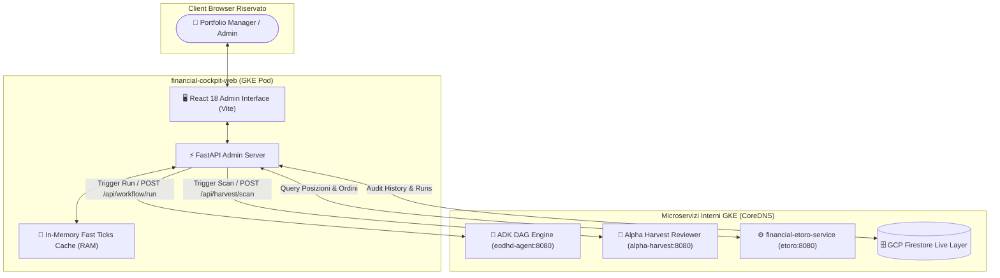

# Financial Cockpit Web (Admin & Operations Hub)

**Autore:** Antigravity AI Engineering Team  
**Stack Tecnologico:** React 18 + Vite + FastAPI (Python 3.12) + WebSockets + Firestore SDK  
**Stato Repository:** Modulo Segregato (Enterprise Intellectual Property Protection)

---

## 1. Visione & Ruolo Architetturale

`financial-cockpit-web` costituisce la console di comando avanzata e riservata per Portfolio Manager, Risk Officer e Ingegneri Quantitativi. Consente il monitoraggio clinico dell'infrastruttura, il trigger manuale del DAG quantitativo a 7 nodi (`eodhd-agent`) e dell'Agente Reviewer (`alpha-harvest-agent`), nonché l'audit retrospettivo avanzato:

- **Separazione Amministrativa:** Isola rigorosamente gli endpoint con capacità di mutazione (trigger pipeline, salvataggio configurazioni, calibrazione parametri) rispetto al portale pubblico read-only `financial-user-web`.
- **FastAPI In-Memory RAM Cache:** Fornisce uno strato di mediazione ad altissime prestazioni per le quotazioni di borsa (`/api/market/ticks`), azzerando le chiamate al broker e offrendo latenze di risposta inferiori a 1ms.
- **System Health Monitor su 23 Sottosistemi:** Visualizzazione in tempo reale dello stato di salute, latenza e disponibilità dell'intero ecosistema cloud (GKE Spot Pods, Cloudflare Tunnel, Firestore, Broker API, Vertex AI, FRED).

---

## 2. Diagramma Architetturale delle Responsabilità

---

## 3. Contratti API REST & WebSocket Esposti

- **`POST /api/workflow/run`**: Avvio asincrono del DAG quantitativo a 7 nodi con parametri personalizzati di regime e capitale.
- **`GET /api/workflow/runs`**: Recupero della cronologia delle esecuzioni quantitative salvate su Firestore.
- **`GET /api/market/ticks`**: Snapshot istantaneo in memoria RAM di tutti i titoli monitorati e delle posizioni aperte.
- **`WS /api/ws/market`**: Canale WebSocket bidirezionale per lo streaming push dei prezzi senza overhead HTTP.
- **`POST /api/harvest/scan`**: Trigger immediato della scansione clinica a 6 pilastri sulle posizioni aperte.
- **`GET /api/system/health`**: Diagnostica combinata dei 23 sottosistemi di mercato e dell'infrastruttura GKE.

---

## 4. Motivazione della Segregazione della Codebase (Enterprise IP Protection)

`financial-cockpit-web` espone endpoint ad alto privilegio in grado di alterare lo stato del portafoglio, avviare esecuzioni di trading e accedere a parametri proprietari di risk management.  
Per garantire i massimi standard di sicurezza operativa e segregazione dei privilegi (PoLP), il modulo è protetto e riservato agli ambienti interni aziendali.
