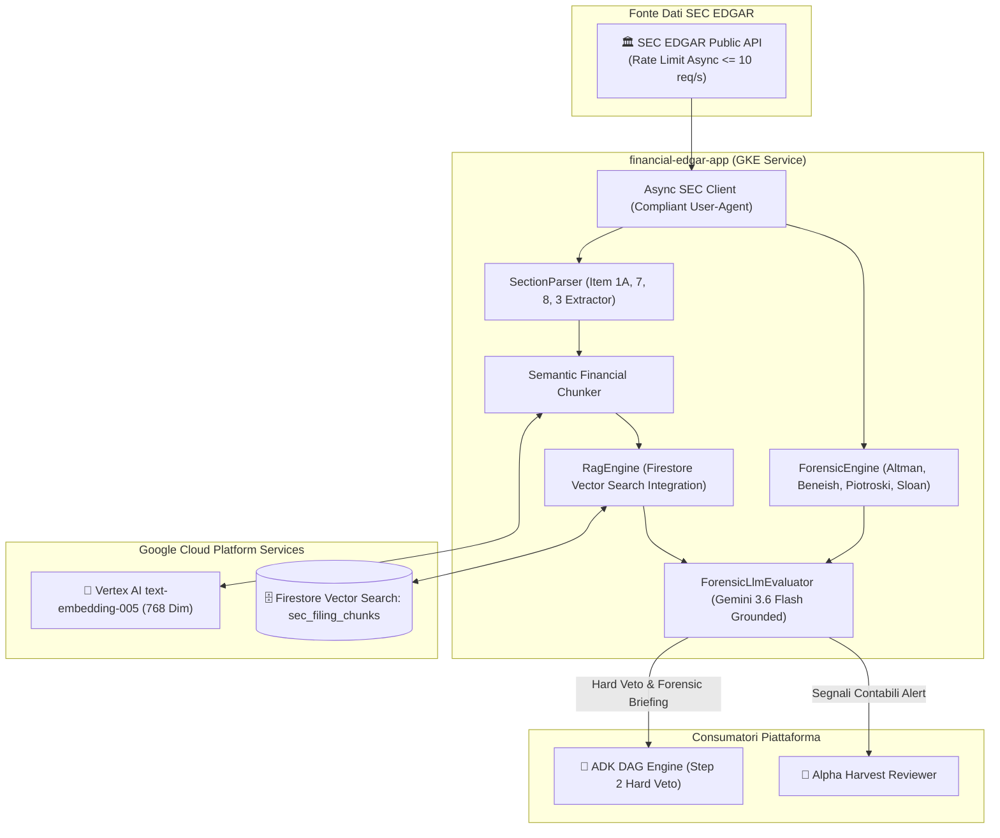

# Financial EDGAR & SEC Forensic Intelligence Service

**Autore:** Antigravity AI Engineering Team  
**Stack Tecnologico:** Python 3.12 + FastAPI + Google Cloud Vertex AI (`text-embedding-005`) + Firestore Vector Search + Gemini 3.6 Flash + Async SEC Client  
**Stato Repository:** Modulo Segregato (Enterprise Intellectual Property Protection)

---

## 1. Visione & Ruolo Architetturale

`financial-edgar-app` è il microservizio enterprise dedicato all'acquisizione in streaming, parsing strutturato, analisi forense contabile deterministica e ricerca semantica vettoriale sui documenti societari ufficiali depositati presso la SEC (Securities and Exchange Commission): Form 10-K (bilancio annuale), 10-Q (bilancio trimestrale) e 8-K (eventi rilevanti straordinari).

- **Hard Veto Forense Deterministico:**  
  Calcola analiticamente senza allucinazioni 4 modelli matematici fondamentali della finanza forense per identificare frodi contabili, rischio fallimento o anomalie di bilancio:
  1. **Altman Z-Score:** Predittore di insolvenza e probabilità di default aziendale.
  2. **Beneish M-Score:** Rilevatore matematico di manipolazione degli utili e ricavi gonfiati.
  3. **Piotroski F-Score:** Punteggio di solidità finanziaria su 9 parametri contabili.
  4. **Sloan Accrual Index:** Misuratore della qualità degli utili basato sulla discrepanza tra utile netto e flussi di cassa operativi.
- **RAG Semantico Vettorizzato con Google Vertex AI:**  
  Esegue il chunking semantico intelligente delle sezioni critiche dei bilanci:
  - **Item 1A:** Fattori di Rischio Operativi, Macro e Competitivi.
  - **Item 7:** Management's Discussion and Analysis of Financial Condition (MD&A).
  - **Item 8:** Note integrative e stime contabili complesse.
  - **Item 3:** Procedimenti Legali, Contenziosi e Sanzioni Antitrust.  
  I vettori a 768 dimensioni (`text-embedding-005`) sono memorizzati su Cloud Firestore Vector Search per consentire retrieval istantaneo e sintesi forensi grounded.

---

## 2. Diagramma Architetturale delle Responsabilità

---

## 3. Contratti API REST Esposti

- **`GET /facts/{ticker}`**: Recupero strutturato dei dati contabili grezzi US-GAAP/IFRS estratti da SEC EDGAR.
- **`GET /forensic/evaluate/{ticker}`**: Calcolo atomico dei 4 modelli forensi deterministici e restituzione del moltiplicatore di rischio.
- **`POST /sync-feed`**: Sincronizzazione periodica dei nuovi filing depositati (azionato via Kubernetes CronJob).
- **`POST /rag/query`**: Interrogazione semantica per similarità vettoriale sui testi delle relazioni 10-K/10-Q.
- **`GET /forensic/briefing/{ticker}`**: Briefing sintetico executive generato da Gemini 3.6 Flash con citazioni dirette alle clausole di bilancio.

---

## 4. Motivazione della Segregazione della Codebase (Enterprise IP Protection)

Gli algoritmi di estrazione e normalizzazione delle tassonomie XBRL/US-GAAP e il chunker semantico proprietario per documenti finanziari rappresentano un vantaggio competitivo proprietario critico.  
La custodia della codebase completa rimane pertanto riservata all'interno del repository master.
