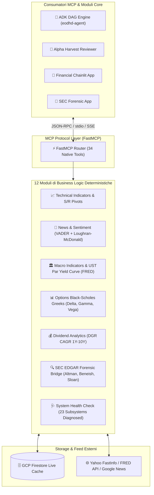

# Financial MCP Server (Model Context Protocol Data Hub)

**Autore:** Antigravity AI Engineering Team  
**Stack Tecnologico:** Python 3.12 + FastMCP SDK + Google Cloud Firestore SDK + Vertex AI + yfinance / FRED API  
**Stato Repository:** Modulo Segregato (Enterprise Intellectual Property Protection)

---

## 1. Visione & Ruolo Architetturale

`financial-mcp-server` è l'hub dati e calcolo analitico centrale della piattaforma FintechDataHub. Implementa lo standard **Model Context Protocol (MCP)** esponendo **34 Tool Nativi** a latenza ultra-bassa per l'arricchimento analitico di agenti LLM (Google ADK, Gemini, Claude, IDE) e del DAG quantitativo a 7 nodi:

- **Indipendenza Totale da API a Pagamento:** Zero costi ricorsivi per licenze di mercato (eliminazione completa delle dipendenze da EODHD a pagamento).
- **Estrazione Concorrente Resiliente:** Pipeline di estrazione asincrona e concorrente su dati di borsa, notizie Google News RSS con filtro di freschezza oraria (`when:1d`) e feed macroeconomici della Federal Reserve (FRED API).
- **Persistenza & Caching Intelligente:** Integrazione con Google Cloud Firestore per la storicizzazione incrementale **Delta-Append** delle serie storiche OHLCV e snapshot dinamici a TTL differenziato (15s durante la sessione regolare di Wall Street, 3600s a mercati chiusi).

---

## 2. Diagramma Architetturale delle Responsabilità

---

## 3. Catalogo dei 34 Tool MCP Nativi Esposti

1. `get_bulk_fundamentals`: Dati fondamentali Top 500 US / Mega-cap per analisi aggregata.
2. `get_fundamentals_data`: Bilanci completi (Stato Patrimoniale, Conto Economico, Flussi di Cassa trimestrali e annuali), multipli e rating.
3. `get_earnings_trends`: Stime di consenso EPS e Ricavi analisti, trend e revisioni storiche.
4. `get_insider_transactions`: Compravendite SEC Form 4 degli executive aziendali.
5. `get_historical_stock_prices`: Serie storiche giornaliere OHLCV con merge incrementale intelligente Delta-Append su Firestore.
6. `get_technical_indicators`: Calcolo analitico di SMA, EMA, RSI, MACD, Bande di Bollinger con parametri personalizzabili.
7. `get_support_resistance_levels`: Supporti e resistenze con Pivot Point Classici e Fibonacci (PP, S1-S3, R1-R3).
8. `stock_screener`: Screener multi-fattoriale su dati fondamentali, multipli e segnali tecnici da database.
9. `get_company_news`: Feed notizie ibrido (yfinance + Google News RSS con filtro di freschezza `when:1d`) con ranking a due livelli.
10. `get_sentiment_data`: Motore di sentiment pure-Python basato su lessico di mercato (VADER + Loughran-McDonald).
11. `get_macro_indicator`: Serie storiche macroeconomiche FRED API (PIL, CPI, M2, Fed Funds, Tasso Disoccupazione, VIX).
12. `get_ust_yield_rates`: Curva dei rendimenti Treasury USA (*Par Yield Curve*) per scadenze da 1M a 30Y.
13. `get_ust_bill_rates`: Tassi Treasury Bills a breve termine (4WK, 13WK, 26WK, 52WK).
14. `get_economic_events`: Calendario economico con eventi macro, rilasci e impatto di mercato.
15. `get_live_price_data`: Prezzi real-time con cache ad alta reattività e TTL dinamico (15s regular session, 3600s chiuso).
16. `get_us_live_extended_quotes`: Quotazioni pre-market e after-hours con spread e variazioni.
17. `get_intraday_historical_data`: Barre intraday storiche ad alta risoluzione (1m, 5m, 15m, 1h).
18. `get_stocks_from_search`: Ricerca globale multi-asset per nome azienda o ticker.
19. `resolve_ticker`: Risoluzione del codice ticker canonico ed exchange di quotazione.
20. `get_exchanges_list`: Catalogo mondiale delle borse valori con orari e fusi orari.
21. `get_exchange_details`: Dettagli specifici di singola borsa (calendario festività e sessioni).
22. `get_historical_dividends`: Storico completo dei dividendi cash distribuiti.
23. `get_dividend_analytics`: Calcolo automatico Dividend Growth Rate (DGR CAGR a 1Y, 3Y, 5Y, 10Y), Dividend Aristocrat streak.
24. `get_historical_splits`: Frazionamenti azionari (stock split) e moltiplicatore cumulativo di rettifica.
25. `get_historical_market_cap`: Serie storica dell'evoluzione della capitalizzazione di mercato.
26. `get_upcoming_earnings`: Calendario dei prossimi annunci degli utili trimestrali.
27. `get_upcoming_ipos`: Calendario delle prossime IPO e quotazioni.
28. `get_historical_commodity_prices`: Prezzi futures materie prime (WTI, Brent, Oro, Argento, Gas Naturale, Rame, Platino).
29. `get_congressional_trades`: Scambi azionari di membri del Congresso e Senato USA (STOCK Act disclosures).
30. `get_us_options_contracts`: Elenco delle scadenze e contratti opzioni azionarie USA.
31. `get_us_options_eod`: Prezzi opzioni con calcolo analitico dei Greci di Black-Scholes (Delta, Gamma, Theta, Vega, IV).
32. `get_sec_forensic_scores`: Modelli contabili forensi deterministici (Altman Z, Beneish M, Piotroski F, Sloan Accrual).
33. `query_sec_rag_filings`: Ricerca semantica grounded su bilanci Form 10-K/10-Q con Vertex AI text-embedding-005.
34. `system_health_check`: Diagnosi live simultanea su 23 sottosistemi di mercato con latenza in millisecondi.

---

## 4. Motivazione della Segregazione della Codebase (Enterprise IP Protection)

Il codice sorgente di `financial-mcp-server` contiene formule proprietarie, algoritmi matematici complessi (calcolo analitico Black-Scholes, modelli di volatilità implicita, parser per elusione blocchi anti-scraping e algoritmi di ranking notizie).  
Per preservare il valore strategico e la proprietà intellettuale della piattaforma istituzionale, il codice sorgente è custodito nel repository master privato di sviluppo.
