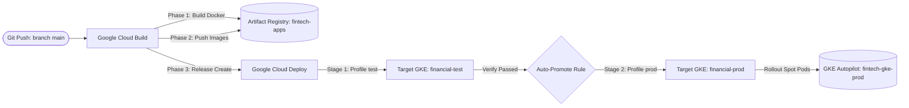

# Guida Completa a Terraform per Google Cloud Platform (GCP)
### *Dall'infrastruttura manuale a Infrastructure as Code (IaC)*

Benvenuto nella directory `terraform/` del progetto!  

---

## 1. Cos'è Terraform e Perché lo Usiamo?

Fino a ieri, per configurare Google Cloud si usavano script bash (`scripts/setup_gcp_infra.sh`) o la console web di GCP:
- **L'approccio vecchio (Imperativo)**: Dici al sistema *cosa fare passo dopo passo* (`gcloud create ...`). Se un comando fallisce o se lo riesegui, rischi errori di risorse duplicate o configurazioni non allineate (*configuration drift*).
- **L'approccio Terraform (Dichiarativo)**: Dici a Terraform *quale deve essere il risultato finale* ("voglio un database Firestore Native chiamato `fintech-data-hub-fs` e 6 servizi Cloud Run"). Terraform calcola autonomamente la sequenza esatta di azioni per portare GCP a quello stato.

### I Tre Concetti Chiave:
1. **I File `.tf`**: Il codice sorgente che descrive l'infrastruttura desiderata.
2. **Lo State (`terraform.tfstate`)**: Il file locale (o remoto su GCS) in cui Terraform tiene a mente l'elenco delle risorse create e le loro proprietà reali su GCP. Non toccare mai questo file a mano!
3. **Il Provider Google**: Il plugin ufficiale che traduce il codice HCL (*HashiCorp Configuration Language*) in chiamate API REST verso Google Cloud.

---

## 2. Mappa dei File nella Cartella `terraform/`

Ogni file ha uno scopo preciso e tematico:

| File | Scopo |
| :--- | :--- |
| **`versions.tf`** | Dichiara la versione minima di Terraform (>= 1.9) e i provider richiesti (`hashicorp/google`). |
| **`provider.tf`** | Configura il progetto GCP predefinito (`project_id`) e la regione (`europe-west1`). |
| **`variables.tf`** | Definisce tutte le variabili in ingresso con tipo, descrizione e valori di default. |
| **`terraform.tfvars.example`** | Modello d'esempio da copiare in `terraform.tfvars` per personalizzare i parametri. |
| **`services.tf`** | Abilita ordinatamente tutte le 11 API Google Cloud necessarie (Run, Firestore, AI Platform, ecc.). |
| **`firestore.tf`** | Crea il database Firestore in Native Mode con protezione contro la cancellazione accidentale. |
| **`artifact_registry.tf`** | Crea il repository Docker privato per archiviare le immagini dei microservizi. |
| **`iam.tf`** | Crea i Service Account (`cloudrun-sa` e `etoro-scheduler-invoker`) e assegna i ruoli di sicurezza. |
| **`secrets.tf`** | Registra i Secret crittografati in Secret Manager per le credenziali API di eToro. |
| **`cloud_run.tf`** | Definisce gli 8 microservizi Cloud Run (Cockpit, User Web, Chainlit, MCP, eToro Client Python, eToro Service Spring Boot, EDGAR, Alpha Harvest Agent). |
| **`cloud_scheduler.tf`** | Definisce i 6 Cron Job con fuso `America/New_York` e token crittografici OIDC. |
| **`cloud_build.tf`** | Configura la pipeline CI/CD di Cloud Build: permessi IAM e Trigger GitHub automatico su `main`. |
| **`cloud_deploy.tf`** | Configura Google Cloud Deploy: Delivery Pipeline a 2 stadi (Test & Prod) e runner SA. |
| **`domain_mapping.tf`** | Gestisce i domini personalizzati nativi di Cloud Run a costo zero (0,00 €) su `europe-west1`. |
| **`outputs.tf`** | Stampa a video gli URL generati, record DNS per i domini e comandi di import. |

---

## 3. Prerequisiti: Autenticazione con Google Cloud

Prima di lanciare Terraform, devi assicurarti che il tuo terminale sia autenticato su GCP con le credenziali applicative (**Application Default Credentials - ADC**):

```bash
# 1. Login con il tuo account Google
gcloud auth login

# 2. Configura le credenziali applicative usate da Terraform
gcloud auth application-default login

# 3. Imposta il progetto predefinito
gcloud config set project fintech-data-hub-75428
```

---

## 4. Guida Passo-Passo: I 4 Comandi di Terraform

Spostati nella cartella `terraform`:
```bash
cd terraform
```

### Passo 1: Inizializzazione (`terraform init`)
Questo comando scarica il plugin ufficiale di Google Cloud (`hashicorp/google`) e prepara l'ambiente di lavoro:
```bash
terraform init
```
*Esito atteso*: Messaggio verde `Terraform has been successfully initialized!`.

### Passo 2: Verifica della Sintassi (`terraform validate`)
Controlla che i file siano scritti correttamente e privi di errori grammaticali o di tipi:
```bash
terraform validate
```
*Esito atteso*: `Success! The configuration is valid.`.

### Passo 3: La Simulazione Preventiva (`terraform plan`)
Questo è il comando più importante di Terraform: **non modifica nulla su GCP**, ma legge lo stato attuale del cloud e mostra un'anteprima esatta di ciò che andrebbe a fare:
```bash
terraform plan
```
Ogni elemento nel terminale è contrassegnato da un simbolo:
- `+` **Verde (create)**: La risorsa non esiste e verrà creata da zero.
- `~` **Giallo (update in-place)**: La risorsa esiste già ma una sua proprietà verrà aggiornata.
- `-` **Rosso (destroy)**: La risorsa verrà eliminata.

### Passo 4: Applicazione Reale (`terraform apply`)
Quando sei soddisfatto dell'anteprima mostrata da `plan`, esegui:
```bash
terraform apply
```
Terraform ricalcolerà il piano e ti chiederà conferma: digita `yes` e premi Invio.  
In pochi secondi tutte le risorse verranno create o allineate su Google Cloud!

---

## 5. Come Gestire Risorse Già Esistenti su GCP (`terraform import`)

> [!IMPORTANT]
> **Hai già un database Firestore o un repository Artifact Registry creato in passato?**  
> Se provi a fare `terraform apply` per creare una risorsa con un nome già esistente su GCP, Google risponderà con un errore `409 Already Exists`.  
> Per insegnare a Terraform che quella risorsa appartiene già al progetto e va solo tracciata nello State, si usa il comando `terraform import`.

Esempi pratici:

### 1. Importare il Database Firestore Esistente
```bash
terraform import google_firestore_database.database projects/fintech-data-hub-45513/databases/fintech-data-hub-fs
```

### 2. Importare il Repository Artifact Registry Esistente
```bash
terraform import google_artifact_registry_repository.docker_repo projects/fintech-data-hub-45513/locations/europe-west1/repositories/fintech-apps
```

### 3. Importare il Service Account Esistente
```bash
terraform import google_service_account.cloudrun_sa projects/fintech-data-hub-45513/serviceAccounts/cloudrun-sa@fintech-data-hub-45513.iam.gserviceaccount.com
terraform import google_service_account.scheduler_sa projects/fintech-data-hub-45513/serviceAccounts/etoro-scheduler-invoker@fintech-data-hub-45513.iam.gserviceaccount.com
```

Dopo aver eseguito l'import, rieseguendo `terraform plan` vedrai che Terraform riconosce le risorse già attive senza tentare di ricrearle da zero.

---

## 6. Gestione del Database Firestore tra Progetti e Utenti Diversi

Uno dei dubbi più frequenti riguarda cosa fare quando si crea un **nuovo progetto GCP** con un **nuovo utente** o account:

### ⚠️ Permessi Richiesti per `terraform import`
Per importare una risorsa già esistente con `terraform import`, l'utente collegato in `gcloud auth application-default login` deve avere permessi di lettura sulla risorsa in GCP:
- **Minimo per l'import**: `roles/datastore.viewer` (o `roles/viewer`).
- **Per gestire e modificare con `apply`**: `roles/datastore.admin` oppure `roles/owner` del progetto GCP.

### Differenza Fondamentale: `terraform import` vs Migrazione Dati
> [!IMPORTANT]
> `terraform import` **NON copia dati tra progetti diversi!**  
> Serve unicamente all'interno dello **stesso progetto** per dire a Terraform: *"Non tentare di creare il database con una chiamata POST, perché esiste già qui: leggi la sua configurazione e aggiungila al tuo file `terraform.tfstate`"*.

### Scenario A: Vuoi solo replicare l'infrastruttura (database vuoto) nel nuovo progetto
Questo è lo scopo principale di Terraform e non richiede alcun `import`:
1. Fai il login con il nuovo utente:
   ```bash
   gcloud auth login
   gcloud auth application-default login
   ```
2. Nel file `terraform/terraform.tfvars`, imposta il nuovo ID del progetto:
   ```hcl
   project_id = "id-del-nuovo-progetto"
   ```
3. Esegui:
   ```bash
   terraform apply
   ```
Terraform creerà automaticamente il database Firestore Native (`fintech-data-hub-fs`) nel nuovo progetto con tutte le configurazioni e la protezione da cancellazione accidentale.

### Scenario B: Vuoi trasferire i DATI (collezioni, prezzi storici, run) dal vecchio al nuovo DB
Terraform gestisce la **struttura** (il contenitore DB), ma **non i record/documenti** NoSQL.  
Per migrare tutti i dati dal vecchio al nuovo database si usa la procedura ufficiale di **Export/Import su Cloud Storage (GCS)**:

```bash
# 1. Nel VECCHIO progetto: esporta l'intero database Firestore su un bucket di backup
gcloud firestore export gs://mio-bucket-backup-firestore \
  --database=fintech-data-hub-fs \
  --project=fintech-data-hub-75428

# 2. Concedi i permessi di lettura del bucket al Service Account Firestore del NUOVO progetto
# (oppure copia la cartella esportata in un bucket appartenente al nuovo progetto)

# 3. Nel NUOVO progetto: importa i dati nel nuovo database creato da Terraform
gcloud firestore import gs://mio-bucket-backup-firestore/[CARTELLA_EXPORT]/ \
  --database=fintech-data-hub-fs \
  --project=id-del-nuovo-progetto
```

---

## 7. Come Gestire e Trasferire i Secret (API Keys eToro) su un Nuovo Progetto

Per popolare o trasferire i valori dei segreti cifrati (come le API Key di eToro) su un nuovo progetto GCP di un altro utente, hai a disposizione **3 metodi**:

### Metodo 1: Tramite `terraform.tfvars` o Variabili d'Ambiente (Consigliato)
Il nostro file `terraform/secrets.tf` include già la creazione automatica della versione attiva se le variabili non sono vuote.  
Il nuovo utente deve semplicemente valorizzarle nel suo file `terraform/terraform.tfvars` (già escluso da Git tramite `.gitignore`):

```hcl
project_id        = "id-del-nuovo-progetto"
etoro_public_key  = "incolla_qui_la_chiave_pubblica"
etoro_private_key = "incolla_qui_la_chiave_privata"
```
Poi lancia `terraform apply`.

*In alternativa (ancora più sicuro, senza scrivere nulla su file)*:
```bash
export TF_VAR_etoro_public_key="tua_chiave_pubblica"
export TF_VAR_etoro_private_key="tua_chiave_privata"
terraform apply
```

### Metodo 2: Passaggio Diretto via CLI `gcloud` (Da Progetto a Progetto)
Se il tuo account Google ha accesso a entrambi i progetti, puoi leggere i valori dal vecchio Secret Manager e scriverli nel nuovo direttamente in memoria RAM, senza mai salvarli in chiaro su disco:

```bash
VECCHIO_PROJ="fintech-data-hub-75428"
NUOVO_PROJ="id-del-nuovo-progetto"

# 1. Estrai i valori dal vecchio progetto in variabili di shell
PUB_KEY=$(gcloud secrets versions access latest --secret="etoro-public-key" --project="$VECCHIO_PROJ")
PRIV_KEY=$(gcloud secrets versions access latest --secret="etoro-private-key" --project="$VECCHIO_PROJ")

# 2. Aggiungi la versione nel nuovo progetto (dopo che Terraform ha creato le risorse secret)
echo -n "$PUB_KEY" | gcloud secrets versions add etoro-public-key --data-file=- --project="$NUOVO_PROJ"
echo -n "$PRIV_KEY" | gcloud secrets versions add etoro-private-key --data-file=- --project="$NUOVO_PROJ"
```

### Metodo 3: Dal file locale `.env`
Se il nuovo utente ha a disposizione il file `.env` nella root del repository, può eseguire lo script di bootstrap:
```bash
GCP_PROJECT="id-del-nuovo-progetto" bash scripts/setup_gcp_infra.sh
```
Lo script estrarrà automaticamente `ETORO_PUBLIC_KEY` ed `ETORO_PRIVATE_KEY` e popolerà Secret Manager sul nuovo progetto.

### Permessi IAM Richiesti per i Secret:
- **Per leggere** un secret: `roles/secretmanager.secretAccessor`.
- **Per creare o aggiornare versioni**: `roles/secretmanager.admin` (incluso automaticamente nel ruolo `Owner`).

---

## 8. Personalizzazione e Variabili

Puoi creare il tuo file di variabili personalizzato:
```bash
cp terraform.tfvars.example terraform.tfvars
```
Modifica `terraform.tfvars` con il tuo editor preferito. Ad esempio, se vuoi creare solo l'infrastruttura di base (API, DB, IAM, Registry) prima di compilare i container Docker, imposta:
```hcl
enable_cloud_run_deploy = false
enable_cloud_scheduler  = false
```
Una volta compilate e pushate le immagini Docker su Artifact Registry tramite Cloud Build, rimetti `true` e riesegui `terraform apply`.

---

## 9. Comandi Utili di Consultazione

- **Vedere gli URL generati in qualsiasi momento**:
  ```bash
  terraform output
  ```
- **Formattare automaticamente tutti i file `.tf`**:
  ```bash
  terraform fmt
  ```
- **Mostrare lo stato corrente salvato**:
  ```bash
  terraform show
  ```

## 10. Creazione Terraform
### Passo 1: Completa la Base dell'Infrastruttura
Flag di attivazione moduli (disattivati per la Fase 1 di bootstrap infrastrutturale in terraform.tfvars)
```hcl
enable_cloud_run_deploy    = false
enable_cloud_scheduler     = false
enable_cloud_build_trigger = true
```

  ```bash
  terraform init
  ```
  ```bash
  terraform validate
  ```
  ```bash
  terraform plan
  ```
  ```bash
  terraform apply
  ```
### Passo 2: Ripristina i Dati su Firestore
Ora che il database e i permessi sul bucket sono attivi, lancia l'import dei dati:
```bash
gcloud firestore import gs://firestore-export-europe-west1-45513/2026-09-19T17:37:23_55519 \
  --database=fintech-data-hub-fs \
  --project=fintech-data-hub-45513
```

### Passo 3: Compila le Immagini Docker
Assicurati di aver collegato il repo su GitHub.
Per riempire il repository fintech-apps con le immagini che servono a Cloud Run

### Passo 4: Accendi Cloud Run e gli Scheduler
Non appena le immagini Docker sono state compilate nel registry fintech-apps:

Riapriamo terraform.tfvars e rimettiamo:
```hcl
enable_cloud_run_deploy    = true
enable_cloud_scheduler     = true
enable_cloud_build_trigger = true
```
Lanci di nuovo 
```bash
terraform apply
```

---

## 11. Selezione del Motore Trading eToro (Dual-Deploy: Python vs Java Spring Boot)

### Motore di Esecuzione Trading
- **`financial-etoro-service`**: Microservizio primario autonomo Enterprise Java 17/21 (Spring Boot 3.3, Virtual Threads, Netty HTTP/2, Resilience4j RateLimiter a 10 req/s & Exponential Retry).
- **`financial-etoro-client` (Python)**: Integralmente dismesso e rimosso dalla codebase in favore del microservizio Java ad alte prestazioni.

```hcl
# Motore Java Spring Boot attivo:
etoro_engine = "springboot"
# etoro_engine = "springboot"
```

Applica la modifica:
```bash
terraform apply
```

Terraform riallineerà in tempo reale:
1. La variabile d'ambiente `ETORO_CLIENT_URL` del cruscotto `financial-cockpit-web`.
2. L'URI di destinazione e l'Audience OIDC dei 3 cron job di Google Cloud Scheduler (`etoro-opening-shield-widen`, `etoro-opening-shield-restore`, `etoro-breakeven-guardian`).

---

## 12. Architettura CI/CD: Cloud Build, Cloud Deploy & Skaffold (GKE Autopilot)

Il repository include una catena completa di automazione CI/CD integrata a livello enterprise tra **Cloud Build**, **Artifact Registry**, **Google Cloud Deploy**, **Skaffold** e **GKE Autopilot**:



### 1. Google Cloud Build (`cloudbuild.yaml`)
Pipeline dichiarativa a 3 fasi attivata automaticamente dal trigger GitHub su push su `main`:
1. **Fase 1 (Build)**: Compilazione parallela con cache inline (`BUILDKIT_INLINE_CACHE=1`) per tutti gli 8 microservizi.
2. **Fase 2 (Push)**: Pubblicazione parallela su Artifact Registry (`europe-west1-docker.pkg.dev/fintech-data-hub-45513/fintech-apps`) con doppio tag (`$COMMIT_SHA` e `latest`).
3. **Fase 3 (Cloud Deploy Release & GKE Rollout Verification)**:
   - Sincronizzazione dichiarativa della pipeline e dei target GKE (`gcloud deploy apply --file=clouddeploy.yaml`).
   - Creazione della release su **Google Cloud Deploy** (`financial-platform-pipeline`) iniettando i digest immutabili di tutti gli 8 container GKE.
   - Verifica dello stato di rollout dei Deployment e dei 7 CronJob nativi `batch/v1` nel namespace `fintech-platform`.

### 2. Google Cloud Deploy (`clouddeploy.yaml` & `terraform/cloud_deploy.tf`)
Delivery Pipeline istituzionale (`financial-platform-pipeline`) a 2 stadi con target GKE Autopilot (`fintech-gke-prod` in `europe-west1`):
- **Target `financial-test`**: Riceve il rollout iniziale dei manifest Kustomize sul cluster GKE con test di verifica post-deploy (`verify: true`, profilo Skaffold `test`).
- **Target `financial-prod`**: Riceve il rollout di produzione automatico (`requireApproval: false`, profilo Skaffold `prod`).
- **Automazione `auto-promote-to-prod`**: Promuove istantaneamente la release da `financial-test` a `financial-prod` al superamento dello smoke test.

> [!IMPORTANT]
> **Convenzione di Naming Release Cloud Deploy (Regola dei 63 Caratteri)**  
> Google Cloud impone un limite massimo di **63 caratteri** sugli ID delle risorse (inclusi i Rollout).  
> Durante la promozione, Cloud Deploy genera ID nel formato:  
> `${RELEASE_NAME}-to-${TARGET}-0001` (dove `-to-financial-test-0001` occupa 23 caratteri).  
> Per evitare collisioni (`ALREADY_EXISTS`) su ricompilazioni dello stesso commit e prevenire errori di lunghezza eccedente (`INVALID_ARGUMENT`), `cloudbuild.yaml` utilizza un nome compatto:
> ```bash
> RELEASE_NAME="rel-${SHORT_SHA}"
> ```
> (con fallback a `rel-${SHORT_SHA}-$$(date +%H%M)` in caso di ricompilazione dello stesso commit).

### 3. Skaffold (`skaffold.yaml`)
Configurazione `skaffold/v4beta7` utilizzata nativamente da Cloud Deploy per:
- Definire gli 8 artefatti Docker della piattaforma.
- Configurare i profili Kustomize (`test`, `prod` e `gke-prod`) mappati sull'overlay di produzione `deploy/k8s/overlays/prod` (con allocazione GKE Spot Pods).
- Eseguire il container `curl-checker` (`curlimages/curl:8.5.0`) nello step di `verify` per validare l'integrità del deployment prima dell'auto-promozione.

### 4. Sincronizzazione Anti-Whipsaw e FinOps (7 Kubernetes CronJob Nativi `batch/v1`)
Tutti i job schedulati girano internamente al cluster GKE (`deploy/k8s/base/cronjobs.yaml`) su CoreDNS (`*.fintech-platform.svc.cluster.local:8080`) a costo zero:
- **09:00 NY (15:00 IT)**: `finops-morning-scaleup` risveglia tutti i Deployment a `replicas=1` prima dell'apertura di Wall Street.
- **09:10 NY (15:10 IT)**: `etoro-opening-shield-widen` allarga lo Stop Loss a -10% per prevenire lo stop-hunting in apertura.
- **10:00 NY (16:00 IT)**: `etoro-opening-shield-restore` ripristina lo Stop Loss quantitativo a book disteso.
- **10:00-16:00 NY (16:00-22:00 IT)**: `etoro-breakeven-guardian` esegue il check ogni 5 minuti a mercati regolari.
- **10:30 NY (16:30 IT)**: `alpha-harvest-portfolio-scan` valuta l'exit strategy a 6 pilastri e il ricircolo del capitale.
- **10:00-16:00 NY (ogni 2h: 10:00, 12:00, 14:00, 16:00 NY)**: `edgar-sync-feed` sincronizza e vettorizza nuovi filing SEC 10-K/10-Q/8-K.
- **16:30 NY (22:30 IT)**: `finops-night-scaledown` porta a `replicas=0` tutti i pod applicativi per azzerare i costi di calcolo notturni e nel weekend.

